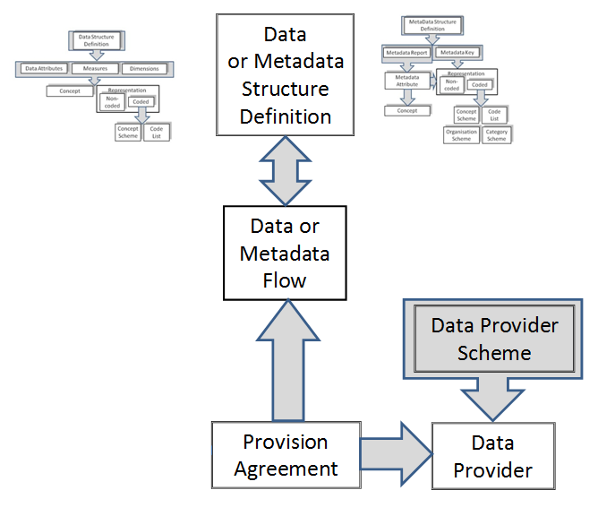
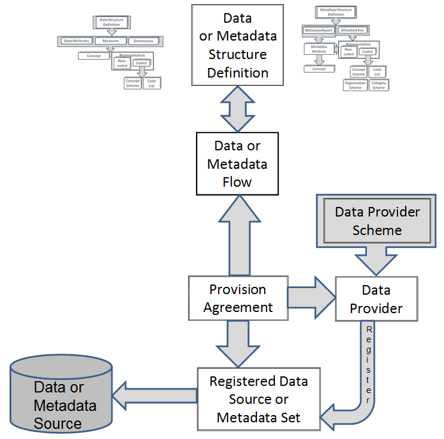
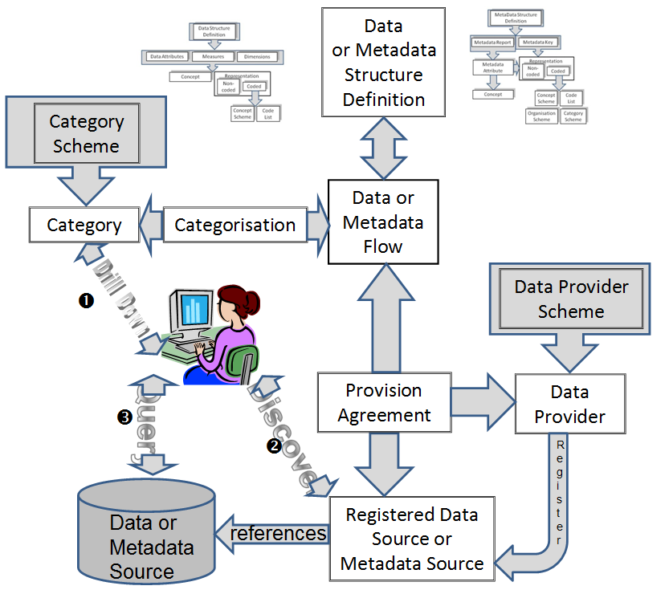
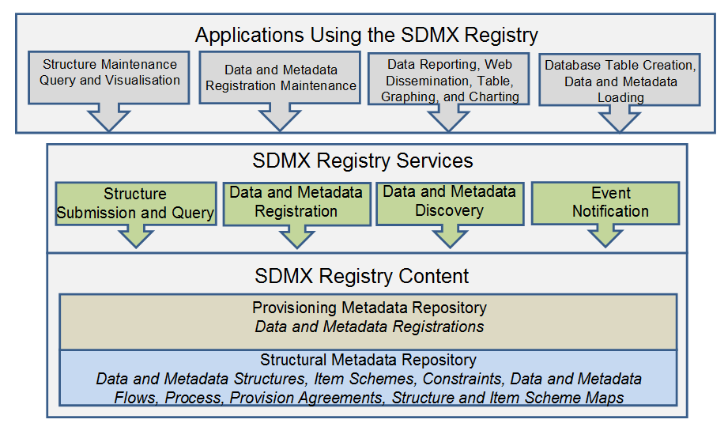
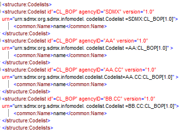
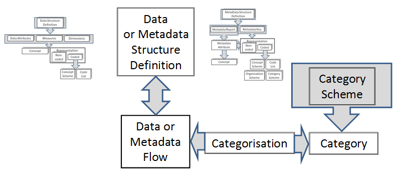
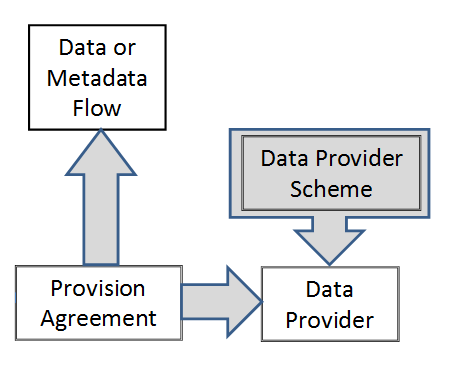
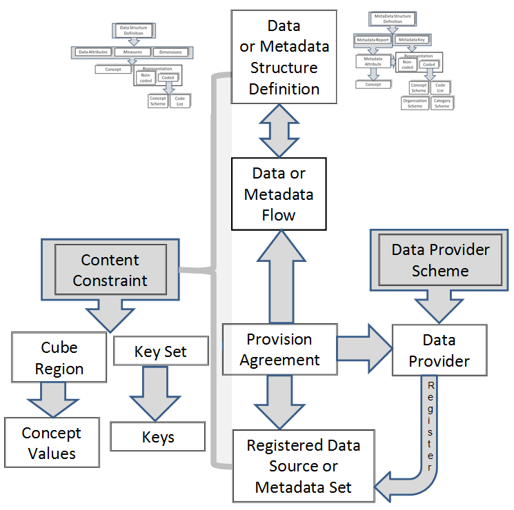
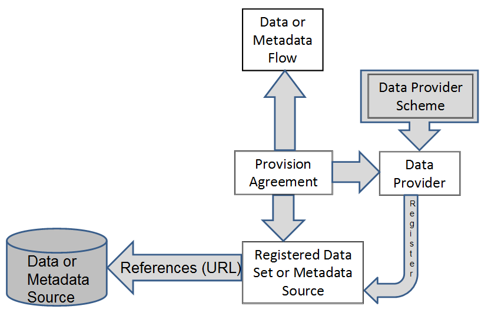

SDMX STANDARDS PART 5

SDMX R\ EGISTRY S\ PECIFICATION: LOGICAL FUNCTIONALITY AND L\ OGICAL
I\ NTERFACES

Version 2.1

April 2011

© SDMX 2011

http://www.sdmx.org/

Table of Contents

`1 Introduction 1 <#introduction>`__

`2 Scope and Normative Status 2 <#scope-and-normative-status>`__

`3 Scope of the SDMX Registry/Repository
2 <#scope-of-the-sdmx-registryrepository>`__

`3.1 Objective 2 <#objective>`__

`3.2 Structural Metadata 3 <#structural-metadata>`__

`3.3 Registration 4 <#registration>`__

`3.4 Notification 4 <#notification>`__

`3.5 Discovery 4 <#discovery>`__

`4 SDMX Registry/Repository Architecture
5 <#sdmx-registryrepository-architecture>`__

`4.1 Architectural Schematic 5 <#architectural-schematic>`__

`4.2 Structural Metadata Repository
6 <#structural-metadata-repository>`__

`4.3 Provisioning Metadata Repository
6 <#provisioning-metadata-repository>`__

`5 Registry Interfaces and Services
7 <#registry-interfaces-and-services>`__

`5.1 Registry Interfaces 7 <#registry-interfaces>`__

`5.2 Registry Services 7 <#registry-services>`__

`5.2.1 Introduction 7 <#introduction-1>`__

`5.2.2 Structure Submission and Query Service
7 <#structure-submission-and-query-service>`__

`5.2.3 Structure Query Service 8 <#structure-query-service>`__

`5.2.4 Data and Reference Metadata Registration Service
9 <#data-and-reference-metadata-registration-service>`__

`5.2.5 Data and Reference Metadata Discovery
10 <#data-and-reference-metadata-discovery>`__

`5.2.6 Subscription and Notification
10 <#subscription-and-notification>`__

`5.2.7 Registry Behaviour 11 <#registry-behaviour>`__

`6 Identification of SDMX Objects
12 <#identification-of-sdmx-objects>`__

`6.1 Identification, Versioning, and Maintenance
12 <#identification-versioning-and-maintenance>`__

`6.1.1 Identification, Naming, Versioning, and Maintenance Model
13 <#identification-naming-versioning-and-maintenance-model>`__

`6.2 Unique identification of SDMX objects
15 <#unique-identification-of-sdmx-objects>`__

`6.2.1 Agencies 15 <#agencies>`__

`6.2.2 Universal Resource Name (URN)
17 <#universal-resource-name-urn>`__

`6.2.3 Table of SDMX-IM Packages and Classes
21 <#table-of-sdmx-im-packages-and-classes>`__

`6.2.4 URN Identification components of SDMX objects
23 <#urn-identification-components-of-sdmx-objects>`__

`7 Implementation Notes 30 <#implementation-notes>`__

`7.1 Structural Definition Metadata
30 <#structural-definition-metadata>`__

`7.1.1 Introduction 30 <#introduction-3>`__

`7.1.2 Item Scheme, Structure 31 <#item-scheme-structure>`__

`7.1.3 Structure Usage 32 <#structure-usage>`__

`7.2 Data and Metadata Provisioning
34 <#data-and-metadata-provisioning>`__

`7.2.1 Provisioning Agreement: Basic concepts
34 <#provisioning-agreement-basic-concepts>`__

`7.2.2 Provisioning Agreement Model – pull use case
34 <#provisioning-agreement-model-pull-use-case>`__

`7.3 Data and Metadata Constraints
36 <#data-and-metadata-constraints>`__

`7.3.1 Data and Metadata Constraints: Basic Concepts
36 <#data-and-metadata-constraints-basic-concepts>`__

`7.3.2 Data and Metadata Constraints: Schematic
37 <#data-and-metadata-constraints-schematic>`__

`7.3.3 Data and Metadata Constraints: Model
38 <#data-and-metadata-constraints-model>`__

`7.4 Data and Metadata Registration
39 <#data-and-metadata-registration>`__

`7.4.1 Basic Concepts 39 <#basic-concepts>`__

`7.4.2 The Registration Request 39 <#the-registration-request>`__

`7.4.3 Registration Response 41 <#registration-response>`__

`7.5 Subscription and Notification Service
42 <#subscription-and-notification-service>`__

`7.5.1 Subscription Logical Class Diagram
43 <#subscription-logical-class-diagram>`__

`7.5.2 Subscription Information 44 <#subscription-information>`__

`7.5.3 Wildcard Facility 44 <#wildcard-facility>`__

`7.5.4 Structural Repository Events
45 <#structural-repository-events>`__

`7.5.5 Registration Events 45 <#registration-events>`__

`7.6 Notification 46 <#notification-1>`__

`7.6.1 Logical Class Diagram 46 <#logical-class-diagram>`__

`7.6.2 Structural Event Component 46 <#structural-event-component>`__

`7.6.3 Registration Event Component
47 <#registration-event-component>`__

Introduction
============

The business vision for SDMX envisages the promotion of a “data sharing”
model to facilitate low-cost, high-quality statistical data and metadata
exchange. Data sharing reduces the reporting burden of organisations by
allowing them to publish data once, and let their counterparties “pull”
data and related metadata as required. The scenario is based on:

-  the availability of an abstract information model capable of
   supporting time-series and cross-sectional data, structural metadata,
   and reference metadata (SDMX-IM)

-  standardised XML schemas derived from the model (SDMX-ML)

-  the use of web-services technology (XML, XSD, WSDL, WADL)

Such an architecture needs to be well organised, and the SDMX
Registry/Repository (SDMX-RR) is tasked with providing structure,
organisation, and maintenance and query interfaces for most of the SDMX
components required to support the data-sharing vision.

However, it is important to emphasis that the SDMX-RR provides support
for the submission and retrieval of all SDMX structural metadata and
provisioning metadata. Therefore, the Registry not only supports the
data sharing scenario, but this metadata is also vital in order to
provide support for data and metadata reporting/collection, and
dissemination scenarios.

Standard formats for the exchange of aggregated statistical data and
metadata as prescribed in SDMX v2.1 are envisaged to bring benefits to
the statistical community because data reporting and dissemination
processes can be made more efficient.

As organisations migrate to SDMX enabled systems, many XML (and
conventional) artefacts will be produced (e.g. Data Structure, Metadata
Structure, Code List and Concept definitions (often collectively called
structural metadata), XML schemas generated from data and metadata
structure definitions, XSLT style-sheets for transformation and display
of data and metadata, terminology references, etc.). The SDMX model
supports interoperability, and it is important to be able to discover
and share these artefacts between parties in a controlled and organized
way.

This is the role of the registry.

With the fundamental SDMX standards in place, a set of architectural
standards are needed to address some of the processes involved in
statistical data and metadata exchange, with an emphasis on maintenance,
retrieval and sharing of the structural metadata. In addition, the
architectural standards support the registration and discovery of data
and referential metadata.

These architectural standards address the ‘how’ rather than the ‘what’,
and are aimed at enabling existing SDMX standards to achieve their
mission. The architectural standards address registry services which
initially comprise:

-  structural metadata repository

-  data and metadata registration

-  query

The registry services outlined in this specification are designed to
help the SDMX community manage the proliferation of SDMX assets and to
support data sharing for reporting and dissemination.

Scope and Normative Status
==========================

The scope of this document is to specify the logical interfaces for the
SDMX registry in terms of the functions required and the data that may
be present in the function call, and the behaviour expected of the
registry.

In this document, functions and behaviours of the Registry Interfaces
are described in four ways:

-  in text

-  with tables

-  with UML diagrams excerpted from the SDMX Information Model (SDMX-IM)

-  with UML diagrams that are not a part of the SDMX-IM but are included
   here for clarity and to aid implementations (these diagram are
   clearly marked as “Logical Class Diagram ...”)

Whilst the introductory section contains some information on the role of
the registry, it is assumed that the reader is familiar with the uses of
a registry in providing shared metadata across a community of
counterparties.

Note that sections 5 and 6 contain normative rules regarding the
Registry Interface and the identification of registry objects. Further,
the minimum standard for access to the registry is via a REST interface
(HTTP or HTTPS), as described in the appropriate sections. The
notification mechanism must support e-mail and HTTP/HTTPS protocols as
described. Normative registry interfaces are specified in the SDMX-ML
specification (Part 03 of the SDMX Standard). All other sections of this
document are informative.

Note that although the term “authorised user” is used in this document,
the SDMX standards do not define an access control mechanism. Such a
mechanism, if required, must be chosen and implemented by the registry
software provider.

Scope of the SDMX Registry/Repository
=====================================

Objective
---------

The objective of the SDMX registry/repository is, in broad terms, to
allow organisations to publish statistical data and reference metadata
in known formats such that interested third parties can discover these
data and interpret them accurately and correctly. The mechanism for
doing this is twofold:

1. To maintain and publish structural metadata that describes the
   structure and valid content of data and reference metadata sources
   such as databases, metadata repositories, data sets, metadata sets.
   This structural metadata enables software applications to understand
   and to interpret the data and reference metadata in these sources.

2. To enable applications, organisations, and individuals to share and
   to discover data and reference metadata. This facilitates data and
   reference metadata dissemination by implementing the data sharing
   vision of SDMX.

Structural Metadata
-------------------

Setting up structural metadata and the exchange context (referred to as
“data provisioning”) involves the following steps for maintenance
agencies:

-  agreeing and creating a specification of the structure of the data
   (called a Data Structure Definition or DSD in this document but also
   known as “key family”) which defines the dimensions, measures and
   attributes of a dataset and their valid value set

-  if required, defining a subset or view of a DSD which allows some
   restriction of content called a “dataflow definition”

-  agreeing and creating a specification of the structure of reference
   metadata (Metadata Structure Definition) which defines the attributes
   and presentational arrangement of a Metadataset and their valid
   values and content

-  if required, defining a subset or view of a MSD which allows some
   restriction of content called a “metadataflow definition”

-  defining which subject matter domains (specified as a Category
   Scheme) are related to the Dataflow and Metadataflow Definitions to
   enable browsing

-  defining one or more lists of Data Providers (which includes metadata
   providers)

-  defining which Data Providers have agreed to publish a given Dataflow
   and/or Metadataflow Definition - this is called a Provision Agreement

|image0|

Figure 1: Schematic of the Basic Structural Artifacts in the SDMX-IM

Registration
------------

Publishing the data and reference metadata involves the following steps
for a Data Provider:

-  making the reference metadata and data available in SDMX-ML
   conformant data files or databases (which respond to an SDMX-ML query
   with SDMX-ML data). The data and reference metadata files or
   databases must be web-accessible, and must conform to an agreed
   Dataflow or Metadataflow Definition (Data Structure Definition or
   Metadata Structure Definition subset)

-  registering the existence of published reference metadata and data
   files or databases with one or more SDMX registries

|image1|

Figure 2: Schematic of Registered Data and Metadata Sources in the
SDMX-IM

Notification
------------

Notifying interested parties of newly published or re-published data,
reference metadata or changes in structural metadata involves:

-  registry support of a subscription-based notification service which
   sends an email or notifies an HTTP address announcing all published
   data that meets the criteria contained in the subscription request

Discovery
---------

Discovering published data and reference metadata involves interaction
with the registry to fulfil the following logical steps that would be
carried out by a user interacting with a service that itself interacts
with the registry and an SDMX-enabled data or reference metadata
resource:

-  optionally browsing a subject matter domain category scheme to find
   Dataflow Definitions (and hence Data Structure Definitions) and
   Metadataflows which structure the type of data and/or reference
   metadata being sought

-  build a query, in terms of the selected Data Structure Definition or
   Metadata Structure Definition, which specifies what data are required
   and submitting this to a service that can query an SDMX registry
   which will return a list of (URLs of) data and reference metadata
   files and databases which satisfy the query

-  processing the query result set and retrieving data and/or reference
   metadata from the supplied URLs

..

   |image2|

Figure 3: Schematic of Data and Metadata Discovery and Query in the
SDMX-IM

 SDMX Registry/Repository Architecture
=====================================

Architectural Schematic
-----------------------

The architecture of the SDMX registry/repository is derived from the
objectives stated above. It is a layered architecture that is founded by
a structural metadata repository which supports a provisioning metadata
repository which supports the registry services. These are all supported
by the SDMX-ML schemas. Applications can be built on top of these
services which support the reporting, storage, retrieval, and
dissemination aspects of the statistical lifecycle as well as the
maintenance of the structural metadata required to drive these
applications.

|image3|

Figure 4: Schematic of the Registry Content and Services

Structural Metadata Repository
------------------------------

The basic layer is that of a structural metadata service which supports
the lifecycle of SDMX structural metadata artefacts such as Maintenance
Agencies, Data Structure Definitions, Metadata Structure Definitions,
Provision Agreements, Processes etc. This layer is supported by the
Structure Submission and Query Service.

Note that the SDMX-ML Submit Structure Request message supports all of
the SDMX structural artefacts. The only structural artefacts that are
not supported by the SDMX-ML Submit Structure Request are::

-  Registration of data and metadata sources

-  Subscription and Notification

Separate registry-based messages are defined to support these artefacts.

Provisioning Metadata Repository
--------------------------------

The function of this repository is to support the definition of the
structural metadata that describes the various types of data-store which
model SDMX-conformant databases or files, and to link to these data
sources. These links can be specified for a data provider, for a
specific data or metadata flow. In the SDMX model this is called the
Provision Agreement.

This layer is supported by the Data and Metadata Registration Service.

Registry Interfaces and Services
================================

Registry Interfaces
-------------------

The Registry Interfaces are:

-  Notify Registry Event

-  Submit Subscription Request

-  Submit Subscription Response

-  Submit Registration Request

-  Submit Registration Response

-  Query Registration Request

-  Query Registration Response

-  Query Subscription Request

-  Query Subscription Response

-  Submit Structure Request

-  Submit Structure Response

The registry interfaces are invoked in one of two ways:

1. The interface is the name of the root node of the SDMX-ML document

2. The interface is invoked as a child element of the RegistryInterface
   message where the RegistryInterface is the root node of the SDMX-ML
   document.

In addition to these interfaces the registry must support a mechanism
for querying for structural metadata. This is detailed in 5.2.2.

All these interactions with the Registry – with the exception of Notify
Registry Event – are designed in pairs. The first document – the one
which invokes the SDMX-RR interface, is a “Request” document. The
message returned by the interface is a “Response” document.

It should be noted that all interactions are assumed to be synchronous,
with the exception of Notify Registry Event. This document is sent by
the SDMX-RR to all subscribers whenever an even occurs to which any
users have subscribed. Thus, it does not conform to the request-response
pattern, because it is inherently asynchronous.

Registry Services
-----------------

.. _introduction-1:

Introduction
~~~~~~~~~~~~

The services described in this section do not imply that each is
implemented as a discrete web service.

Structure Submission and Query Service
~~~~~~~~~~~~~~~~~~~~~~~~~~~~~~~~~~~~~~

This service must implement the following SDMX-ML Interfaces:

-  SubmitStructureRequest

-  SubmitStructureResponse

These interfaces allow structural definitions to be created, modified,
and removed in a controlled fashion. It also allows the structural
metadata artefacts to be queried and retrieved either in part or as a
whole. In order for the architecture to be scalable, the finest-grained
piece of structural metadata that can be processed by the SDMX-RR is a
MaintainableArtefact (see next section on the SDMX Information Model).

Structure Query Service
~~~~~~~~~~~~~~~~~~~~~~~

The registry must support a mechanism for querying for structural
metadata. This mechanism can be one or both of the SDMX-ML Query message
and the SDMX REST interface for structural metadata (this is defined in
Part 7 of the SDMX standards). The registry response to both of these
query mechanisms is the SDMX Structure message which has as its root
node

-  Structure

The SDMX structural artefacts that may be queried are:

-  dataflows and metadataflows

-  data structure definitions and metadata structure definitions

-  codelists

-  concept schemes

-  reporting taxonomies

-  provision agreements

-  structure sets

-  processes

-  hierarchical code lists

-  constraints

-  category schemes

-  categorisations and categorised objects (examples are categorised
   dataflows and metadatflows, data structure definitions, metadata
   structure definitions, provision agreements registered data sources
   and metadata sources)

-  organisation schemes (agency scheme, data provider scheme, data
   consumer scheme, organisation unit scheme)

The SDMX query messages that are a part of the SDMX-ML Query message
are:

-  StructuresQuery

-  DataflowQuery

-  MetadataflowQuery

-  DataStructureQuery

-  MetadataStructureQuery

-  CategorySchemeQuery

-  ConceptScheneQuery

-  CodelistQuery

-  HiearchicalCodelistQuery

-  OrganisationSchemeQuery

-  ReportingTaxonomyQuery

-  StructureSetQuery

-  ProcessQuery

-  CategorisationQuery

-  ProvisionAgreementQuery

-  ConstraintQuery

Data and Reference Metadata Registration Service
~~~~~~~~~~~~~~~~~~~~~~~~~~~~~~~~~~~~~~~~~~~~~~~~

This service must implement the following SDMX-ML Interfaces:

-  SubmitRegistrationRequest

-  SubmitRegistrationResponse

-  QueryRegistrationRequest

-  QueryRegistrationResponse

The Data and Metadata Registration Service allows SDMX conformant XML
files and web-accessible databases containing published data and
reference metadata to be registered in the SDMX Registry. The
registration process MAY validate the content of the data-sets or
metadata-sets, and MAY extract a concise representation of the contents
in terms of concept values (e.g. values of the data attribute,
dimension, metadata attribute), or entire keys, and storing this as a
record in the registry to enable discovery of the original data-set or
metadata-set. These are called Constraints in the SDMX-IM.

The Data and Metadata Registration Service MAY validate the following,
subject to the access control mechanism implemented in the Registry:

-  that the data provider is allowed to register the data-set or
   metadata-set

-  that the content of the data set or metadata set meets the validation
   constraints. This is dependent upon such constraints being defined in
   the structural repository and which reference the relevant Dataflow,
   Metadataflow, Data Provider, Data Structure Definition, Metadata
   Structure Definition, Provision Agreement

-  that a queryable data source exists - this would necessitate the
   registration service querying the service to determine its existence

-  that a simple data source exists (i.e. a file accessible at a URL)

-  that the correct Data Structure Definition or Metadata Structure
   Definition is used by the registered data

-  that the components (Dimensions, Attributes, Measures, Identifier
   Components etc.) are consistent with the Data Structure Definition or
   Metadata Structure Definition

-  that the valid representations of the concepts to which these
   components correspond conform to the definition in the Data Structure
   Definition or Metadata Structure Definition

The Registration has an action attribute which takes one of the
following values:

========================== ====================================================================================================================================
**Action Attribute Value** **Behaviour**
========================== ====================================================================================================================================
Append                     Add this registration to the registry
Replace                    Replace the existing Registration with this Registration identified by the id in the Registration of the Submit Registration Request
Delete                     Delete the existing Registration identified by the id in the Registration of the Submit Registration Request
========================== ====================================================================================================================================

The Registration has three Boolean attributes which may be present to
determine how an SDMX compliant Dataset or Metadata Set indexing
application must index the Datasets or Metadata Set upon registration.
The indexing application behaviour is as follows:

===================== ====================================================================================================================================================================================================================================================
**Boolean Attribute** **Behaviour if Value is “true”**
===================== ====================================================================================================================================================================================================================================================
indexTimeSeries       A compliant indexing application must index all the time series keys (for a Dataset registration) or metadata target values (for a Metadata Set registration)
indexDataSet          A compliant indexing application must index the range of actual (present) values for each dimension of the Dataset (for a Dataset registration) or the range of actual (present) values for each Metadata Attribute which takes an enumerated value.
                     
                      Note that for data this requires much less storage than full key indexing, but this method cannot guarantee that a specific combination of Dimension values (the Key) is actually present in the Dataset
indexReportingPeriod  A compliant indexing application must index the time period range(s) for which data are present in the Dataset or Metadata Set
===================== ====================================================================================================================================================================================================================================================

Data and Reference Metadata Discovery
~~~~~~~~~~~~~~~~~~~~~~~~~~~~~~~~~~~~~

The Data and Metadata Discovery Service implements the following
Registry Interfaces:

-  QueryRegistrationRequest

-  QueryRegistrationResponse

Subscription and Notification
~~~~~~~~~~~~~~~~~~~~~~~~~~~~~

The Subscription and Notification Service implements the following
Registry Interfaces:

-  SubmitSubscriptionRequest

-  SubmitSubscriptionResponse

-  NotifyRegistryEvent

The data sharing paradigm relies upon the consumers of data and metadata
being able to pull information from data providers’ dissemination
systems. For this to work efficiently, a data consumer needs to know
when to pull data, i.e. when something has changed in the registry (e.g.
a dataset has been updated and re-registered). Additionally, SDMX
systems may also want to know if a new Data Structure Definition, Code
List or Metadata Structure Definition has been added. The Subscription
and Notification Service comprises two parts: subscription management,
and notification.

Subscription management involves a user submitting a subscription
request which contains:

-  a query or constraint expression in terms of a filter which defines
   the events for which the user is interested (e.g. new data for a
   specific dataflow, or for a domain category, or changes to a Data
   Structure Definition).

-  a list of URIs or end-points to which an XML notification message can
   be sent. Supported end-point types will be email (mailto:) and HTTP
   POST (a normal http:// address)

-  request for a list of submitted subscriptions

-  deletion of a subscription

Notification requires that the structural metadata repository and the
provisioning metadata repository monitor any event which is of interest
to a user (the object of a subscription request query), and to issue an
SDMX-ML notification document to the end-points specified in the
relevant subscriptions.

Registry Behaviour
~~~~~~~~~~~~~~~~~~

The following table defines the behaviour of the SDMX Registry for the
various Registry Interface messages.

=========================== ========================================================================================================================================================================================================================================================================================
**Interface**               **Behaviour**
=========================== ========================================================================================================================================================================================================================================================================================
All                         1) If the action is set to “replace” then the entire contents of the existing maintainable object in the Registry MUST be replaced by the object submitted, unless the final attribute is set to “true” in which case the only changes that are allowed are to the following constructs:
                           
                            -  Name – this applies to the Maintainable object and its contained elements, such a Code in a Code list.
                           
                            -  Description - this applies to the Maintainable object and its contained elements, such a Code in a Code list.
                           
                            -  Annotation - this applies to the Maintainable object and its contained elements, such a Code in a Code list.
                           
                            -  validTo
                           
                            -  validFrom
                           
                            -  structureURL
                           
                            -  serviceURL
                           
                            -  uri
                           
                            -  isExternalReference
                           
                            2) Cross referenced structures MUST exist in either the submitted document (in Structures or Structure Location) or in the registry to which the request is submitted.
                           
                            3) If the action is set to “delete” then the Registry MUST verify that the object can deleted. In order to qualify for deletion the object must:
                           
                            a) Not have the final attribute set to “true”
                           
                            b) Not be referenced from any other object in the Registry.
                           
                            4) The version rules in the SDMX Schema documentation MUST be obeyed.
                           
                            5) The specific rules for the elements and attributes documented in the SDMX Schema MUST be obeyed.
SubmitStructureRequest      Structures are submitted at the level of the Maintainable Artefact and the behaviour in “All” above is therefore at the level of the Maintainable Artefact.
SubmitProvisioningRequest   No additional behaviour.
Submit Registration Request If the datasource is a file (simple datasource) then the file MAY be retrieved and indexed according to the Boolean attributes set in the Registration.
                           
                            For a queryable datasource the Registry MAY validate that the source exists and can accept an SDMX-ML data query.
=========================== ========================================================================================================================================================================================================================================================================================

Identification of SDMX Objects
==============================

Identification, Versioning, and Maintenance
-------------------------------------------

All major classes of the SDMX Information model inherit from one of:

-  **IdentifiableArtefact** - this gives an object the ability to be
   uniquely identified (see following section on identification), to
   have a user-defined URI, and to have multi-lingual annotations.

-  **NamableArtefact** - this has all of the features of
   IdentifiableArtefact plus the ability to have a multi-lingual name
   and description,

-  **VersionableArtefact** – this has all of the above features plus a
   version number and a validity period.

-  **MaintainableArtefact** – this has all of the above features, and
   indication as to whether the object is “final” and cannot be changed
   or deleted, registry and structure URIs, plus an association to the
   maintenance agency of the object.

Identification, Naming, Versioning, and Maintenance Model
~~~~~~~~~~~~~~~~~~~~~~~~~~~~~~~~~~~~~~~~~~~~~~~~~~~~~~~~~

|image4|

-  Figure 5: Class diagram of fundamental artefacts in the SDMX-IM

The table below shows the identification and related data attributes to
be stored in a registry for objects that are one of:

-  Annotable

-  Identifiable

-  Nameable

-  Versionable

-  Maintainable

=============== ================================================== ========== ============= ========================================================================================================================================================================================================================
**Object Type** **Data Attributes**                                **Status** **Data type** **Notes**
=============== ================================================== ========== ============= ========================================================================================================================================================================================================================
Annotable       AnnotationTitle                                    C          string       
\               AnnotationType                                     C          string       
\               AnnotationURN                                      C          string       
\               AnnotationText in the form of International String C                        This can have language-specific variants.
\                                                                                          
Identifiable    all content as for Annotable plus                                          
\               id                                                 M          string       
\               uri                                                C          string       
\               urn                                                C          string        Although the urn is computable and therefore may not be submitted or stored physically, the Registry must return the urn for each object, and must be able to service a query on an object referenced solely by its urn.
Nameable        all content as for Identifiable plus                                       
\               Name in the form of International String           M          string        This can have language-specific variants.
\               Description in the form of International String    C          string        This can have language-specific variants.
Versionable     All content as for Identifiable plus                                       
\               version                                            C          string        This is the version number. If not present the default is 1.0
\               validFrom                                          C          Date/time    
\               validTo                                            C          Date/time    
Maintainable    All content as for Versionable plus                                        
\               final                                                         boolean       Value of “true” indicates that this is a final specification and it cannot be changed except as a new version. Note that providing a “final’ object is not referenced from another object then it may be deleted.
\               isExternalReference                                C          boolean       Value of “true” indicates that the actual resource is held outside of this registry. The actual reference is given in the registry URI or the structureURI, each of which must return a valid SDMX-ML file.
\               serviceURL                                         C          string        The url of the service that can be queried for this resource
\               structureURL                                       C          string        The url of the resource.
\               (Maintenance) agencyId                             M          string        The object must be linked to a maintenance agency.
=============== ================================================== ========== ============= ========================================================================================================================================================================================================================

Table 1: Common Attributes of Object Types

Unique identification of SDMX objects
-------------------------------------

Agencies
~~~~~~~~

The Maintenance Agency in SDMX is maintained in an Agency Scheme which
itself is a sub class of Organisation Scheme – this is shown in the
class diagram below.

|image5|

Figure 6: Agency Scheme Model

The Agency in SDMX is extremely important. The Agency Id system used in
SDMX is an n-level structure. The top level of this structure is
maintained by SDMX. Any Agency in this top level can declare sub
agencies and any sub agency can also declare sub agencies. The Agency
Scheme has a fixed id and version and is never declared explicitly in
the SDMX object identification mechanism.

In order to achieve this SDMX adopts the following rules:

1. Agencies are maintained in an Agency Scheme (which is a sub class of
   Organisation Scheme)

2. The agency of the Agency Scheme must also be declared in a
   (different) Agency Scheme.

3. The “top-level” agency is SDMX and maintains the “top-level” Agency
   Scheme.

4. Agencies registered in the top-level scheme can themselves maintain a
   single Agency Scheme. Agencies in these second-tier schemes can
   themselves maintain a single Agency Scheme and so on.

5. The AgencyScheme cannot be versioned and so take a default version
   number of 1.0 and cannot be made “final”.

6. There can be only one AgencyScheme maintained by any one Agency. It
   has a fixed Id of AGENCY_SCHEME.

7. The /hierarchy of Organisation is not inherited by Maintenance Agency
   – thus each Agency Scheme is a flat list of Maintenance Agencies.

8. The format of the agency identifier is agencyID.agencyID etc. The
   top-level agency in this identification mechanism is the agency
   registered in the SDMX agency scheme. In other words, SDMX is not a
   part of the hierarchical ID structure for agencies. However SDMX is,
   itself, a maintenance agency and is contained in the top-level Agency
   Scheme.

This supports a hierarchical structure of agencyID.

An example is shown below.

|image6|

-  Figure 7: Example of Hierarchic Structure of Agencies

The following organizations maintain an Agency Scheme.

-  SDMX – contains Agencies AA, BB

-  AA – contains Agencies CC, DD

-  BB – contains Agencies CC, DD

-  DD – Contains Agency EE

Each agency is identified by its full hierarchy excluding SDMX.

e.g. the id of EE as an agencyID is AA.DD.EE

An example of this is shown in the XML snippet below.

|image7|

-  Figure 8: Example Showing Use of Agency Identifiers

Each of these maintenance agencies has an identical Code list with the
Id CL_BOP. However, each is uniquely identified by means of the
hierarchic agency structure.

Universal Resource Name (URN)
~~~~~~~~~~~~~~~~~~~~~~~~~~~~~

.. _introduction-2:

Introduction
^^^^^^^^^^^^

To provide interoperability between SDMX Registry/Repositories in a
distributed network environment, it is important to have a scheme for
uniquely identifying (and thus accessing) all first-class (Identifiable)
SDMX-IM objects. Most of these unique identifiers are composite
(containing maintenance agency, or parent object identifiers), and there
is a need to be able to construct a unique reference as a single string.
This is achieved by having a globally unique identifier called a
universal resource name (URN) which is generated from the actual
identification components in the SDMX-RR APIs. In other words, the URN
for any Identifiable Artefact is constructed from its component
identifiers (agency, Id, version etc.).

URN Structure
^^^^^^^^^^^^^

**Case Rules for URN**

For the URN, all parts of the string are case sensitive. The Id of any
object must be UPPER CASE. Therefore, CRED_ext_Debt is invalid and it
should be CRED_EXT_DEBT.

The generic structure of the URN is as follows:

SDMXprefix.SDMX-IM-package-name.class-name=agency-id:maintainedobject-id(maintainedobject-version).*container-object-id.object-id

\* this can repeat and may not be present (see explanation below)

Note that in the SDMX Information Model there are no concrete
Versionable Artefacts that are not a Maintainable Artefact. For this
reason the only version information that is allowed is for the
maintainable object.

The Maintenance agency identifier is separated from the maintainable
artefact identifier by a colon ‘:’. All other identifiers in the SDMX
URN syntax are separated by a period(.).

Explanation of the generic structure
^^^^^^^^^^^^^^^^^^^^^^^^^^^^^^^^^^^^

In the explanation below the actual object that is the target of the URN
is called the **actual object**.

**SDMXPrefix:** urn:sdmx:org.

**SDMX-IM package name:** sdmx.infomodel.package=

The packages are:

base

codelist

conceptscheme

datastructure

categoryscheme

registry

metadatastructure

process

mapping

**maintainable-object-id** is the identifier of the maintainable object.
This will always be present as all identifiable objects are either a
maintainable object or contained in a maintainable object.

**(maintainable-object-version)** is the version of the maintainable
object and is enclosed in round brackets (). It will always be present.

**container-object-id** is the identifier of an intermediary object that
contains the actual object which the URN is identifying. It is not
mandatory as many actual objects do not have an intermediary container
object. For instance, a Code is in a maintained object (Code List) and
has no intermediary container object, whereas a Metadata Attribute has
an intermediary container object (Report Structure) and may have an
intermediary container object which is its parent Metadata Attribute.
For this reason the container object id may repeat, with each repetition
identifying the object at the next-lower level in its hierarchy. Note
that if there is only a single containing object in the model then it is
NOT included in the URN structure. This applies to Attribute Descriptor,
Dimension Descriptor, and Measure Descriptor where there can be only one
such object and this object has a fixed id. Therefore, whilst each of
these has a URN, the id of the Attribute Descriptor, Dimension
Descriptor, and Measure Descriptor is not included when the actual
object is a Data Attribute or a Dimension/Measure Dimension/ Time
Dimension, or a Measure.

Note that although a Code can have a parent Code and a Concept can have
a parent Concept these are maintained in a flat structure and therefore
do not have a container-object-id.

For example the sequence is agency:DSDid(version).DimensionId and not
agency:DSDid(version).DimensionDescriptorId.DimensionId.

**object-id** is the identifier of the actual object unless the actual
object is a maintainable object. If present it is always the last id and
is not followed by any other character.

**Generic Examples of the URN Structure**

Actual object is a maintainable

SDMXPrefix.SDMX-IM package name.classname=agency
id:maintained-object-id(version)

Actual object is contained in a maintained object with no intermediate
containing object

SDMXPrefix.SDMX-IM package name.classname=agency
id:maintained-object-id(version).object-id

Actual object is contained in a maintained object with an intermediate
containing object

SDMXPrefix.SDMX-IM package name.classname=agency
id:maintained-object-id(version).contained-object-id.object-id

Actual object is contained in a maintained object with no intermediate
containing object but the object type itself is hierarchical

In this case the object id may not be unique in itself but only within
the context of the hierarchy. In the general syntax of the URN all
intermediary objects in the structure (with the exception, of course, of
the maintained object) are shown as a contained object. An example here
would be a Category in a Category Scheme. The Category is hierarchical
and all intermediate Categories are shown as a contained object. The
example below shows the generic structure for Category
Scheme/Category/Category

SDMXPrefix.SDMX-IM package name.classname=agency
id:maintained-object-id(version).contained-object-id.object-id

Actual object is contained in a maintained object with an intermediate
containing object and the object type itself is hierarchical

In this case the generic syntax is the same as for the example above as
the parent object is regarded as a containing object, even if it is of
the same type. An example here is a Metadata Attribute where the
contained objects are Report Structure (first contained object id) and
Metadata Attribute (subsequent contained object Ids). The example below
shows the generic structure for MSD/Report Structure/Metadata
Attribute/Metadata Attribute

SDMXPrefix.SDMX-IM package name.classname=agency
id:maintained-object-id(version).contained-object-id.
contained-object-id contained-object-id.object-id

**Concrete Examples of the URN Structure**

The Data Structure Definition CRED_EXT_DEBT version 1.0 maintained by
the top level Agency TFFS would have the URN:

urn:sdmx:org.sdmx.infomodel.datastructure.DataStucture=TFFS:CRED_EXT_DEBT(1.0)

The URN for a code for Argentina maintained by ISO in the code list
CL_3166A2 version 1.0 would be:

urn:sdmx:org.sdmx.infomodel.codelist.Code=ISO:CL_3166A2(1.0).AR

The URN for a category (id of 1) which has parent category (id of 2)
maintained by SDMX in the category scheme SUBJECT_MATTER_DOMAINS version
1.0 would be:

urn:sdmx:org.sdmx.infomodel.categoryscheme.Category=SDMX:SUBJECT_MATTER_DOMAINS(1.0).1.2

The URN for a Metadata Attribute maintained by SDMX in the MSD
CONTACT_METADATA version 1.0 in the Report Structure CONTACT_REPORT
where the hierarchy of the Metadata Attribute is
CONTACT_DETAILS/CONTACT_NAME would be:

urn:sdmx:org.sdmx.infomodel.metadatastructure.MetadataAttribute=SDMX:CONTACT_METADATA(1.0).CONTACT_REPORT.CONTACT_DETAILS.CONTACT_NAME

The TFFS defines ABC as a sub Agency of TFFS then the URN of a Dataflow
maintained by ABC and identified as EXTERNAL_DEBT version 1.0 would be:

urn:sdmx:org.sdmx.infomodel.datastructure.Dataflow=TFFS.ABC:EXTERNAL_DEBT(1.0)

The SDMX-RR MUST support this globally unique identification scheme. The
SDMX-RR MUST be able to create the URN from the individual
identification attributes submitted and to transform the URN to these
identification attributes. The identification attributes are:

-  **Identifiable and Nameable Artefacts**: id (in some cases this id
   may be hierarchic)

-  **Maintainable Artefacts**: id, version, agencyId,

The SDMX-RR MUST be able to resolve the unique identifier of an SDMX
artefact and to produce an SDMX-ML rendering of that artefact if it is
located in the Registry.

Table of SDMX-IM Packages and Classes
~~~~~~~~~~~~~~~~~~~~~~~~~~~~~~~~~~~~~

The table below lists all of the packages in the SDMX-IM together with
the concrete classes that are in these packages and whose objects have a
URN.

================= ===========================================================
**Package**       **URN Classname (model classname where this is different)**
================= ===========================================================
base              Agency
\                 OrganisationUnitScheme
\                 AgencyScheme
\                 DataProviderScheme
\                 DataConsumerScheme
\                 OrganisationUnit
\                 DataProvider
\                 DataConsumer
\                
datastructure     DataStructure (DataStructureDefinition)
\                 AttributeDescriptor
\                 DataAttribute
\                 GroupDimensionDescriptor
\                 DimensionDescriptor
\                 Dimension
\                 MeasureDimension
\                 TimeDimension
\                 MeasureDescriptor
\                 PrimaryMeasure
\                 Dataflow (DataflowDefinition)
\                
metadatastructure MetadataTarget
\                 DimensionDescriptorValueTarget
\                 IdentifiableObjectTarget
\                 ReportPeriodTarget
\                 DataSetTarget
\                 ReportStructure
\                 MetadataAttribute
\                 MetadataStructure (MetadataStructureDefinition)
\                 Metadataflow (MetadataflowDefinition)
\                
process           Process
\                 ProcessStep
\                 Transition
\                
registry          ProvisionAgreement
\                 AttachmentConstraint
\                 ContentConstraint
\                 Subscription
\                
mapping           StructureMap
\                 StructureSet
\                 ComponentMap
\                 ConceptSchemeMap
\                 OrganisationSchemeMap
\                 CodelistMap
\                 CategorySchemeMap
\                 ReportingTaxonomyMap
\                 ConceptMap
\                 OrganisationMap
\                 CodeMap
\                 HybridCodelistMap
\                 CategoryMap
\                 HybridCodeMap
\                 ReportingCategoryMap
\                
codelist          Codelist
\                 HierarchicalCodelist
\                 Hierarchy
\                 Hierarchy
\                 Code
\                 HierarchicalCode
\                 Level
\                
categoryscheme    CategoryScheme
\                 Category
\                 Categorisation
\                 ReportingTaxonomy
\                 ReportingCategory
\                
conceptscheme     ConceptScheme
\                 Concept
================= ===========================================================

Table 2: SDMX-IM Packages and Contained Classes

.. _section-1:

URN Identification components of SDMX objects
~~~~~~~~~~~~~~~~~~~~~~~~~~~~~~~~~~~~~~~~~~~~~

The table below describes the identification components for all SDMX
object types that have identification. Note the actual attributes are
all Id, but have been prefixed by their class name or multiple class
names to show navigation, e.g. conceptSchemeAgencyId is really the Id
attribute of the Agency class that is associated to the ConceptScheme.

\* indicates that the object is maintainable.

Note that for brevity the URN examples omit the prefix. All URNs have
the prefix

urn:sdmx.org.sdmx.infomodel.{package}.{classname}=

========================== ================================================================================================================================================================================================================================================================================================================= =================================================================================================================================================================================================================================================================================================================================================================================================================================================================================================
**SDMX Class**                **Key attribute(s)**                                                                                                                                                                                                                                                                                           **Example of URN**
========================== ================================================================================================================================================================================================================================================================================================================= =================================================================================================================================================================================================================================================================================================================================================================================================================================================================================================
Agency                     The URN for an Agency is shown later in this table. The identification of an Agency in the URN structure for the maintainable object is by means of the agencyId. The AgencyScheme is not identified as SDMX has a mechanism for identifying an Agency uniquely by its Id. Note that this Id may be hierarchical. IMF
                                                                                                                                                                                                                                                                                                                                            
                                                                                                                                                                                                                                                                                                                                             Sub agency in the IMF AGENCY_SCHEME
                                                                                                                                                                                                                                                                                                                                            
                                                                                                                                                                                                                                                                                                                                             IMF.SubAgency1
\*ConceptScheme            conceptSchemeAgencyId:conceptSchemeId(version)                                                                                                                                                                                                                                                                    SDMX:CROSS_DOMAIN_CONCEPTS(1.0)
Concept                    conceptSchemeAgencyId: conceptSchemeId(version).conceptId                                                                                                                                                                                                                                                         SDMX:CROSS_DOMAIN_CONCEPTS(1.0).FREQ
\*Codelist                 codeListAgencyId:codeListId(version)                                                                                                                                                                                                                                                                              SDMX:CL_FREQ(1.0)
Code                       codeListAgencyId:codelistId(version).codeId                                                                                                                                                                                                                                                                       SDMX:CL_FREQ(1.0).Q
\*Hierarchical             hierachicalCodelistAgencyId: hierarchicalCodelistId(version)                                                                                                                                                                                                                                                      UNESCO:CL_EXP_SOURCE(1.0)
Codelist                                                                                                                                                                                                                                                                                                                                    
Hierarchy                  hierachicalcodeListAgencyId: hierarchicalcodelistId(version).Hierarchy                                                                                                                                                                                                                                            UNESCO:CL_EXP_SOURCE(1.0).
                                                                                                                                                                                                                                                                                                                                            
                                                                                                                                                                                                                                                                                                                                             H-C-GOV
Level                      hierachicalcodeListAgencyId: hierarchicalcodelistId(version).Hierarchy.Level                                                                                                                                                                                                                                      ESTAT:HCL_REGION(1.0).H_1.COUNTRY
HierarchicalCode           hierachicalCodeListAgencyId: hierarchicalcodelistId(version).hierarchy.hierarchicalCode                                                                                                                                                                                                                           UNESCO:CL_EXP_SOURCE(1.0).
                                                                                                                                                                                                                                                                                                                                            
                                                                                                                                                                                                                                                                                                                                             H-C-GOV.GOV_CODE1
\*DataStructure            dataStructureDefintitionAgencyId: dataStructureDefintitionId(version)                                                                                                                                                                                                                                             TFFS:EXT_DEBT(1.0)
Dimension                  | dataStructureDefinitionAgencyId: dataStructureDefinitionId(version).                                                                                                                                                                                                                                            TFFS:EXT_DEBT(1.0).DimensionDescriptor
Descriptor                 | componentListId                                                                                                                                                                                                                                                                                                 TFFS:EXT_DEBT(1.0).MeasureDescriptor
Measure Descriptor                                                                                                                                                                                                                                                                                                                           TFFS:EXT_DEBT(1.0).AttributeDescriptor
Attribute                  where the componentListId is the name of the class (there is only one occurrence of each in the Data Structure Definition)                                                                                                                                                                                       
Descriptor                                                                                                                                                                                                                                                                                                                                  
GroupDimension             dataStructureDefinitionAgencyId: dataStructureDefinitionId(version).                                                                                                                                                                                                                                              TFFS:EXT_DEBT(1.0).SIBLING
Descriptor                 groupDimensionDescriptorId                                                                                                                                                                                                                                                                                       
Dimension                  dataStructureDefinitionAgencyId: dataStructureDefinition (version).                                                                                                                                                                                                                                               TFFS:EXT_DEBT(1.0).FREQ
                                                                                                                                                                                                                                                                                                                                            
                           dimensionId                                                                                                                                                                                                                                                                                                      
TimeDimension              dataStructureDefinitionAgencyId: dataStructureDefinition (version).                                                                                                                                                                                                                                               TFFS:EXT_DEBT(1.0).TIME_PERIOD
                                                                                                                                                                                                                                                                                                                                            
                           timeDimensionId                                                                                                                                                                                                                                                                                                  
Measure                    dataStructureDefinitionAgencyId: dataStructureDefinition (version).                                                                                                                                                                                                                                               TFFS:EXT_DEBT(1.0).STOCK_FLOW
Dimension                                                                                                                                                                                                                                                                                                                                   
                           measureDimensionId                                                                                                                                                                                                                                                                                               
DataAttrribute             dataStructureDefinitionAgencyId: dataStructureDefinition (version).                                                                                                                                                                                                                                               TFFS:EXT_DEBT(1.0).OBS_STATUS
                                                                                                                                                                                                                                                                                                                                            
                           dataAttributeId                                                                                                                                                                                                                                                                                                  
PrimaryMeasure             dataStructureDefinitionAgencyId: dataStructureDefinition (version).                                                                                                                                                                                                                                               TFFS:EXT_DEBT(1.0).OBS_VALUE
                                                                                                                                                                                                                                                                                                                                            
                           primaryMeasureId                                                                                                                                                                                                                                                                                                 
\*Category Scheme          categorySchemeAgencyId: categorySchemeId(version)                                                                                                                                                                                                                                                                 IMF:SDDS(1.0)
Category                   | categorySchemeAgencyId:                                                                                                                                                                                                                                                                                         IMF:SDDS(1.0):
                           | categorySchemeId(version).                                                                                                                                                                                                                                                                                     
                                                                                                                                                                                                                                                                                                                                             level_1_category.level_2_category …
                           categoryId.categoryId                                                                                                                                                                                                                                                                                            
                                                                                                                                                                                                                                                                                                                                            
                           categoryId.categoryId                                                                                                                                                                                                                                                                                            
                                                                                                                                                                                                                                                                                                                                            
                           etc.                                                                                                                                                                                                                                                                                                             
\*Reporting                reportingTaxonomyAgencyId:                                                                                                                                                                                                                                                                                        IMF:REP_1(1.0)
Taxonomy                   reportingTaxonomyId(version)                                                                                                                                                                                                                                                                                     
ReportingCategory          | reportingTaxonomyAgencyId:                                                                                                                                                                                                                                                                                      IMF:REP_1(1.0):
                           | reportingTaxonomyId(version)                                                                                                                                                                                                                                                                                   
                                                                                                                                                                                                                                                                                                                                             level_1_repcategory.level_2_repcategory …
                           reportingcategoryId.reportingcategoryId                                                                                                                                                                                                                                                                          
\*Categorisation           categorisationAgencyId: categorisationId(version)                                                                                                                                                                                                                                                                 IMF:cat001(1.0)
\*Organisation Unit Scheme organisationUnitSchemeAgencyId: organisationUnitSchemeId(version)                                                                                                                                                                                                                                                 ECB:ORGANISATIONS(1.0)
Organisation Unit          organisationUnitSchemeAgencyId: organisationUnitSchemeId(version).                                                                                                                                                                                                                                                ECB:ORGANISATIONS(1.0).1F
                           organisationUnitId                                                                                                                                                                                                                                                                                               
\*AgencyScheme             agencySchemeAgencyId: agencySchemeId(version)                                                                                                                                                                                                                                                                     ECB:AGENCIES(1.0)
Agency                     | agencySchemeAgencyId:                                                                                                                                                                                                                                                                                           ECB:AGENCY(1.0).AA
                           | agencySchemeId(version).                                                                                                                                                                                                                                                                                       
                                                                                                                                                                                                                                                                                                                                            
                           agencyId                                                                                                                                                                                                                                                                                                         
\*DataProvider Scheme      dataProviderSchemeAgencyId: dataProviderSchemeId(version)                                                                                                                                                                                                                                                         SDMX:DATA_PROVIDERS(1.0)
DataProvider               dataProviderSchemeAgencyId: dataProviderSchemeId(version)                                                                                                                                                                                                                                                         SDMX:DATA_PROVIDERS(1.0).PROVIDER_1
                                                                                                                                                                                                                                                                                                                                            
                           dataProviderId                                                                                                                                                                                                                                                                                                   
\*DataConsumer Scheme      dataConsumerSchemeAgencyId:                                                                                                                                                                                                                                                                                       SDMX:DATA_CONSUMERS(1.0)
                           dataConsumerSchemeId(version)                                                                                                                                                                                                                                                                                    
Data Consumer              | dataConsumerSchemeAgencyId:                                                                                                                                                                                                                                                                                     SDMX:DATA_CONSUMERS(1.0).CONSUMER_1
                           | dataConsumerSchemeId(version)                                                                                                                                                                                                                                                                                  
                                                                                                                                                                                                                                                                                                                                            
                           dataConsumerId                                                                                                                                                                                                                                                                                                   
\*Metadata Structure       MSDAgencyId:MSDId(version)                                                                                                                                                                                                                                                                                        IMF:SDDS_MSD(1.0)
MetadataTarget             MSDAgencyId:                                                                                                                                                                                                                                                                                                      IMF:SDDS_MSD(1.0).AGENCY
                                                                                                                                                                                                                                                                                                                                            
                           MSDId(version).metadataTargetId                                                                                                                                                                                                                                                                                  
Dimension                  MSDAgencyId:                                                                                                                                                                                                                                                                                                      IMF:SDDS_MSD(1.0).AGENCY.KEY
DescriptorValuesTarget                                                                                                                                                                                                                                                                                                                      
                           | MSDId(version).                                                                                                                                                                                                                                                                                                
                           | metadataTargetId.keyDescriptorValueTargetId                                                                                                                                                                                                                                                                    
Identifiable               MSDAgencyId:                                                                                                                                                                                                                                                                                                      IMF:SDDS_MSD(1.0).AGENCY.STR-OBJECT
ObjectTarget                                                                                                                                                                                                                                                                                                                                
                           | MSDId(version).metadataTargetId.identifiable                                                                                                                                                                                                                                                                   
                           | ObjectTargetId                                                                                                                                                                                                                                                                                                 
DataSetTarget              MSDAgencyId:                                                                                                                                                                                                                                                                                                      IMF:SDDS_MSD(1.0).AGENCY.D1101
                                                                                                                                                                                                                                                                                                                                            
                           | MSDId(version).metadataTargetId.dataSet                                                                                                                                                                                                                                                                        
                           | TargetId                                                                                                                                                                                                                                                                                                       
PeportPeriod               MSDAgencyId:                                                                                                                                                                                                                                                                                                      IMF:SDDS_MSD(1.0).AGENCY.REP_PER
Target                                                                                                                                                                                                                                                                                                                                      
                           MSDId(version).metadataTargetId.reportPeriodTargetId                                                                                                                                                                                                                                                             
ReportStructure            MSDAgencyId:                                                                                                                                                                                                                                                                                                      IMF:SDDS_MSD(1.0).AGENCY_REPORT
                                                                                                                                                                                                                                                                                                                                            
                           MSDId(version).reportStructureId                                                                                                                                                                                                                                                                                 
Metadata                   MSDAgencyId:                                                                                                                                                                                                                                                                                                      IMF:SDDS_MSD(1.0).AGENCY_REPORT.COMPILATION
Attribute                                                                                                                                                                                                                                                                                                                                   
                           MSDId(version).reportStructureId.metadataattributeID                                                                                                                                                                                                                                                             
\*Dataflow                 dataflowAgencyId: dataflowId(version)                                                                                                                                                                                                                                                                             TFFS:CRED_EXT_DEBT(1.0)
\*Provision                provisionAgreementAgencyId:provisionAgreementId(version)                                                                                                                                                                                                                                                          TFFS:CRED_EXT_DEBT_AB(1.0)
Agreement                                                                                                                                                                                                                                                                                                                                   
\*Content                  constraintAgencyId:ContentConstraintId(version)                                                                                                                                                                                                                                                                   TFFS:CREDITOR_DATA_CONTENT(1.0)
Constraint                                                                                                                                                                                                                                                                                                                                  
\*Attachment               constraintAgencyId: attachmentConstraintId(version)                                                                                                                                                                                                                                                               TFFS:CREDITOR_DATA_ATTACHMENT_CONSTRAINT_ONE(1.0)
Constraint                                                                                                                                                                                                                                                                                                                                  
\*Metadataflow             metadataflowAgencyId: metadataflowId(version)                                                                                                                                                                                                                                                                     IMF:SDDS_FLOW(1.0)
\*StructureSet             structureSetAgencyId:                                                                                                                                                                                                                                                                                             SDMX:BOP_STRUCTURES(1.0)
                           structureSetId(version)                                                                                                                                                                                                                                                                                          
StructureMap               structureSetAgencyId:                                                                                                                                                                                                                                                                                             SDMX:BOP_STRUCTURES(1.0).TABLE1_TABLE2
                           structureSetId(version).                                                                                                                                                                                                                                                                                         
                           structureMapId                                                                                                                                                                                                                                                                                                   
Component                  structureSetAgencyId:                                                                                                                                                                                                                                                                                             SDMX:BOP_STRUCTURES(1.0).TABLE1_TABLE2. REFAREA_REPCOUNTRY
Map                        structureSetId(version).                                                                                                                                                                                                                                                                                         
                           structureMapId.                                                                                                                                                                                                                                                                                                  
                           componentMapId                                                                                                                                                                                                                                                                                                   
CodelistMap                structureSetAgencyId:                                                                                                                                                                                                                                                                                             SDMX:BOP_STRUCTURES(1.0).CLREFAREA_CLREPCOUNTRY
                           structureSetId(version).                                                                                                                                                                                                                                                                                         
                           codelistMapId                                                                                                                                                                                                                                                                                                    
CodeMap                    | structureSetAgencyId:                                                                                                                                                                                                                                                                                           SDMX:BOP_STRUCTURES(1.0).CLREFAREA_CLREPCOUNTRY.DE_GER
                           | structureSetId(version).                                                                                                                                                                                                                                                                                       
                           | codeListMapId.                                                                                                                                                                                                                                                                                                 
                                                                                                                                                                                                                                                                                                                                            
                           codeMapId                                                                                                                                                                                                                                                                                                        
Category                   structureSetAgencyId:                                                                                                                                                                                                                                                                                             SDMX:BOP_STRUCTURES(1.0).SDMX_EUROSTAT
SchemeMap                  structureSetId(version).                                                                                                                                                                                                                                                                                         
                           categorySchemeMapId                                                                                                                                                                                                                                                                                              
CategoryMap                structureSetAgencyId:                                                                                                                                                                                                                                                                                             SDMX:BOP_STRUCTURES(1.0).SDMX_EUROSTAT.TOURISM_MAP
                           structureSetId(version).                                                                                                                                                                                                                                                                                         
                           categorySchemeMapId.                                                                                                                                                                                                                                                                                             
                           categoryMapId                                                                                                                                                                                                                                                                                                    
Organisation               structureSetAgencyId:                                                                                                                                                                                                                                                                                             SDMX:BOP_STRUCTURES(1.0).DATA_PROVIDER_MAP
SchemeMap                  structureSetId(version).                                                                                                                                                                                                                                                                                         
                           organisationSchemeMapId                                                                                                                                                                                                                                                                                          
Organisation               structureSetAgencyId:                                                                                                                                                                                                                                                                                             SDMX:BOP_STRUCTURES(1.0).DATA_PROVIDER_MAP.IMF_1C0
Map                        structureSetId(version).                                                                                                                                                                                                                                                                                         
                           organisationSchemeMapId.                                                                                                                                                                                                                                                                                         
                           organisationMapId                                                                                                                                                                                                                                                                                                
Concept                    structureSetAgencyId:                                                                                                                                                                                                                                                                                             SDMX:BOP_STRUCTURES(1.0).SDMX_OECD
SchemeMap                  structureSetId(version).                                                                                                                                                                                                                                                                                         
                           conceptSchemeMapId                                                                                                                                                                                                                                                                                               
ConceptMap                 structureSetAgencyId:                                                                                                                                                                                                                                                                                             SDMX:BOP_STRUCTURES(1.0).SDMX_OECD.COVERAGE_AVAILABILITY
                           structureSetId(version).                                                                                                                                                                                                                                                                                         
                           conceptSchemeMapId.                                                                                                                                                                                                                                                                                              
                           conceptMapId                                                                                                                                                                                                                                                                                                     
Reporting                  structureSetAgencyId:                                                                                                                                                                                                                                                                                             SDMX:BOP_STRUCTURES(1.0).TAXMAP
TaxonomyMap                structureSetId(version).                                                                                                                                                                                                                                                                                         
                           reportingTaxonomyMapId                                                                                                                                                                                                                                                                                           
Reporting                  structureSetAgencyId:                                                                                                                                                                                                                                                                                             SDMX:BOP_STRUCTURES(1.0).TAXMAP.TOPCAT
CategoryMap                structureSetId(version).                                                                                                                                                                                                                                                                                         
                           reportngCategoryId                                                                                                                                                                                                                                                                                               
HybridCodelist             structureSetAgencyId:                                                                                                                                                                                                                                                                                             SDMX:BOP_STRUCTURES(1.0).COUNTRY_HIERARCHYMAP
Map                        structureSetId(version).                                                                                                                                                                                                                                                                                         
                           hybridCodelistMapId.                                                                                                                                                                                                                                                                                             
HybridCodeMap              | structureSetAgencyId:                                                                                                                                                                                                                                                                                           SDMX:BOP_STRUCTURES(1.0).COUNTRY_HIERARCHYMAP.CODEMAP1
                           | structureSetId(version).                                                                                                                                                                                                                                                                                       
                           | hybridCodelistMapId.                                                                                                                                                                                                                                                                                           
                                                                                                                                                                                                                                                                                                                                            
                           hybridCodeMapId                                                                                                                                                                                                                                                                                                  
\*Process                  processAgencyId:                                                                                                                                                                                                                                                                                                  BIS:PROCESS1(1.0)
                           processId{version]                                                                                                                                                                                                                                                                                               
ProcessStep                processAgencyId:                                                                                                                                                                                                                                                                                                  BIS:PROCESS1(1.0).STEP1
                           processId(version).                                                                                                                                                                                                                                                                                              
                           processStepId                                                                                                                                                                                                                                                                                                    
Transition                 | processAgencyId:                                                                                                                                                                                                                                                                                                BIS:PROCESS1(1.0).STEP1.TRANSITION1
                           | processId(version).                                                                                                                                                                                                                                                                                            
                           | processStepId                                                                                                                                                                                                                                                                                                  
                                                                                                                                                                                                                                                                                                                                            
                           transitionId                                                                                                                                                                                                                                                                                                     
Subscription               The Subscription is not itself an Identifiable Artefact and therefore it does not follow the rules for URN structure, The name of the URN is registryURN There is no pre-determined format.                                                                                                                       This cannot be generated by a common mechanism as subscriptions, although maintainable in the sense that they can be submitted and deleted, are not mandated to be created by a maintenance agency, and have no versioning mechanism. It is therefore the responsibility of the target registry to generate a unique Id for the Subscription, and for the application creating the subscription to store the registryURN that is returned from the registry in the subscription response message.
\                                                                                                                                                                                                                                                                                                                                           
========================== ================================================================================================================================================================================================================================================================================================================= =================================================================================================================================================================================================================================================================================================================================================================================================================================================================================================

-  Table 3: Table of identification components for SDMX Identifiable
   Artefacts

Implementation Notes
====================

Structural Definition Metadata
------------------------------

.. _introduction-3:

Introduction
~~~~~~~~~~~~

The SDMX Registry must have the ability to support agencies in their
role of defining and disseminating structural metadata artefacts. These
artefacts include data structure definitions, code lists, concepts etc.
and are fully defined in the SDMX-IM. An authenticated agency may submit
valid structural metadata definitions which must be stored in the
registry. Note that the term “structural metadata” refers as a general
term to all structural components (Data structure Definitions, Metadata
Structure Definitions, Code lists, Concept Schemes, etc.)

At a minimum, structural metadata definitions may be submitted to and
queried from the registry via an HTTP/HTTPS POST in the form of one of
the SDMX-ML registry messages for structural metadata and the SDMX Query
message for structure queries. The use of SOAP is also recommended, as
described in the SDMX Web Services Guidelines. The message may contain
all structural metadata items for the whole registry, structural
metadata items for one maintenance agency, or individual structural
metadata items.

Structural metadata items

-  may only be modified by the maintenance agency which created them

-  may only be deleted by the agency which created them

-  may not be deleted if they are referenced from other constructs in
   the Registry

The level of granularity for the maintenance of SDMX Structural Metadata
objects in the registry is the Maintainable Artefact. In other words,
any function such as add, modify, delete is at the level of the
Maintainable Artefact. For instance, if a Code is added to a Code List,
or the Name of a Code is changed, the Registry must replace the existing
Code List with the submitted Code List of the same Maintenance Agency,
Code List, Id and Version.

The following table lists the Maintainable Artefacts.

====================== ============================= ==============================================================================
Maintainable Artefacts Content                      
====================== ============================= ==============================================================================
Abstract Class         Concrete Class               
Item Scheme            Codelist                      Code
\                      Concept Scheme                Concept
\                      Category Scheme               Category
\                      Organisation Unit Scheme      Organisation Unit
\                      Agency Scheme                 Agency
\                      Data Provider Scheme          Data Provider
\                      Data Consumer Scheme          Data Consumer
\                      Reporting Taxonomy            Reporting Category
\                                                   
Structure              Data Structure Definition     Dimension Descriptor
                                                    
                                                     Group Dimension Descriptor
                                                    
                                                     Dimension
                                                    
                                                     Measure Dimension
                                                    
                                                     Time Dimension
                                                    
                                                     Attribute Descriptor
                                                    
                                                     Data Attribute
                                                    
                                                     Measure Descriptor
                                                    
                                                     Primary Measure
\                      Metadata Structure Definition Metadata Target, Dimension Descriptor Values Target Identifiable Object Target
                                                    
                                                     Report Period Target
                                                    
                                                     Data SetTarget
                                                    
                                                     Report Structure
                                                    
                                                     Metadata Attribute
Structure Usage        Dataflow Definition          
\                      Metadataflow Definition      
None                   Process                       Process Step
None                   Structure Set                 Component Map
                                                    
                                                     Concept Scheme Map
                                                    
                                                     Codelist Map
                                                    
                                                     Category Scheme Map
                                                    
                                                     Reporting Taxonomy Map
                                                    
                                                     Organisation Scheme Map
                                                    
                                                     Concept Map
                                                    
                                                     Code Map
                                                    
                                                     Category Map
                                                    
                                                     Organisation Map
                                                    
                                                     Reporting Category Map
                                                    
                                                     Hybrid Codelist Map
                                                    
                                                     Hybrid Code Map
None                   Provision Agreement          
None                   Hierarchical Codelist         Hierarchy
                                                    
                                                     Hierarchical Code
====================== ============================= ==============================================================================

Table 4: Table of Maintainable Artefacts for Structural Definition
Metadata

Item Scheme, Structure
~~~~~~~~~~~~~~~~~~~~~~

The artefacts included in the structural definitions are:

-  All types of Item Scheme (Codelist, Concept Scheme, Category Scheme,
   Organisation Scheme - Agency Scheme, Data Provider Scheme, Data
   Consumer Scheme, Organisation Unit Scheme)

-  All types of Structure (Data Structure Definition, Metadata Structure
   Definition)

-  All types of Structure Usage (Dataflow Definition, Metadataflow
   Definition)

Structure Usage
~~~~~~~~~~~~~~~

Structure Usage: Basic Concepts
^^^^^^^^^^^^^^^^^^^^^^^^^^^^^^^

The Structure Usage defines, in its concrete classes of Dataflow
Definition and Metadataflow Definition, which flows of data and metadata
use which specific Structure, and importantly for the support of data
and metadata discovery, the Structure Usage can be linked to one or more
Category in one or more Category Scheme using the Categorisation
mechanism. This gives the ability for an application to discover data
and metadata by “drilling down” the Category Schemes.

Structure Usage Schematic
^^^^^^^^^^^^^^^^^^^^^^^^^

|image8|

Figure 9: Schematic of Linking the Data and Metadata Flows to Categories
and Structure Definitions

Structure Usage Model
^^^^^^^^^^^^^^^^^^^^^

|image9|

Figure 10: SDMX-IM of links from Structure Usage to Category

In addition to the maintenance of the Dataflow Definition and the
Metadataflow Definition the following links must be maintained in the
registry:

-  Dataflow Definition to Data Structure Definition

-  Metadataflow Definition to Metadata Structure Definition

   The following links may be created by means of a Categorisation

-  Categorisation to Dataflow Definition and Category

-  Categorisation to Metadataflow Definition and Category

Data and Metadata Provisioning
------------------------------

Provisioning Agreement: Basic concepts
~~~~~~~~~~~~~~~~~~~~~~~~~~~~~~~~~~~~~~

Data provisioning defines a framework in which the provision of
different types of statistical data and metadata by various data
providers can be specified and controlled. This framework is the basis
on which the existence of data can be made known to the SDMX-enabled
community and hence the basis on which data can subsequently be
discovered. Such a framework can be used to regulate the data content to
facilitate the building of intelligent applications. It can also be used
to facilitate the processing implied by service level agreements, or
other provisioning agreements in those scenarios that are based on legal
directives. Additionally, quality and timeliness metadata can be
supported by this framework which makes it practical to implement
information supply chain monitoring.

Note that in the SDMX-IM the class “Data Provider” encompasses both data
and metadata and the term “data provisioning” here includes both the
provisioning of data and metadata.

Although the Provision Agreement directly supports the data-sharing
“pull” model, it is also useful in “push” exchanges (bilateral and
gateway scenarios), or in a dissemination environment. It should be
noted, too, that in any exchange scenario, the registry functions as a
repository of structural metadata.

Provisioning Agreement Model – pull use case
~~~~~~~~~~~~~~~~~~~~~~~~~~~~~~~~~~~~~~~~~~~~

An organisation which publishes statistical data or reference metadata
and wishes to make it available to an SDMX enabled community is called a
Data Provider. In terms of the SDMX Information Model, the Data Provider
is maintained in a Data Provider Scheme.

|image10|

Figure 11: SDMX-IM of the Data Provider

Note that the Data Provider does not inherit the hierarchy association.
The diagram below shows a logical schematic of the data model classes
required to maintain provision agreements

|image11|

Figure 12: Schematic of the Provision Agreement

The diagram below is a logical representation of the data required in
order to maintain Provision Agreements.

|image12|

Figure 13: Logical class diagram of the information contained in the
Provision Agreement

A Provision Agreement is structural metadata. Each Provision Agreement
must reference a Data Provider and a Dataflow or Metadataflow
Definition. The Data Provider and the Dataflow/Metadataflow Definition
must exist already in order to set up a Provision Agreement.

Data and Metadata Constraints
-----------------------------

Data and Metadata Constraints: Basic Concepts
~~~~~~~~~~~~~~~~~~~~~~~~~~~~~~~~~~~~~~~~~~~~~

Constraints are, effectively, lists of the valid or actual content of
data and metadata. Constraints can be used to specify a sub set of the
theoretical content of data set or metadata set which can be derived
from the specification of the DSD or MSD. A Constraint can comprise a
list of keys or a list of content (usually code values) of a specific
component such as a dimension or attribute.

Constraints comprise the specification of subsets of key or target
values or attribute values that are contained in a Datasource, or is to
be provided for a Dataflow or Metadataflow Definition, or directly
attached to a Data Structure Definition or Metadata Structure
Definition. This is important metadata because, for example, the full
range of possibilities which is implied by the Data Structure Definition
(e.g. the complete set of valid keys is the Cartesian product of all the
values in the code lists for each of the Dimensions) is often more than
is actually present in any specific Datasource, or more than is intended
to be supplied according to a specific Dataflow Definition.

Often a Data Provider will not be able to provide data for all key
combinations, either because the combination itself is not meaningful,
or simply because the provider does not have the data for that
combination. In this case the Data Provider could constrain the
Datasource (at the level of the Provision Agreement or the Data
Provider) by supplying metadata that defines the key combinations or
cube regions that are available. This is done by means of a Constraint.
The Content Constraint is also used to define a code list sub set which
is used to populate a Partial Code List.

Furthermore, it is often useful to define subsets or views of the Data
Structure Definition which restrict values in some code lists,
especially where many such subsets restrict the same Data Structure
Definition. Such a view is called a Dataflow Definition, and there can
be one or more defined for any Data Structure Definition.

Whenever data is published or made available by a Data Provider, it must
conform to a Dataflow Definition (and hence to a Data Structure
Definition). The Dataflow Definition is thus a means of enabling content
based processing.

In addition, Constraints can be extremely useful in a data visualisation
system, such as dissemination of statistics on a website. In such a
system a Cube Region can be used to specify the Dimension codes that
actually exist in a datasource (these can be used to build relevant
selection tables), and the Key Set can be used to specify the keys that
exist in a datasource (these can be used to guide the user to select
only those Dimension code values that will return data based on the
Dimension values already selected).

Data and Metadata Constraints: Schematic
~~~~~~~~~~~~~~~~~~~~~~~~~~~~~~~~~~~~~~~~

|image13|

Figure 14: Schematic of the Constraint and the Artefacts that can be
Constrained

Data and Metadata Constraints: Model
~~~~~~~~~~~~~~~~~~~~~~~~~~~~~~~~~~~~

|image14|

Figure 15: Logical class diagram showing inheritance between and
reference to constrainable artifacts

The class diagram above shows that DataProvider, DataflowDefinition,
MetadataflowDefinition, ProvisionAgreement, DataStructureDefinition,
MetadataStructureDefinition, SimpleDatasource and QueryDatasource are
all concrete sub-classes of ConstrainableArtefact and can therefore have
Constraints specified. Note that the actual Constraint as submitted is
associated to the reference classes which inherit from ConstrainableRef:
these are used to refer to the classes to which the Constraint applies.

The content of the Constraint can be found in the SDMX Information Model
document.

Data and Metadata Registration
------------------------------

Basic Concepts
~~~~~~~~~~~~~~

A Data Provider has published a new dataset conforming to an existing
Dataflow Definition (and hence Data Structure Definition). This is
implemented as either a web-accessible SDMX-ML file, or in a database
which has a web-services interface capable of responding to an SDMX-ML
Query or RESTful query with an SDMX-ML data stream.

The Data Provider wishes to make this new data available to one or more
data collectors in a “pull” scenario, or to make the data available to
data consumers. To do this, the Data Provider registers the new dataset
with one or more SDMX conformant registries that have been configured
with structural and provisioning metadata. In other words, the registry
“knows” the Data Provider and “knows” what data flows the data provider
has agreed to make available.

The same mechanism can be used to report or make available a metadata
set.

SDMX-RR supports dataset and metadata set registration via the
Registration Request, which can be created by the Data Provider (giving
the Data Provider maximum control). The registry responds to the
registration request with a registration response which indicates if the
registration was successful. In the event of an error, the error
messages are returned as a registry exception within the response.

The Registration Request
~~~~~~~~~~~~~~~~~~~~~~~~

Registration Request Schematic
^^^^^^^^^^^^^^^^^^^^^^^^^^^^^^

|image15|

-  Figure 16: Schematic of the Objects Concerned with Registration

Registration Request Model
^^^^^^^^^^^^^^^^^^^^^^^^^^

The following UML diagram shows the composition of the registration
request. Each request is made up of one or more Registrations, one per
dataset or metadata set to be registered. The Registration can
optionally have information which has been extracted from the
Registration:

-  validFrom

-  validTo

-  lastUpdated

The last updated date is useful during the discovery process to make
sure the client knows which data is freshest.

The Registration has an action attribute which takes one of the
following values:

========================== ==================================================================================================================
**Action Attribute Value** **Behaviour**
========================== ==================================================================================================================
Append                     Add this Registration to the registry
Replace                    Replace the existing Registration with identified by the id in the Registration of the Submit Registration Request
Delete                     Delete the existing Registration identified by the id in the Registration of the Submit Registration Request
========================== ==================================================================================================================

|image16|

Figure 17: Logical Class Diagram of Registration of Data and Metadata

The Query Datasource is an abstract class that represents a data source
which can understand an SDMX-ML query (SOAPDatasource) or RESTful query
(RESTDatasource) and respond appropriately. Each of these different
Datasources inherit the dataURL from Datasource, and the QueryDatasource
has an additional URL to locate a WSDL or WADL document to describe how
to access it. All other supported protocols are assumed to use the
Simple Datasource URL.

A Simple Datasource is used to reference a physical SDMX-ML file that is
available at a URL.

The Registration Request has an action attribute which defines whether
this is a new (append) or updated (replace) Registration, or that the
Registration is to be deleted (delete). The id is only provided for the
replace and delete actions, as the Registry will allocate the unique id
of the (new) Registration.

The Registration includes attributes that state how a Simple Datasource
is to be indexed when registered. The Registry registration process must
act as follows.

Information in the data or metadata set is extracted and placed in one
or more Content Constraints (see the Constraints model in the SDMX
Information Model – Section 2 of the SDMX Standards). The information to
be extracted is indicated by the Boolean values set on the Provision
Agreement as shown in the table below.

===================== ==========================================================================================================================================================================================
**Indexing Required** **Registration Process Activity**
===================== ==========================================================================================================================================================================================
indexTimeSeries       Extract all the series keys and create a KeySet(s) Constraint.
indexDataSet          Extract all the codes and other content defined in the Cube Region of the Constraints model in the SDMX-IM and create one or more Cube Regions
indexReportingPeriod  This applies only to a registered dataset. Extract the Reporting Begin and Reporting End from the Header of the Message containing the data set, and create a Reference Period constraint.
===================== ==========================================================================================================================================================================================

Constraints that specify the contents of a Query Datasource are
submitted to the Registry in a Submit Structure Request.

The Registration must reference the Provision Agreement to which it
relates.

Registration Response
~~~~~~~~~~~~~~~~~~~~~

After a registration request has been submitted to the registry, a
response is returned to the submitter indicating success or failure.
Given that a registration request can hold many Registrations, then
there must be a registration status for each Registration. The Submit
Registration class has a status field which is either set to “Success”,
“Warning” or “Failure”.

If the registration has succeeded, a Registration will be returned -
this holds the Registry-allocated Id of the newly registered Datasource
plus a Datasource holding the URL to access the dataset, metadataset, or
query service.

The Registration Response returns set of registration status (one for
each registration submitted) in terms of a Status Message (this is
common to all Registry Responses) that indicates success or failure. In
the event of registration failure, a set of Message Text are returned,
giving the error messages that occurred during registration. It is
entirely possible when registering a batch of datasets, that the
response will contain some successful and some failed statuses. The
logical model for the Registration Response is shown below:

|image17|

Figure 18: Logical class diagram showing the registration response

Subscription and Notification Service
-------------------------------------

The contents of the SDMX Registry/Repository will change regularly: new
code lists and key families will be published, new datasets and
metadata-sets will be registered. To obviate the need for users to
repeatedly query the registry to see when new information is available,
a mechanism is provided to allow users to be notified when these events
happen.

A user can submit a subscription in the registry that defines which
events are of interest, and either an email and/or an HTTP address to
which a notification of qualifying events will be delivered. The
subscription will be identified in the registry by a URN which is
returned to the user when the subscription is created. If the user wants
to delete the subscription at a later point, the subscription URN is
used as identification. Subscriptions have a validity period expressed
as a date range (startDate, endDate) and the registry may delete any
expired subscriptions, and will notify the subscriber on expiry.

When a registry/repository artefact is modified, any subscriptions which
are observing the object are activated, and either an email or HTTP POST
is instigated to report details of the changes to the user specified in
the subscription. This is called a “notification”.

.. _section-2:

Subscription Logical Class Diagram
~~~~~~~~~~~~~~~~~~~~~~~~~~~~~~~~~~

|image18|

Figure 19: Logical Class Diagram of the Subscription

Subscription Information
~~~~~~~~~~~~~~~~~~~~~~~~

Regardless of the type of registry/repository events being observed, a
subscription always contains:

1. A set of URIs describing the end-points to which notifications must
   be sent if the subscription is activated. The URIs can be either
   mailto: or http: protocol. In the former case an email notification
   is sent; in the latter an HTTP POST notification is sent.

2. A user-defined identifier which is returned in the response to the
   subscription request. This helps with asynchronous processing and is
   NOT stored in the Registry.

3. A validity period which defines both when the subscription becomes
   active and expires. The subscriber may be sent a notification on
   expiration of the subscription.

4. A selector which specifies which type of events are of interest. The
   set of event types is:

============================ ====================================================================================================================================
Event Type                   Comment
============================ ====================================================================================================================================
STRUCTURAL_REPOSITORY_EVENTS Life-cycle changes to Maintainable Artefacts in the structural metadata repository.
DATA_REGISTRATION_EVENTS     Whenever a published dataset is registered. This can be either a SDMX-ML data file or an SDMX conformant database.
METADATA_REGISTRATION_EVENTS Whenever a published metadataset is registered. This can be either a SDMX-ML reference metadata file or an SDMX conformant database.
ALL_EVENTS                   All events of the specified EventType
============================ ====================================================================================================================================

Wildcard Facility
~~~~~~~~~~~~~~~~~

Subscription notification supports wildcarded identifier components
URNs, which are identiiers which have some or all of their component
parts replaced by the wildcard character \`%`. Identifier components
comprise:

-  agencyID

-  id

-  version

Examples of wildcarded identifier components for an identified object
type of Codelist are shown below.

AgencyID = %

Id = %

Version = %

This subscribes to all Codelists of all versions for all agencies.

AgencyID = AGENCY1

Id = CODELIST1

Version = %

This subscribes to all versions of Codelist CODELIST1 maintained by the
agency AGENCY1

AgencyID = AGENCY1

Id = %

Version = %

This subscribes to all versions of all Codelist objects maintained by
the agency AGENCY1

AgencyID = %

Id = CODELIST1

Version = %

This subscribes to all versions of Codelist CODELIST1 maintained by the
agency AGENCY1

Note that if the subscription is to the latest version then this can be
achieved by the \* character

i.e. Version = \*

Note that a subscription using the URN mechanism cannot use wildcard
characters.

Structural Repository Events
~~~~~~~~~~~~~~~~~~~~~~~~~~~~

Whenever a maintainable artefact (data structure definition, concept
scheme, codelist, metadata structure definition, category scheme, etc.)
is added to, deleted from, or modified in the structural metadata
repository, a structural metadata event is triggered. Subscriptions may
be set up to monitor all such events, or focus on specific artefacts
such as a Data Structure Definition.

Registration Events
~~~~~~~~~~~~~~~~~~~

Whenever a dataset or metadata-set is registered a registration event is
created. A subscription may be observing all data or metadata
registrations, or it may focus on specific registrations as shown in the
table below:

===================================================== =========================================================================================================================================================================
Selector                                              Comment
===================================================== =========================================================================================================================================================================
DataProvider                                          Any datasets or metadata sets registered by the specified data provider will activate the notification.
ProvisionAgreement                                    Any datasets or metadata sets registered for the provision agreement will activate the notification.
Dataflow (&Metadataflow)                              Any datasets or metadata sets registered for the specified dataflow (or metadataflow) will activate the notification.
DataStructureDefinition & MetadataStructureDefinition Any datasets or metadata sets registered for those dataflows (or metadataflows) that are based on the specified Data Structure Definition will activate the notification.
Category                                              Any datasets or metadata sets registered for those dataflows, metadataflows, provision agreements that are categorised by the category.
===================================================== =========================================================================================================================================================================

The event will also capture the semantic of the registration: deletion
or replacement of an existing registration or a new registration.

.. _notification-1:

 Notification
------------

Logical Class Diagram
~~~~~~~~~~~~~~~~~~~~~

|image19|

Figure 20: Logical Class Diagram of the Notification

A notification is an XML document that is sent to a user via email or
http POST whenever a subscription is activated. It is an asynchronous
one-way message.

Regardless of the registry component that caused the event to be
triggered, the following common information is in the message:

-  Date and time that the event occurred

-  The URN of the artefact that caused the event

-  The URN of the Subscription that produced the notification

-  Event Action: Add, Replace, or Delete.

Additionally, supplementary information may be contained in the
notification as detailed below.

Structural Event Component
~~~~~~~~~~~~~~~~~~~~~~~~~~

The notification will contain the MaintainableArtefact that triggered
the event in a form similar to the SDMX-ML structural message (using
elements from that namespace).

Registration Event Component
~~~~~~~~~~~~~~~~~~~~~~~~~~~~

The notification will contain the Registration.

.. |image4| image:: ./media-SDMX_2_1_SECTION_5_RegistrySpecification/media/image6.emf
.. |image5| image:: ./media-SDMX_2_1_SECTION_5_RegistrySpecification/media/image7.emf
.. |image6| image:: ./media-SDMX_2_1_SECTION_5_RegistrySpecification/media/image8.jpeg

.. |image9| image:: ./media-SDMX_2_1_SECTION_5_RegistrySpecification/media/image11.emf
.. |image10| image:: ./media-SDMX_2_1_SECTION_5_RegistrySpecification/media/image12.emf

.. |image12| image:: ./media-SDMX_2_1_SECTION_5_RegistrySpecification/media/image14.emf

.. |image14| image:: ./media-SDMX_2_1_SECTION_5_RegistrySpecification/media/image16.emf

.. |image16| image:: ./media-SDMX_2_1_SECTION_5_RegistrySpecification/media/image18.emf
.. |image17| image:: ./media-SDMX_2_1_SECTION_5_RegistrySpecification/media/image19.emf
.. |image18| image:: ./media-SDMX_2_1_SECTION_5_RegistrySpecification/media/image20.emf
.. |image19| image:: ./media-SDMX_2_1_SECTION_5_RegistrySpecification/media/image21.emf

