© SDMX 2011

http://www.sdmx.org/

**Change Log**

============ =========== ======================================================================================================================================
**Revision** **Date**    **Remarks**
============ =========== ======================================================================================================================================
\            April 2011  Initial version
1.0          April 2013  Added section 9 - Transforming between versions of SDMX
2.0          August 2014 Amended section on Versioning (4.4) to include the limited set of elements that can be changed without the need to change the version.
============ =========== ======================================================================================================================================

Contents

`1 Purpose and Structure 1 <#purpose-and-structure>`__

`1.1 Purpose 1 <#purpose>`__

`1.2 Structure 1 <#structure>`__

`2 General Notes on This Document 1 <#general-notes-on-this-document>`__

`3 Guide for SDMX Format Standards
2 <#guide-for-sdmx-format-standards>`__

`3.1 Introduction 2 <#introduction>`__

`3.2 SDMX Information Model for Format Implementers
2 <#sdmx-information-model-for-format-implementers>`__

`3.3 SDMX-ML and SDMX-EDI: Comparison of Expressive Capabilities and
Function
3 <#sdmx-ml-and-sdmx-edi-comparison-of-expressive-capabilities-and-function>`__

`3.4 SDMX-ML and SDMX-EDI Best Practices
6 <#sdmx-ml-and-sdmx-edi-best-practices>`__

`4 General Notes for Implementers
12 <#general-notes-for-implementers>`__

`4.1 Representations 12 <#representations>`__

`4.2 Time and Time Format 14 <#time-and-time-format>`__

`4.3 Structural Metadata Querying Best Practices
24 <#structural-metadata-querying-best-practices>`__

`4.4 Versioning and External Referencing
24 <#versioning-and-external-referencing>`__

`5 Metadata Structure Definition (MSD)
25 <#metadata-structure-definition-msd>`__

`5.1 Scope 25 <#scope>`__

`5.2 Identification of the Object Type to which the Metadata is to be
Attached
26 <#identification-of-the-object-type-to-which-the-metadata-is-to-be-attached>`__

`5.3 Report Structure 28 <#report-structure>`__

`5.4 Metadata Set 29 <#metadata-set>`__

`6 Maintenance Agencies 29 <#maintenance-agencies>`__

`7 Concept Roles 32 <#concept-roles>`__

`7.1 Overview 32 <#overview>`__

`7.2 Information Model 32 <#information-model>`__

`7.3 Technical Mechanism 32 <#technical-mechanism>`__

`7.4 SDMX-ML Examples in a DSD 33 <#sdmx-ml-examples-in-a-dsd>`__

`7.5 SDMX Cross Domain Concept Scheme
34 <#sdmx-cross-domain-concept-scheme>`__

`8 Constraints 35 <#constraints>`__

`8.1 Introduction 35 <#introduction-4>`__

`8.2 Types of Constraint 35 <#types-of-constraint>`__

`8.3 Rules for a Content Constraint
36 <#rules-for-a-content-constraint>`__

`9 Transforming between versions of SDMX
45 <#transforming-between-versions-of-sdmx>`__

`9.1 Scope 45 <#scope-1>`__

`9.2 Groups and Dimension Groups 45 <#groups-and-dimension-groups>`__

`10 46 <#section-2>`__

`11 Annex I: How to eliminate extra element in the .NET SDMX Web Service
46 <#annex-i-how-to-eliminate-extra-element-in-the-.net-sdmx-web-service>`__

`11.1 Problem statement 46 <#problem-statement>`__

`11.2 Solution 47 <#solution>`__

`11.3 Applying the solution 51 <#applying-the-solution>`__

Purpose and Structure
=====================

Purpose
-------

The intention of this document is to document certain aspects of SDMX
that are important to understand and will aid implementation decisions.
The explanations here supplement the information documented in the SDMX
XML schema and the Information Model.

Structure
---------

This document is organized into the following major parts:

A guide to the SDMX Information Model relating to Data Structure
Definitions and Data Sets, statement of differences in functionality
supported by the different formats and syntaxes for Data Structure
Definitions and Data Sets, and best practices for use of SDMX formats,
including the representation for time period

A guide to the SDMX Information Model relating to Metadata Structure
Definitions, and Metadata Sets

Other structural artefacts of interest: agencies, concept role.
constraint, partial code list

General Notes on This Document
==============================

At this version of the standards, the term “Key family” is replaced by
Data Structure Definition (also known and referred to as DSD) both in
the XML schemas and the Information Model. The term “Key family” is not
familiar to many people and its name was taken from the model of
SDMX-EDI (previously known as GESMES/TS). The more familiar name “Data
Structure Definition” which was used in many documents is now also the
technical artefact in the SDMX-ML and Information Model technical
specifications. The term “Key family” is still used in the SDMX-EDI
specification.

There has been much work within the SDMX community on the creation of
user guides, tutorials, and other aides to implementation and
understanding of the standard. This document is not intended to
duplicate the function of these documents, but instead represents a
short set of technical notes not generally covered elsewhere.

Guide for SDMX Format Standards
===============================

Introduction
------------

This guide exists to provide information to implementers of the SDMX
format standards – SDMX-ML and SDMX-EDI – that are concerned with data,
i.e. Data Structure Definitions and Data Sets. This section is intended
to provide information which will help users of SDMX understand and
implement the standards. It is not normative, and it does not provide
any rules for the use of the standards, such as those found in *SDMX-ML:
Schema and Documentation* and *SDMX-EDI: Syntax and Documentation*.

SDMX Information Model for Format Implementers
----------------------------------------------

.. _introduction-1:

Introduction
~~~~~~~~~~~~

The purpose of this sub-section is to provide an introduction to the
SDMX-IM relating to Data Structure Definitions and Data Sets for those
whose primary interest is in the use of the XML or EDI formats. For
those wishing to have a deeper understanding of the Information Model,
the full SDMX-IM document, and other sections in this guide provide a
more in-depth view, along with UML diagrams and supporting explanation.
For those who are unfamiliar with DSDs, an appendix to the SDMX-IM
provides a tutorial which may serve as a useful introduction.

The SDMX-IM is used to describe the basic data and metadata structures
used in all of the SDMX data formats. The Information Model concerns
itself with statistical data and its structural metadata, and that is
what is described here. Both structural metadata and data have some
additional metadata in common, related to their management and
administration. These aspects of the data model are not addressed in
this section and covered elsewhere in this guide or in the full SDMX-IM
document.

The Data Structure Definition and Data Set parts of the information
model are consistent with the GESMES/TS version 3.0 Data Model (called
SDMX-EDI in the SDMX standard), with these exceptions:

the “sibling group” construct has been generalized to permit any
dimension or dimensions to be wildcarded, and not just frequency, as in
GESMES/TS. It has been renamed a “group” to distinguish it from the
“sibling group” where only frequency is wildcarded. The set of allowable
partial “group” keys must be declared in the DSD, and attributes may be
attached to any of these group keys;

furthermore, whilst the “group” has been retained for compatibility with
version 2.0 and with SDMX-EDI, it has, at version 2.1, been replaced by
the “Attribute Relationship” definition which is explained later

the section on data representation is now a convention, to support
interoperability with EDIFACT-syntax implementations ( see section
3.3.2);

DSD-specific data formats are derived from the model, and some
supporting features for declaring multiple measures have been added to
the structural metadata descriptions

Clearly, this is not a coincidence. The GESMES/TS Data Model provides
the foundation for the EDIFACT messages in SDMX-EDI, and also is the
starting point for the development of SDMX-ML.

Note that in the descriptions below, text in courier and italicised are
the names used in the information model (e.g. *DataSet*).

SDMX-ML and SDMX-EDI: Comparison of Expressive Capabilities and Function
------------------------------------------------------------------------

SDMX offers several equivalent formats for describing data and
structural metadata, optimized for use in different applications.
Although all of these formats are derived directly from the SDM-IM, and
are thus equivalent, the syntaxes used to express the model place some
restrictions on their use. Also, different optimizations provide
different capabilities. This section describes these differences, and
provides some rules for applications which may need to support more than
one SDMX format or syntax. This section is constrained to the Data
Structure Definitionand the Date Set.

Format Optimizations and Differences
~~~~~~~~~~~~~~~~~~~~~~~~~~~~~~~~~~~~

The following section provides a brief overview of the differences
between the various SDMX formats.

Version 2.0 was characterised by 4 data messages, each with a distinct
format: Generic, Compact, Cross-Sectional and Utility. Because of the
design, data in some formats could not always be related to another
format. In version 2.1, this issue has been addressed by merging some
formats and eliminating others. As a result, in SDMX 2.1 there are just
two types of data formats: *GenericData* and *StructureSpecificData*
(i.e. specific to one Data Structure Definition).

Both of these formats are now flexible enough to allow for data to be
oriented in series with any dimension used to disambiguate the
observations (as opposed to only time or a cross sectional measure in
version 2.0). The formats have also been expanded to allow for ungrouped
observations.

To allow for applications which only understand time series data,
variations of these formats have been introduced in the form of two data
messages; *GenericTimeSeriesData* and *StructureSpecificTimeSeriesData*.
It is important to note that these variations are built on the same root
structure and can be processed in the same manner as the base format so
that they do NOT introduce additional processing requirements.

Structure Definition

The SDMX-ML Structure Message supports the use of annotations to the
structure, which is not supported by the SDMX-EDI syntax.

The SDMX-ML Structure Message allows for the structures on which a Data
Structure Definition depends – that is, codelists and concepts – to be
either included in the message or to be referenced by the message
containing the data structure definition. XML syntax is designed to
leverage URIs and other Internet-based referencing mechanisms, and these
are used in the SDMX-ML message. This option is not available to those
using the SDMX-EDI structure message.

Validation

SDMX-EDI – as is typical of EDIFACT syntax messages – leaves validation
to dedicated applications (“validation” being the checking of syntax,
data typing, and adherence of the data message to the structure as
described in the structural definition.)

The SDMX-ML Generic Data Message also leaves validation above the XML
syntax level to the application.

The SDMX-ML DSD-specific messages will allow validation of XML syntax
and datatyping to be performed with a generic XML parser, and enforce
agreement between the structural definition and the data to a moderate
degree with the same tool.

Update and Delete Messages and Documentation Messages

All SDMX data messages allow for both delete messages and messages
consisting of only data or only documentation.

Character Encodings

All SDMX-ML messages use the UTF-8 encoding, while SDMX-EDI uses the ISO
8879-1 character encoding. There is a greater capacity with UTF-8 to
express some character sets (see the “APPENDIX: MAP OF ISO 8859-1 (UNOC)
CHARACTER SET (LATIN 1 OR “WESTERN”) in the document “SYNTAX AND
DOCUMENTATION VERSION 2.0”.) Many transformation tools are available
which allow XML instances with UTF-8 encodings to be expressed as ISO
8879-1-encoded characters, and to transform UTF-8 into ISO 8879-1. Such
tools should be used when transforming SDMX-ML messages into SDMX-EDI
messages and vice-versa.

Data Typing

The XML syntax and EDIFACT syntax have different data-typing mechanisms.
The section below provides a set of conventions to be observed when
support for messages in both syntaxes is required. For more information
on the SDMX-ML representations of data, see below.

Data Types
~~~~~~~~~~

The XML syntax has a very different mechanism for data-typing than the
EDIFACT syntax, and this difference may create some difficulties for
applications which support both EDIFACT-based and XML-based SDMX data
formats. This section provides a set of conventions for the expression
in data in all formats, to allow for clean interoperability between
them.

It should be noted that this section does not address character
encodings – it is assumed that conversion software will include the use
of transformations which will map between the ISO 8879-1 encoding of the
SDMX-EDI format and the UTF-8 encoding of the SDMX-ML formats.

Note that the following conventions may be followed for ease of
interoperation between EDIFACT and XML representations of the data and
metadata. For implementations in which no transformation between EDIFACT
and XML syntaxes is foreseen, the restrictions below need not apply.

1. **Identifiers** are:

-  Maximum 18 characters;

-  Any of A..Z (upper case alphabetic), 0..9 (numeric), \_ (underscore);

-  The first character is alphabetic.

2. **Names** are:

-  Maximum 70 characters.

-  From ISO 8859-1 character set (including accented characters)

3. **Descriptions** are:

-  Maximum 350 characters;

-  From ISO 8859-1 character set.

4. **Code values** are:

-  Maximum 18 characters;

-  Any of A..Z (upper case alphabetic), 0..9 (numeric), \_ (underscore),
   / (solidus, slash), = (equal sign), - (hyphen);

However, code values providing values to a dimension must use only the
following characters:

A..Z (upper case alphabetic), 0..9 (numeric), \_ (underscore)

5. **Observation values** are:

-  Decimal numerics (signed only if they are negative);

-  The maximum number of significant figures is:

-  15 for a positive number

-  14 for a positive decimal or a negative integer

-  13 for a negative decimal

-  Scientific notation may be used.

6. **Uncoded statistical concept** text values are:

-  Maximum 1050 characters;

-  From ISO 8859-1 character set.

7. **Time series keys**:

In principle, the maximum permissible length of time series keys used in
a data exchange does not need to be restricted. However, for working
purposes, an effort is made to limit the maximum length to 35
characters; in this length, also (for SDMX-EDI) one (separator) position
is included between all successive dimension values; this means that the
maximum length allowed for a pure series key (concatenation of dimension
values) can be less than 35 characters. The separator character is a
colon (“:”) by conventional usage.

SDMX-ML and SDMX-EDI Best Practices
-----------------------------------

Reporting and Dissemination Guidelines
~~~~~~~~~~~~~~~~~~~~~~~~~~~~~~~~~~~~~~

Central Institutions and Their Role in Statistical Data Exchanges
^^^^^^^^^^^^^^^^^^^^^^^^^^^^^^^^^^^^^^^^^^^^^^^^^^^^^^^^^^^^^^^^^

Central institutions are the organisations to which other partner
institutions "report" statistics. These statistics are used by central
institutions either to compile aggregates and/or they are put together
and made available in a uniform manner (e.g. on-line or on a CD-ROM or
through file transfers). Therefore, central institutions receive data
from other institutions and, usually, they also "disseminate" data to
individual and/or institutions for end-use. Within a country, a NSI or a
national central bank (NCB) plays, of course, a central institution role
as it collects data from other entities and it disseminates statistical
information to end users. In SDMX the role of central institution is
very important: every statistical message is based on underlying
structural definitions (statistical concepts, code lists, DSDs) which
have been devised by a particular agency, usually a central institution.
Such an institution plays the role of the reference "structural
definitions maintenance agency" for the corresponding messages which are
exchanged. Of course, two institutions could exchange data
using/referring to structural information devised by a third
institution.

Central institutions can play a double role:

-  collecting and further disseminating statistics;

-  devising structural definitions for use in data exchanges.

Defining Data Structure Definitions (DSDs)
^^^^^^^^^^^^^^^^^^^^^^^^^^^^^^^^^^^^^^^^^^

The following guidelines are suggested for building a DSD. However, it
is expected that these guidelines will be considered by central
institutions when devising new DSDs.

Dimensions, Attributes and Code Lists

**Avoid dimensions that are not appropriate for all the series in the
data structure definition.** If some dimensions are not applicable (this
is evident from the need to have a code in a code list which is marked
as “not applicable”, “not relevant” or “total”) for some series then
consider moving these series to a new data structure definition in which
these dimensions are dropped from the key structure. This is a judgement
call as it is sometimes difficult to achieve this without increasing
considerably the number of DSDs.

**Devise DSDs with a small number of Dimensions for public viewing of
data.** A DSD with the number dimensions in excess 6 or 7 is often
difficult for non specialist users to understand. In these cases it is
better to have a larger number of DSDs with smaller “cubes” of data, or
to eliminate dimensions and aggregate the data at a higher level.
Dissemination of data on the web is a growing use case for the SDMX
standards: the differentiation of observations by dimensionality which
are necessary for statisticians and economists are often obscure to
public consumers who may not always understand the semantic of the
differentiation.

**Avoid composite dimensions.** Each dimension should correspond to a
single characteristic of the data, not to a combination of
characteristics.

**Consider the inclusion of the following attributes**. Once the key
structure of a data structure definition has been decided, then the set
of (preferably mandatory) attributes of this data structure definition
has to be defined. In general, some statistical concepts are deemed
necessary across all Data Structure Definitions to qualify the contained
information. Examples of these are:

-  A descriptive title for the series (this is most useful for
   dissemination of data for viewing e.g. on the web)

-  Collection (e.g. end of period, averaged or summed over period)

-  Unit (e.g. currency of denomination)

-  Unit multiplier (e.g. expressed in millions)

-  Availability (which institutions can a series become available to)

-  Decimals (i.e. number of decimal digits used in numerical
      observations)

-  Observation Status (e.g. estimate, provisional, normal)

Moreover, additional attributes may be considered as mandatory when a
specific data structure definition is defined.

**Avoid creating a new code list where one already exists.** It is
highly recommended that structural definitions and code lists be
consistent with internationally agreed standard methodologies, wherever
they exist, e.g., System of National Accounts 1993; Balance of Payments
Manual, Fifth Edition; Monetary and Financial Statistics Manual;
Government Finance Statistics Manual, etc. When setting-up a new data
exchange, the following order of priority is suggested when considering
the use of code lists:

-  international standard code lists;

-  international code lists supplemented by other international and/or
   regional institutions;

-  standardised lists used already by international institutions;

-  new code lists agreed between two international or regional
   institutions;

-  new specific code lists.

The same code list can be used for several statistical concepts, within
a data structure definition or across DSDs. Note that SDMX has
recognised that these classifications are often quite large and the
usage of codes in any one DSD is only a small extract of the full code
list. In this version of the standard it is possible to exchange and
disseminate a **partial code list** which is extracted from the full
code list and which supports the dimension values valid for a particular
DSD.

Data Structure Definition Structure

The following items have to be specified by a structural definitions
maintenance agency when defining a new data structure definition:

Data structure definition (DSD) identification:

-  DSD identifier

-  DSD name

A list of metadata concepts assigned as dimensions of the data structure
definition. For each:

-  (statistical) concept identifier

-  ordinal number of the dimension in the key structure (SDMX-EDI only)

-  code list identifier (Id, version, maintenance agency) if the
   representation is coded

A list of (statistical) concepts assigned as attributes for the data
structure definition. For each:

-  (statistical) concept identifier

-  code list identifier if the concept is coded

-  assignment status: mandatory or conditional

-  attachment level

-  maximum text length for the uncoded concepts

-  maximum code length for the coded concepts

A list of the code lists used in the data structure definition. For
each:

-  code list identifier

-  code list name

-  code values and descriptions

Definition of data flow definitions. Two (or more) partners performing
data exchanges in a certain context need to agree on:

-  the list of data set identifiers they will be using;

-  for each data flow:

-  its content and description

-  the relevant DSD that defines the structure of the data reported or
   disseminated according the the dataflow definition

Exchanging Attributes
^^^^^^^^^^^^^^^^^^^^^

Attributes on series, sibling and data set level
''''''''''''''''''''''''''''''''''''''''''''''''

*Static properties*.

-  Upon creation of a series the sender has to provide to the receiver
   values for all mandatory attributes. In case they are available,
   values for conditional attributes should also be provided. Whereas
   initially this information may be provided by means other than
   SDMX-ML or SDMX-EDI messages (e.g. paper, telephone) it is expected
   that partner institutions will be in a position to provide this
   information in SDMX-ML or SDMX-EDI format over time.

-  A centre may agree with its data exchange partners special procedures
   for authorising the setting of attributes' initial values.

-  Attribute values at a data set level are set and maintained
   exclusively by the centre administrating the exchanged data set.

*Communication of changes* to the centre.

-  Following the creation of a series, the attribute values do not have
   to be reported again by senders, as long as they do not change.

-  Whenever changes in attribute values for a series (or sibling group)
   occur, the reporting institutions should report either all attribute
   values again (this is the recommended option) or only the attribute
   values which have changed. This applies both to the mandatory and the
   conditional attributes. For example, if a previously reported value
   for a conditional attribute is no longer valid, this has to be
   reported to the centre.

-  A centre may agree with its data exchange partners special procedures
   for authorising modifications in the attribute values.

Communication of observation level attributes “observation status”,
"observation confidentiality", "observation pre-break".

-  In SDMX-EDI, the observation level attribute “observation status” is
   part of the fixed syntax of the ARR segment used for observation
   reporting. Whenever an observation is exchanged, the corresponding
   observation status must also be exchanged attached to the
   observation, regardless of whether it has changed or not since the
   previous data exchange. This rule also applies to the use of the
   SDMX-ML formats, although the syntax does not necessarily require
   this.

-  If the “observation status” changes and the observation remains
   unchanged, both components would have to be reported.

-  For Data Structure Definitions having also the observation level
   attributes “observation confidentiality” and "observation pre-break"
   defined, this rule applies to these attribute as well: if an
   institution receives from another institution an observation with an
   observation status attribute only attached, this means that the
   associated observation confidentiality and pre-break observation
   attributes either never existed or from now they do not have a value
   for this observation.

Best Practices for Batch Data Exchange
~~~~~~~~~~~~~~~~~~~~~~~~~~~~~~~~~~~~~~

.. _introduction-2:

Introduction
^^^^^^^^^^^^

Batch data exchange is the exchange and maintenance of entire databases
between counterparties. It is an activity that often employs SDMX-EDI
formats, and might also use the SDMX-ML DSD-specific data set. The
following points apply equally to both formats.

Positioning of the Dimension "Frequency"
^^^^^^^^^^^^^^^^^^^^^^^^^^^^^^^^^^^^^^^^

The position of the “frequency” dimension is unambiguously identified in
the data structure definition. Moreover, most central institutions
devising structural definitions have decided to assign to this dimension
the first position in the key structure. This facilitates the easy
identification of this dimension, something that it is necessary to
frequency's crucial role in several database systems and in attaching
attributes at the “sibling” group level.

Identification of Data Structure Definitions (DSDs)
^^^^^^^^^^^^^^^^^^^^^^^^^^^^^^^^^^^^^^^^^^^^^^^^^^^

In order to facilitate the easy and immediate recognition of the
structural definition maintenance agency that defined a data structure
definition, most central institutions devising structural definitions
use the first characters of the data structure definition identifiers to
identify their institution: e.g. BIS_EER, EUROSTAT_BOP_01, ECB_BOP1,
etc.

Identification of the Data Flows
^^^^^^^^^^^^^^^^^^^^^^^^^^^^^^^^

In order to facilitate the easy and immediate recognition of the
institution administrating a data flow definitions, many central
institutions prefer to use the first characters of the data flow
definition identifiers to identify their institution: e.g. BIS_EER,
ECB_BOP1, ECB_BOP1, etc. Note that in GESMES/TS the Data Set plays the
role of the data flow definition (see *DataSet* in the SDMX-IM\ *)*.

The statistical information in SDMX is broken down into two fundamental
parts - structural metadata (comprising the Data Structure Definition,
and associated Concepts and Code Lists) - see Framework for Standards -,
and observational data (the DataSet). This is an important distinction,
with specific terminology associated with each part. Data - which is
typically a set of numeric observations at specific points in time - is
organized into data sets (*DataSet*) These data sets are structured
according to a specific Data Structure Definition
(*DataStructureDefinition*) and are described in the data flow
definition (*DataflowDefinition)* The Data Structure Definition
describes the metadata that allows an understanding of what is expressed
in the data set, whilst the data flow definition provides the identifier
and other important information (such as the periodicity of reporting)
that is common to all of its component data sets.

Note that the role of the Data Flow (called *DataflowDefintion* in the
model) and Data Set is very specific in the model, and the terminology
used may not be the same as used in all organisations, and specifically
the term Data Set is used differently in SDMX than in GESMES/TS.
Essentially the GESMES/TS term "Data Set" is, in SDMX, the "Dataflow
Definition" whist the term "Data Set" in SDMX is used to describe the
"container" for an instance of the data.

Special Issues
^^^^^^^^^^^^^^

"Frequency" related issues
''''''''''''''''''''''''''

**Special frequencies.** The issue of data collected at special (regular
or irregular) intervals at a lower than daily frequency (e.g. 24 or 36
or 48 observations per year, on irregular days during the year) is not
extensively discussed here. However, for data exchange purposes:

-  such data can be mapped into a series with daily frequency; this
   daily series will only hold observations for those days on which the
   measured event takes place;

-  if the collection intervals are regular, additional values to the
   existing frequency code list(s) could be added in the future.

**Tick data.** The issue of data collected at irregular intervals at a
higher than daily frequency (e.g. tick-by-tick data) is not discussed
here either. However, for data exchange purposes, such series can
already be exchanged in the SDMX-EDI format by using the option to send
observations with the associated time stamp.

General Notes for Implementers
==============================

This section discusses a number of topics other than the exchange of
data sets in SDMX-ML and SDMX-EDI. Supported only in SDMX-ML, these
topics include the use of the reference metadata mechanism in SDMX, the
use of Structure Sets and Reporting Taxonomies, the use of Processes, a
discussion of time and data-typing, and some of the conventional
mechanisms within the SDMX-ML Structure message regarding versioning and
external referencing.

This section does not go into great detail on these topics, but provides
a useful overview of these features to assist implementors in further
use of the parts of the specification which are relevant to them.

Representations
---------------

There are several different representations in SDMX-ML, taken from XML
Schemas and common programming languages. The table below describes the
various representations which are found in SDMX-ML, and their
equivalents.

===================== ======================== ======================= =======================================
**SDMX-ML Data Type** **XML Schema Data Type** **.NET Framework Type** **Java Data Type**
===================== ======================== ======================= =======================================
**String**            **xsd:string**           **System.String**       **java.lang.String**
**Big Integer**       **xsd:integer**          **System.Decimal**      **java.math.BigInteger**
**Integer**           **xsd:int**              **System.Int32**        **int**
**Long**              **xsd.long**             **System.Int64**        **long**
**Short**             **xsd:short**            **System.Int16**        **short**
**Decimal**           **xsd:decimal**          **System.Decimal**      **java.math.BigDecimal**
**Float**             **xsd:float**            **System.Single**       **float**
**Double**            **xsd:double**           **System.Double**       **double**
**Boolean**           **xsd:boolean**          **System.Boolean**      **boolean**
URI                   xsd:anyURI               **System.Uri**          Java.net.URI or java.lang.String
DateTime              xsd:dateTime             **System.DateTime**     javax.xml.datatype.XMLGregorianCalendar
Time                  xsd:time                 **System.DateTime**     javax.xml.datatype.XMLGregorianCalendar
GregorianYear         xsd:gYear                **System.DateTime**     javax.xml.datatype.XMLGregorianCalendar
GregorianMonth        xsd:gYearMonth           **System.DateTime**     javax.xml.datatype.XMLGregorianCalendar
GregorianDay          xsd:date                 **System.DateTime**     javax.xml.datatype.XMLGregorianCalendar
Day, MonthDay, Month  xsd:g\*                  **System.DateTime**     javax.xml.datatype.XMLGregorianCalendar
**Duration**          **xsd:duration**         **System.TimeSpan**     **javax.xml.datatype.Duration**
===================== ======================== ======================= =======================================

There are also a number of SDMX-ML data types which do not have these
direct correspondences, often because they are composite representations
or restrictions of a broader data type. For most of these, there are
simple types which can be referenced from the SDMX schemas, for others a
derived simple type will be necessary:

-  AlphaNumeric (common:AlphaNumericType, string which only allows A-z
   and 0-9)

-  Alpha (common:AlphaType, string which only allows A-z)

-  Numeric (common:NumericType, string which only allows 0-9, but is not
   numeric so that is can having leading zeros)

-  Count (xs:integer, a sequence with an interval of “1”)

-  InclusiveValueRange (xs:decimal with the minValue and maxValue facets
   supplying the bounds)

-  ExclusiveValueRange (xs:decimal with the minValue and maxValue facets
   supplying the bounds)

-  Incremental (xs:decimal with a specified interval; the interval is
   typically enforced outside of the XML validation)

-  TimeRange (common:TimeRangeType, start DateTime + Duration,)

-  ObservationalTimePeriod (common: ObservationalTimePeriodType, a union
   of StandardTimePeriod and TimeRange).

-  StandardTimePeriod (common: StandardTimePeriodType, a union of
   BasicTimePeriod and TimeRange).

-  BasicTimePeriod (common: BasicTimePeriodType, a union of
   GregorianTimePeriod and DateTime)

-  GregorianTimePeriod (common:GregorianTimePeriodType, a union of
   GregorianYear, GregorianMonth, and GregorianDay)

-  ReportingTimePeriod (common:ReportingTimePeriodType, a union of
   ReportingYear, ReportingSemester, ReportingTrimester,
   ReportingQuarter, ReportingMonth, ReportingWeek, and ReportingDay).

-  ReportingYear (common:ReportingYearType)

-  ReportingSemester (common:ReportingSemesterType)

-  ReportingTrimester (common:ReportingTrimesterType)

-  ReportingQuarter (common:ReportingQuarterType)

-  ReportingMonth (common:ReportingMonthType)

-  ReportingWeek (common:ReportingWeekType)

-  ReportingDay (common:ReportingDayType)

-  XHTML (common:StructuredText, allows for multi-lingual text content
   that has XHTML markup)

-  KeyValues (common:DataKeyType)

-  IdentifiableReference (types for each identifiable object)

-  DataSetReference (common:DataSetReferenceType)

-  AttachmentConstraintReference
   (common:AttachmentConstraintReferenceType)

Data types also have a set of facets:

-  isSequence = true \| false (indicates a sequentially increasing
   value)

-  minLength = positive integer (# of characters/digits)

-  maxLength = positive integer (# of characters/digits)

-  startValue = decimal (for numeric sequence)

-  endValue = decimal (for numeric sequence)

-  interval = decimal (for numeric sequence)

-  timeInterval = duration

-  startTime = BasicTimePeriod (for time range)

-  endTime = BasicTimePeriod (for time range)

-  minValue = decimal (for numeric range)

-  maxValue = decimal (for numeric range)

-  decimal = Integer (# of digits to right of decimal point)

-  pattern = (a regular expression, as per W3C XML Schema)

-  isMultiLingual = boolean (for specifying text can occur in more than
   one language)

Note that code lists may also have textual representations assigned to
them, in addition to their enumeration of codes.s

Time and Time Format
--------------------

.. _introduction-3:

Introduction 
~~~~~~~~~~~~~

First, it is important to recognize that most observation times are a
period. SDMX specifies precisely how Time is handled.

The representation of time is broken into a hierarchical collection of
representations. A data structure definition can use of any of the
representations in the hierarchy as the representation of time. This
allows for the time dimension of a particular data structure definition
allow for only a subset of the default representation.

The hierarchy of time formats is as follows (**bold** indicates a
category which is made up of multiple formats, *italic* indicates a
distinct format):

-  **Observational Time Period**

   -  **Standard Time Period**

      -  **Basic Time Period**

         -  **Gregorian Time Period**

         -  *Date Time*

      -  **Reporting Time Period**

   -  *Time Range*

The details of these time period categories and of the distinct formats
which make them up are detailed in the sections to follow.

Observational Time Period
~~~~~~~~~~~~~~~~~~~~~~~~~

This is the superset of all time representations in SDMX. This allows
for time to be expressed as any of the allowable formats.

Standard Time Period
~~~~~~~~~~~~~~~~~~~~

This is the superset of any predefined time period or a distinct point
in time. A time period consists of a distinct start and end point. If
the start and end of a period are expressed as date instead of a
complete date time, then it is implied that the start of the period is
the beginning of the start day (i.e. 00:00:00) and the end of the period
is the end of the end day (i.e. 23:59:59).

Gregorian Time Period
~~~~~~~~~~~~~~~~~~~~~

A Gregorian time period is always represented by a Gregorian year,
year-month, or day. These are all based on ISO 8601 dates. The
representation in SDMX-ML messages and the period covered by each of the
Gregorian time periods are as follows:

   **Gregorian Year:**

   Representation: xs:gYear (YYYY)

   Period: the start of January 1 to the end of December 31

   **Gregorian Year Month**:

   Representation: xs:gYearMonth (YYYY-MM)

   Period: the start of the first day of the month to end of the last
   day of the month

   **Gregorian Day**:

   Representation: xs:date (YYYY-MM-DD)

   Period: the start of the day (00:00:00) to the end of the day
   (23:59:59)

Date Time
~~~~~~~~~

This is used to unambiguously state that a date-time represents an
observation at a single point in time. Therefore, if one wants to use
SDMX for data which is measured at a distinct point in time rather than
being reported over a period, the date-time representation can be used.

   Representation: xs:dateTime (YYYY-MM-DDThh:mm:ss) [1]_

Standard Reporting Period
~~~~~~~~~~~~~~~~~~~~~~~~~

Standard reporting periods are periods of time in relation to a
reporting year. Each of these standard reporting periods has a duration
(based on the ISO 8601 definition) associated with it. The general
format of a reporting period is as follows:

   [REPORTING_YEAR]-[PERIOD_INDICATOR][PERIOD_VALUE]

   Where:

   REPORTING_YEAR represents the reporting year as four digits (YYYY)

   PERIOD_INDICATOR identifies the type of period which determines the
   duration of the period

   PERIOD_VALUE indicates the actual period within the year

The following section details each of the standard reporting periods
defined in SDMX:

   **Reporting Year**:

   Period Indicator: A

   Period Duration: P1Y (one year)

   Limit per year: 1

   Representation: common:ReportingYearType (YYYY-A1, e.g. 2000-A1)

   **Reporting Semester:**

   Period Indicator: S

   Period Duration: P6M (six months)

   Limit per year: 2

   Representation: common:ReportingSemesterType (YYYY-Ss, e.g. 2000-S2)

   **Reporting Trimester:**

   Period Indicator: T

   Period Duration: P4M (four months)

   Limit per year: 3

   Representation: common:ReportingTrimesterType (YYYY-Tt, e.g. 2000-T3)

   **Reporting Quarter:**

   Period Indicator: Q

   Period Duration: P3M (three months)

   Limit per year: 4

   Representation: common:ReportingQuarterType (YYYY-Qq, e.g. 2000-Q4)

   **Reporting Month**:

   Period Indicator: M

   Period Duration: P1M (one month)

   Limit per year: 1

   Representation: common:ReportingMonthType (YYYY-Mmm, e.g. 2000-M12)

   Notes: The reporting month is always represented as two digits,
   therefore 1-9 are 0 padded (e.g. 01). This allows the values to be
   sorted chronologically using textual sorting methods.

   **Reporting Week**:

   Period Indicator: W

   Period Duration: P7D (seven days)

   Limit per year: 53

   Representation: common:ReportingWeekType (YYYY-Www, e.g. 2000-W53)

   Notes: There are either 52 or 53 weeks in a reporting year. This is
   based on the ISO 8601 definition of a week (Monday - Saturday), where
   the first week of a reporting year is defined as the week with the
   first Thursday on or after the reporting year start day. [2]_ The
   reporting week is always represented as two digits, therefore 1-9 are
   0 padded (e.g. 01). This allows the values to be sorted
   chronologically using textual sorting methods.

   **Reporting Day**:

   Period Indicator: D

   Period Duration: P1D (one day)

   Limit per year: 366

   Representation: common:ReportingDayType (YYYY-Dddd, e.g. 2000-D366)

   Notes: There are either 365 or 366 days in a reporting year,
   depending on whether the reporting year includes leap day (February
   29). The reporting day is always represented as three digits,
   therefore 1-99 are 0 padded (e.g. 001). This allows the values to be
   sorted chronologically using textual sorting methods.

The meaning of a reporting year is always based on the start day of the
year and requires that the reporting year is expressed as the year at
the start of the period. This start day is always the same for a
reporting year, and is expressed as a day and a month (e.g. July 1).
Therefore, the reporting year 2000 with a start day of July 1 begins on
July 1, 2000.

A specialized attribute (reporting year start day) exists for the
purpose of communicating the reporting year start day. This attribute
has a fixed identifier (REPORTING_YEAR_START_DAY) and a fixed
representation (xs:gMonthDay) so that it can always be easily identified
and processed in a data message. Although this attribute exists in
specialized sub-class, it functions the same as any other attribute
outside of its identification and representation. It must takes its
identity from a concept and state its relationship with other components
of the data structure definition. The ability to state this relationship
allows this reporting year start day attribute to exist at the
appropriate levels of a data message. In the absence of this attribute,
the reporting year start date is assumed to be January 1; therefore if
the reporting year coincides with the calendar year, this Attribute is
not necessary.

Since the duration and the reporting year start day are known for any
reporting period, it is possible to relate any reporting period to a
distinct calendar period. The actual Gregorian calendar period covered
by the reporting period can be computed as follows (based on the
standard format of [REPROTING_YEAR]-[PERIOD_INDICATOR][PERIOD_VALUE] and
the reporting year start day as [REPORTING_YEAR_START_DAY]):

1. **Determine [REPORTING_YEAR_BASE]:**

..

   Combine [REPORTING_YEAR] of the reporting period value (YYYY) with
   [REPORTING_YEAR_START_DAY] (MM-DD) to get a date (YYYY-MM-DD). This
   is the [REPORTING_YEAR_START_DATE]

a. **If the [PERIOD_INDICATOR] is W:**

   1. **If [REPORTING_YEAR_START_DATE] is a Friday, Saturday, or
      Sunday:**

..

   Add\ :sup:`3` (P3D, P2D, or P1D respectively) to the
   [REPORTING_YEAR_START_DATE]. The result is the [REPORTING_YEAR_BASE].

2. **If [REPORTING_YEAR_START_DATE] is a Monday, Tuesday, Wednesday, or
   Thursday:**

..

   Add\ :sup:`3` (P0D, -P1D, -P2D, or -P3D respectively) to the
   [REPORTING_YEAR_START_DATE]. The result is the [REPORTING_YEAR_BASE].

b. **Else:**

..

   The [REPORTING_YEAR_START_DATE] is the [REPORTING_YEAR_BASE].

2. **Determine [PERIOD_DURATION]:**

   c. If the [PERIOD_INDICATOR] is A, the [PERIOD_DURATION] is P1Y.

   d. If the [PERIOD_INDICATOR] is S, the [PERIOD_DURATION] is P6M.

   e. If the [PERIOD_INDICATOR] is T, the [PERIOD_DURATION] is P4M.

   f. If the [PERIOD_INDICATOR] is Q, the [PERIOD_DURATION] is P3M.

   g. If the [PERIOD_INDICATOR] is M, the [PERIOD_DURATION] is P1M.

   h. If the [PERIOD_INDICATOR] is W, the [PERIOD_DURATION] is P7D.

   i. If the [PERIOD_INDICATOR] is D, the [PERIOD_DURATION] is P1D.

3. **Determine [PERIOD_START]:**

..

   Subtract one from the [PERIOD_VALUE] and multiply this by the
   [PERIOD_DURATION]. Add [3]_ this to the [REPORTING_YEAR_BASE]. The
   result is the [PERIOD_START].

4. **Determine the [PERIOD_END]:**

..

   Multiply the [PERIOD_VALUE] by the [PERIOD_DURATION]. Add\ :sup:`3`
   this to the [REPORTING_YEAR_BASE] add\ :sup:`3` -P1D. The result is
   the [PERIOD_END].

For all of these ranges, the bounds include the beginning of the
[PERIOD_START] (i.e. 00:00:00) and the end of the [PERIOD_END] (i.e.
23:59:59).

**Examples:**

**2010-Q2, REPORTING_YEAR_START_DAY = --07-01 (July 1)**

1. [REPORTING_YEAR_START_DATE] = 2010-07-01

b) [REPORTING_YEAR_BASE] = 2010-07-01

2. [PERIOD_DURATION] = P3M

3. (2-1) \* P3M = P3M

..

   2010-07-01 + P3M = 2010-10-01

   [PERIOD_START] = 2010-10-01

4. 2 \* P3M = P6M

..

   2010-07-01 + P6M = 2010-13-01 = 2011-01-01

   2011-01-01 + -P1D = 2010-12-31

   [PERIOD_END] = 2011-12-31

   The actual calendar range covered by 2010-Q2 (assuming the reporting
   year begins July 1) is 2010-10-01T00:00:00/2010-12-31T23:59:59

**2011-W36, REPORTING_YEAR_START_DAY = --07-01 (July 1)**

1. [REPORTING_YEAR_START_DATE] = 2010-07-01

a) 2011-07-01 = Friday

..

   2011-07-01 + P3D = 2011-07-04

   [REPORTING_YEAR_BASE] = 2011-07-04

2. [PERIOD_DURATION] = P7D

3. (36-1) \* P7D = P245D

..

   2011-07-04 + P245D = 2012-03-05

   [PERIOD_START] = 2012-03-05

4. 36 \* P7D = P252D

..

   2011-07-04 + P252D =2012-03-12

   2012-03-12 + -P1D = 2012-03-11

   [PERIOD_END] = 2012-03-11

   The actual calendar range covered by 2011-W36 (assuming the reporting
   year begins July 1) is 2012-03-05T00:00:00/2012-03-11T23:59:59

Distinct Range
~~~~~~~~~~~~~~

In the case that the reporting period does not fit into one of the
prescribe periods above, a distinct time range can be used. The value of
these ranges is based on the ISO 8601 time interval format of
start/duration. Start can be expressed as either an ISO 8601 date or a
date-time, and duration is expressed as an ISO 8601 duration. However,
the duration can only be postive.

Time Format
~~~~~~~~~~~

In version 2.0 of SDMX there is a recommendation to use the time format
attribute to gives additional information on the way time is represented
in the message. Following an appraisal of its usefulness this is no
longer required. However, it is still possible, if required , to include
the time format attribute in SDMX-ML.

======== ===========================================================================================================================
**Code** **Format**
======== ===========================================================================================================================
**OTP**  Observational Time Period: Superset of all SDMX time formats (Gregorian Time Period, Reporting Time Period, and Time Range)
**STP**  Standard Time Period: Superset of Gregorian and Reporting Time Periods
**GTP**  Superset of all Gregorian Time Periods and date-time
**RTP**  Superset of all Reporting Time Periods
**TR**   Time Range: Start time and duration (YYYY-MM-DD(Thh:mm:ss)?/<duration>)
**GY**   Gregorian Year (YYYY)
**GTM**  Gregorian Year Month (YYYY-MM)
**GD**   Gregorian Day (YYYY-MM-DD)
**DT**   Distinct Point: date-time (YYYY-MM-DDThh:mm:ss)
**RY**   Reporting Year (YYYY-A1)
**RS**   Reporting Semester (YYYY-Ss)
**RT**   Reporting Trimester (YYYY-Tt)
**RQ**   Reporting Quarter (YYYY-Qq)
**RM**   Reporting Month (YYYY-Mmm)
**RW**   Reporting Week (YYYY-Www)
**RD**   Reporting Day (YYYY-Dddd)
======== ===========================================================================================================================

-  Table 1: SDMX-ML Time Format Codes

Transformation between SDMX-ML and SDMX-EDI
~~~~~~~~~~~~~~~~~~~~~~~~~~~~~~~~~~~~~~~~~~~

When converting SDMX-ML data structure definitions to SDMX-EDI data
structure definitions, only the identifier of the time format attribute
will be retained. The representation of the attribute will be converted
from the SDMX-ML format to the fixed SDMX-EDI code list. If the SDMX-ML
data structure definition does not define a time format attribute, then
one will be automatically created with the identifier "TIME_FORMAT".

When converting SDMX-ML data to SDMX-EDI, the source time format
attribute will be irrelevant. Since the SDMX-ML time representation
types are not ambiguous, the target time format can be determined from
the source time value directly. For example, if the SDMX-ML time is
2000-Q2 the SDMX-EDI format will always be 608/708 (depending on whether
the target series contains one observation or a range of observations)

When converting a data structure definition originating in SDMX-EDI, the
time format attribute should be ignored, as it serves no purpose in
SDMX-ML.

When converting data from SDMX-EDI to SDMX-ML, the source time format is
only necessary to determine the format of the target time value. For
example, a source time format of 604 will result in a target time in the
format YYYY-Ss whereas a source format of 608 will result in a target
time value in the format YYYY-Qq.

Time Zones
~~~~~~~~~~

In alignment with ISO 8601, SDMX allows the specification of a time zone
on all time periods and on the reporting year start day. If a time zone
is provided on a reporting year start day, then the same time zone (or
none) should be reported for each reporting time period. If the
reporting year start day and the reporting period time zone differ, the
time zone of the reporting period will take precedence. Examples of each
format with time zones are as follows (time zone indicated in bold):

-  Time Range (start date): 2006-06-05\ **-05:00**/P5D

-  Time Range (start date-time): 2006-06-05T00:00:00\ **-05:00**/P5D

-  Gregorian Year: 2006\ **-05:00**

-  Gregorian Month: 2006-06\ **-05:00**

-  Gregorian Day: 2006-06-05\ **-05:00**

-  Distinct Point: 2006-06-05T00:00:00\ **-05:00**

-  Reporting Year: 2006-A1\ **-05:00**

-  Reporting Semester: 2006-S2\ **-05:00**

-  Reporting Trimester: 2006-T2\ **-05:00**

-  Reporting Quarter: 2006-Q3\ **-05:00**

-  Reporting Month: 2006-M06\ **-05:00**

-  Reporting Week: 2006-W23\ **-05:00**

-  Reporting Day: 2006-D156\ **-05:00**

-  Reporting Year Start Day: --07-01**-05:00**

According to ISO 8601, a date without a time-zone is considered "local
time". SDMX assumes that local time is that of the sender of the
message. In this version of SDMX, an optional field is added to the
sender definition in the header for specifying a time zone. This field
has a default value of 'Z' (UTC). This determination of local time
applies for all dates in a message.

Representing Time Spans Elsewhere
~~~~~~~~~~~~~~~~~~~~~~~~~~~~~~~~~

It has been possible since SDMX 2.0 for a Component to specify a
representation of a time span. Depending on the format of the data
message, this resulted in either an element with 2 XML attributes for
holding the start time and the duration or two separate XML attributes
based on the underlying Component identifier. For example if REF_PERIOD
were given a representation of time span, then in the Compact data
format, it would be represented by two XML attributes;
REF_PERIODStartTime (holding the start) and REF_PERIOD (holding the
duration). If a new simple type is introduced in the SDMX schemas that
can hold ISO 8601 time intervals, then this will no longer be necessary.
What was represented as this:

   <Series REF_PERIODStartTime="2000-01-01T00:00:00" REF_PERIOD="P2M"/>

can now be represented with this:

   <Series REF_PERIOD="2000-01-01T00:00:00/P2M"/>

Notes on Formats
~~~~~~~~~~~~~~~~

There is no ambiguity in these formats so that for any given value of
time, the category of the period (and thus the intended time period
range) is always clear. It should also be noted that by utilizing the
ISO 8601 format, and a format loosely based on it for the report
periods, the values of time can easily be sorted chronologically without
additional parsing.

Effect on Time Ranges
~~~~~~~~~~~~~~~~~~~~~

All SDMX-ML data messages are capable of functioning in a manner similar
to SDMX-EDI if the Dimension at the observation level is time: the time
period for the first observation can be stated and the rest of the
observations can omit the time value as it can be derived from the start
time and the frequency. Since the frequency can be determined based on
the actual format of the time value for everything but distinct points
in time and time ranges, this makes is even simpler to process as the
interval between time ranges is known directly from the time value.

Time in Query Messages
~~~~~~~~~~~~~~~~~~~~~~

When querying for time values, the value of a time parameter can be
provided as any of the Observational Time Period formats and must be
paired with an operator. In addition, an explicit value for the
reporting year start day can be provided, or this can be set to "Any".
This section will detail how systems processing query messages should
interpret these parameters.

Fundamental to processing a time value parameter in a query message is
understanding that all time periods should be handled as a distinct
range of time. Since the time parameter in the query is paired with an
operator, this is also effectively represents a distinct range of time.
Therefore, a system processing the query must simply match the data
where the time period for requested parameter is encompassed by the time
period resulting from value of the query parameter. The following table
details how the operators should be interpreted for any time period
provided as a parameter.

======================== ==========================================
**Operator**             **Rule**
======================== ==========================================
Greater Than             Any data after the last moment of the
                        
                         period
Less Than                Any data before the first moment of the
                        
                         period
Greater Than or Equal To Any data on or after the first moment of
                        
                         the period
Less Than or Equal To    Any data on or before the last moment of
                        
                         the period
Equal To                 Any data which falls on or after the first
                        
                         moment of the period and before or on
                        
                         the last moment of the period
======================== ==========================================

Reporting Time Periods as query parameters are handled based on whether
the value of the reportingYearStartDay XML attribute is an explicit
month and day or "Any":

   If the time parameter provides an explicit month and day value for
   the reportingYearStartDay XML attribute, then the parameter value is
   converted to a distinct range and processed as any other time period
   would be processed.

   If the reportingYeartStartDay XML attribute has a value of "Any",
   then any data within the bounds of the reporting period for the year
   is matched, regardless of the actual start day of the reporting year.
   In addition, data reported against a normal calendar period is
   matched if it falls within the bounds of the time parameter based on
   a reporting year start day of January 1. When determining whether
   another reporting period falls within the bounds of a report period
   query parameter, one will have to take into account the actual time
   period to compare weeks and days to higher order report periods. This
   will be demonstrated in the examples to follow.

Note that the reportingYearStartDay XML attribute on the time value
parameter is only used to qualify a reporting period value for the given
time value parameter. The usage of this is different than using the
attribute value parameter for the actual reporting year start day
attribute. In the case that the attribute value parameters is used for
the reporting year start day data structure attribute, it will be
treated as any other attribute value parameter; data will be filtered to
that which matches the values specified for the given attribute. For
example, if the attribute value parameter references the reporting year
start day attribute and specifies a value of "--07-01", then only data
which has this attribute with the value "--07-01" will be returned. In
terms of processing any time value parameters, the value supplied in the
attribute value parameter will be irrelevant.

**Examples:**

**Gregorian Period**

   Query Parameter: Greater than 2010

   Literal Interpretation: Any data where the start period occurs after
   2010-12-31T23:59:59.

   Example Matches:

-  2011 or later

-  2011-01 or later

-  2011-01-01 or later

-  2011-01-01/P[Any Duration] or any later start date

-  2011-[Any reporting period] (any reporting year start day)

-  2010-S2 (reporting year start day --07-01 or later)

-  2010-T3 (reporting year start day --07-01 or later)

-  2010-Q3 or later (reporting year start day --07-01 or later)

-  2010-M07 or later (reporting year start day --07-01 or later)

-  2010-W28 or later (reporting year start day --07-01 or later)

-  2010-D185 or later (reporting year start day --07-01 or later)

**Reporting Period with explicit start day**

   Query Parameter: Greater than or equal to 2009-Q3, reporting year
   start day = "--07-01"

   Literal Interpretation: Any data where the start period occurs on
   after 2010-01-01T00:00:00 (Note that in this case 2009-Q3 is
   converted to the explicit date range of 2010-01-01/2010-03-31 because
   of the reporting year start day value).

   Example Matches: Same as previous example

**Reporting Period with "Any" start day**

   Query Parameter: Greater than or equal to 2010-Q3, reporting year
   start day = "Any"

   Literal Interpretation: Any data with a reporting period where the
   start period is on or after the start period of 2010-Q3 for the same
   reporting year start day, or and data where the start period is on or
   after 2010-07-01.

   Example Matches:

-  2011 or later

-  2010-07 or later

-  2010-07-01 or later

-  2010-07-01/P[Any Duration] or any later start date

-  2011-[Any reporting period] (any reporting year start day)

-  2010-S2 (any reporting year start day)

-  2010-T3 (any reporting year start day)

-  2010-Q3 or later (any reporting year start day)

-  2010-M07 or later (any reporting year start day)

-  2010-W27 or later (reporting year start day --01-01) [4]_

-  2010-D182 or later (reporting year start day --01-01)

-  2010-W28 or later (reporting year start day --07-01) [5]_

-  2010-D185 or later (reporting year start day --07-01)

Structural Metadata Querying Best Practices 
--------------------------------------------

When querying for structural metadata, the ability to state how
references should be resolved is quite powerful. However, this mechanism
is not always necessary and can create an undue burden on the systems
processing the queries if it is not used properly.

Any structural metadata object which contains a reference to an object
can be queried based on that reference. For example, a categorisation
references both a category and the object is it categorising. As this is
the case, one can query for categorisations which categorise a
particular object or which categorise against a particular category or
category scheme. This mechanism should be used when the referenced
object is known.

When the referenced object is not know, then the reference resolution
mechanism could be used. For example, suppose one wanted to find all
category schemes and the related categorisations for a given maintenance
agency. In this case, one could query for the category scheme by the
maintenance agency and specify that parent and sibling references should
be resolved. This would result in the categorisations which reference
the categories in the matched schemes to be returned, as well as the
object which they categorise.

Versioning and External Referencing 
------------------------------------

Within the SDMX-ML Structure Message, there is a pattern for versioning
and external referencing which should be pointed out. The identifiers
are qualified by their version numbers – that is, an object with an
Agency of “A”, and ID of “X” and a version of “1.0” is a different
object than one with an Agency of “A’, an ID of “X”, and a version of
“1.1”.

The production versions of identifiable objects/resources should only be
changed in a limited way by setting the isFinal attribute set to ‘true”.
When the isFinal attribute is set to “true” the ability to change this
version of the object is limited to a few use cases. The components of a
Maintainable object that can be changed when the object is marked as
final are:

-  Name – this applies to the Maintainable object and its contained
   elements, such a Code in a Code list.

-  Description - this applies to the Maintainable object and its
   contained elements, such a Code in a Code list.

-  Annotation - this applies to the Maintainable object and its
   contained elements, such a Code in a Code list.

-  validTo

-  validFrom

-  structureURL

-  serviceURL

-  uri

-  isExternalReference

Outside of these exceptions the only way that a final object can be
changed is by creating a new (higher) version.

During development of structural metadata objects it is recommended that
the isFinal attribute is given a value of “false” (this is the default
if no isFinal attribute is set), but non-final objects should not be
used outside of a specific system designed to accommodate them. For most
purposes, all objects should be declared final before use in production.

This mechanism is an “early binding” one – everything with a versioned
identity is a known quantity, and will not change. It is worth pointing
out that in some cases relationships are essentially one-way references:
an illustrative case is that of Categories. While a Category may be
referenced by many dataflows and metadata flows, the addition of more
references from flow objects does not version the Category. This is
because the flows are not properties of the Categories – they merely
make references to it. If the name of a Category changed, or its
sub-Categories changed, then versioning would be necessary.

Versioning operates at the level of versionable and maintainable objects
in the SDMX information model. If any of the children of objects at
these levels change, then the objects themselves are versioned.

One area which is much impacted by this versioning scheme is the ability
to reference external objects. With the many dependencies within the
various structural objects in SDMX, it is useful to have a scheme for
external referencing. This is done at the level of maintainable objects
(DSDs, code lists, concept schemes, etc.) In an SDMX-ML Structure
Message, whenever an “isExternalReference” attribute is set to true,
then the application must resolve the address provided in the associated
“uri” attribute and use the SDMX-ML Structure Message stored at that
location for the full definition of the object in question. Alternately,
if a registry “urn” attribute has been provided, the registry can be
used to supply the full details of the object.

Because the version number is part of the identifier for an object,
versions are a necessary part of determining that a given resource is
the one which was called for. It should be noted that whenever a version
number is not supplied, it is assumed to be “1.0”. (The “x.x” versioning
notation is conventional in practice with SDMX, but not required.)

Metadata Structure Definition (MSD)
===================================

Scope
-----

The scope of the MSD is enhanced in this version to better support the
types of construct to which metadata can be attached. In particular it
is possible to specify an attachment to any key or partial key of a data
set. This is particularly useful for web dissemination where metadata
may be present for the data, but is not stored with the data but is
related to it. For this use case to be supported it is necessary to be
able to specify in the MSD that metadata is attached to a key or partial
key, and the actual key or partial key to be identified in the Metadata
Set.

In addition to the increase in the scope of objects that can be included
in an MSD, the way the identifier mechanism works in this version, and
the terminology used, is much simpler.

Identification of the Object Type to which the Metadata is to be Attached
-------------------------------------------------------------------------

The following example shows the structure and naming of the MSD
components for the use case of defining full and partial keys.

The schematic structure of an MSD is shown below.

|image0|

-  Figure 1: Schematic of the Metadata Structure Definition

The MSD comprises the specification of the object types to which
metadata can be reported in a Metadata Set (Metadata Target(s)), and the
Report Structure(s) comprising the Metadata Attributes that identify the
Concept for which metadata may be reported in the Metadata Set.
Importantly, one Report Structure references the Metadata Target for
which it is relevant. One Report Structure can reference many Metadata
Target i.e. the same Report Structure can be used for different target
objects.\ |image1|

-  Figure 2: Example MSD showing Metadata Targets

Note that the SDMX-ML schemas have explicit XML elements for each
identifiable object type because identifying, for instance, a
Maintainable Object has different properties from an Identifiable Object
which must also include the agencyId, version, and id of the
Maintainable Object in which it resides.

Report Structure
----------------

An example is shown below.

|image2|

Figure 3: Example MSD showing specification of three Metadata Attributes

This example shows the following hierarchy of Metadata Attributes:

Source – this is presentational and no metadata is expected to be
reported at this level

-  Source Type

-  Collection Source Name

Metadata Set
------------

An example of reporting metadata according to the MSD described above,
is shown below.

|image3|

-  Figure 4: Example Metadata Set

This example shows:

1. The reference to the MSD, Metadata Report, and Metadata Target
   (MetadataTargetValue)

2. The reported metadata attributes (AttributeValueSet)

Maintenance Agencies
====================

All structural metadata in SDMX is owned and maintained by a maintenance
agency (Agency identified by agencyID in the schemas). It is vital to
the integrity of the structural metadata that there are no conflicts in
agencyID. In order to achieve this SDMX adopts the following rules:

1. Agencies are maintained in an Agency Scheme (which is a sub class of
   Organisation Scheme)

2. The maintenance agency of the Agency Scheme must also be declared in
   a (different) Agency Scheme.

3. The “top-level” agency is SDMX and this agency scheme is maintained
   by SDMX.

4. Agencies registered in the top-level scheme can themselves maintain a
   single Agency Scheme. SDMX is an agency in the SDMX agency scheme.
   Agencies in this scheme can themselves maintain a single Agency
   Scheme and so on.

5. The AgencyScheme cannot be versioned and so take a default version
   number of 1.0 and cannot be made “final”.

6. There can be only one AgencyScheme maintained by any one Agency. It
   has a fixed Id of AgencyScheme.

7. The format of the agency identifier is agencyId.agencyID etc. The
   top-level agency in this identification mechanism is the agency
   registered in the SDMX agency scheme. In other words, SDMX is not a
   part of the hierarchical ID structure for agencies. SDMX is, itself,
   a maintenance agency.

This supports a hierarchical structure of agencyID.

An example is shown below.

|image4|

-  Figure 5: Example of Hierarchic Structure of Agencies

Each agency is identified by its full hierarchy excluding SDMX.

The XML representing this structure is shown below.

|image5|

-  Figure 6: Example Agency Schemes Showing a Hierarchy

Example of Structure Definitions:

|image6|

-  Figure 7: Example Showing Use of Agency Identifiers

Each of these maintenance agencies has an identical Codelist with the Id
CL_BOP. However, each is uniquely identified by means of the hierarchic
agency structure.

Concept Roles
=============

Overview
--------

The DSD Components of Dimension and Attribute can play a specific role
in the DSD and it is important to some applications that this role is
specified. For instance, the following roles are some examples:

**Frequency** – in a data set the content of this Component contains
information on the frequency of the observation values

**Geography** - in a data set the content of this Component contains
information on the geographic location of the observation values

**Unit** **of Measure** - in a data set the content of this Component
contains information on the unit of measure of the observation values

In order for these roles to be extensible and also to enable user
communities to maintain community-specific roles, the roles are
maintained in a controlled vocabulary which is implemented in SDMX as
Concepts in a Concept Scheme. The Component optionally references this
Concept if it is required to declare the role explicitly. Note that a
Component can play more than one role and therefore multiple “role”
concepts can be referenced.

Information Model
-----------------

The Information Model for this is shown below:

|image7|

-  Figure 8: Information Model Extract for Concept Role

It is possible to specify zero or more concept roles for a Dimension,
Measure Dimension and Data Attribute (but not the
ReportingYearStartDay). The Time Dimension, Primary Measure, and the
Attribute ReportingYearStartDay have explicitly defined roles and cannot
be further specified with additional concept roles.

Technical Mechanism
-------------------

The mechanism for maintain and using concept roles is as follows:

1. Any recognized Agency can have a concept scheme that contains
   concepts that identify concept roles. Indeed, from a technical
   perspective any agency can have more than one of these schemes,
   though this is not recommended.

2. The concept scheme that contains the “role” concepts can contain
   concepts that do not play a role.

3. There is no explicit indication on the Concept whether it is a ‘role”
   concept.

4. Therefore, any concept in any concept scheme is capable of being a
   “role” concept.

5. It is the responsibility of Agencies to ensure their community knows
   which concepts in which concept schemes play a “role” and the
   significance and interpretation of this role. In other words, such
   concepts must be known by applications, there is no technical
   mechanism that can inform an application on how to process such a
   “role”.

6. If the concept referenced in the Concept Identity in a DSD component
   (Dimension, Measure Dimension, Attribute) is contained in the concept
   scheme containing concept roles then the DSD component could play the
   role implied by the concept, if this is understood by the processing
   application.

7. If the concept referenced in the Concept Identity in a DSD component
   (Dimension, Measure Dimension, Attribute) is not contained in the
   concept scheme containing concept roles, and the DSD component is
   playing a role, then the concept role is identified by the Concept
   Role in the schema.

SDMX-ML Examples in a DSD
-------------------------

The Cross-Domain Concept Scheme maintained by SDMX contains concept role
concepts (FREQ chosen as an example).

|image8|

Whether this is a role or not depends upon the application understanding
that FREQ in the Cross-Domain Concept Scheme is a role of Frequency.

Using a Concept Scheme that is not the Cross-Domain Concept Scheme where
it is required to assign a role using the Cross-Domain Concept Scheme.
Again FREQ is chosen as the example.

|image9|

This explicitly states that this Dimension is playing a role identified
by the FREQ concept in the Cross-Domain Concept Scheme. Again the
application needs to understand what FREQ in the Cross-Domain Concept
Scheme implies in terms of a role.

This is all that is required for interoperability within a community.
The important point is that a community must recognise a specific Agency
as having the authority to define concept roles and to maintain these
“role” concepts in a concept scheme together with documentation on the
meaning of the role and any relevant processing implications. This will
then ensure there is interoperability between systems that understand
the use of these concepts.

Note that each of the Components (Data Attribute, Primary Measure,
Dimension, Measure Dimension, Time Dimension) has a mandatory identity
association (Concept Identity) and if this Concept also identifies the
role then it is possible to state this by

SDMX Cross Domain Concept Scheme
--------------------------------

All concepts in the SDMX Cross Domain Concept Scheme are capable of
playing a role and this scheme will contain all of the roles that were
allowed at version 2.0 and will be maintained with new roles that are
agreed at the level of the community using the Cross Domain Concept
Scheme.

The table below lists the Concepts that need to be in this scheme either
for compatibility with version 2.0 or because of requests for additional
roles at version 2.1 which have been accepted.

Note that each of the Components (Data Attribute, Primary Measure,
Dimension, Measure Dimension, Time Dimension) has a mandatory identity
association (Concept Identity) and if this Concept also identifies the
role then it is possible to state this by means of the isRole attribute
(isRole=true) Additional roles can still be specified by means of the
+role association to additional Concepts that identify the role.

Constraints
===========

.. _introduction-4:

Introduction
------------

In this version of SDMX the Constraints is a Maintainable Artefact can
be associated to one or more of:

-  Data Structure Definition

-  Metadata Structure Definition

-  Dataflow

-  Metadataflow

-  Provision Agreement

-  Data Provider (this is restricted to a Release Calendar Constraint)

-  Simple or Queryable Datasources

Note that regardless of the artifact to which the Constraint is
associated, it is constraining the contents of code lists in the DSD to
which the constrained object is related. This does not apply, of course,
to a Data Provider as the Data Provider can be associated, via the
Provision Agreement, to many DSDs. Hence the reason for the restriction
on the type of Constraint that can be attached to a Data Provider.

Types of Constraint
-------------------

The Constraint can be of one of two types:

-  Content constraint

-  Attachable constraint

The attachable constraint is used to define “cube slices” which identify
sub sets of data in terms of series keys or dimension values. The
purpose of this is to enable metadata to be attached to the constraint,
and thereby to the cube slices defined in the Constraint. The metadata
can be attached via the “reference metadata” mechanism – MSD and
Metadata Set – or via a Group in the DSD. Below is snippet of the schema
for a DSD that shows the constructs that enable the Constraint to
referenced from a Group in a DSD.

|image10|

Figure 9: Extract from the SDMX-ML Schema showing reference to
Attachment Constraint

For the Content Constraint specific “inheritance” rules apply and these
are detailed below.

Rules for a Content Constraint
------------------------------

Scope of a Content Constraint
~~~~~~~~~~~~~~~~~~~~~~~~~~~~~

A Content Constraint is used specify the content of a data or metadata
source in terms of the component values or the keys.

In terms of data the components are:

-  Dimension

-  Measure Dimension

-  Time Dimension

-  Data Attribute

-  Primary Measure

And the keys are the content of the KeyDescriptor – i.e. the series keys
composed, for each key, by a value for each Dimension and Measure
Dimension

In terms of reference metadata the components are:

-  Target Object which is one of:

   -  Key Descriptor Values

   -  Data Set

   -  Report Period

   -  IdentifiableObject

-  Metadata Attribute

The “key” is therefore the combination of the Target Objects that are
defined for the Metadata Target.

For a Constraint based on a DSD the Content Constraint can reference one
or more of:

-  Data Structure Definition

-  Dataflow

-  Provision Agreement

For a Constraint based on an MSD the Content Constraint can reference
one or more of:

-  Metadata Structure Definition

-  Metadataflow

-  Provision Agreement

Furthermore, there can be more than one Content Constraint specified for
a specific object e.g. more than one Constraint for a specific DSD.

In view of the flexibility of constraints attachment, clear rules on
their usage are required. These are elaborated below.

Multiple Content Constraints
~~~~~~~~~~~~~~~~~~~~~~~~~~~~

There can be many Content Constraints for any Constrainable Artefact
(e.g. DSD), subject to the following restrictions:

Cube Region
^^^^^^^^^^^

1. The constraint can contain multiple Member Selections (e.g.
   Dimension) but:

2. A specific Member Selection (e.g. Dimension FREQ) can only be
   contained in one Content Constraint for any one attached object (e.g.
   a specific DSD or specific Dataflow)

Key Set
^^^^^^^

Key Sets will be processed in the order they appear in the Constraint
and wildcards can be used (e.g. any key position not reference
explicitly is deemed to be “all values”). As the Key Sets can be
“included” or “excluded” it is recommended that Key Sets with wildcards
are declared before KeySets with specific series keys. This will
minimize the risk that keys are inadvertently included or excluded.

Inheritance of a Content Constraint
~~~~~~~~~~~~~~~~~~~~~~~~~~~~~~~~~~~

Attachment levels of a Content Constraint
^^^^^^^^^^^^^^^^^^^^^^^^^^^^^^^^^^^^^^^^^

There are three levels of constraint attachment for which these
inheritance rules apply:

-  DSD/MSD – top level

   -  Dataflow/Metadataflow – second level

      -  Provision Agreement – third level

Note that these rules do not apply to the Simple Datasoucre or Queryable
Datasource: the Content Constraint(s) attached to these artefacts are
resolved for this artefact only and do not take into account Constraints
attached to other artefacts (e.g. Provision Agreement. Dataflow, DSD).

It is not necessary for a Content Constraint to be attached to higher
level artifact. e.g. it is valid to have a Content Constraint for a
Provision Agreement where there are no constraints attached the relevant
dataflow or DSD.

Cascade rules for processing Constraints
^^^^^^^^^^^^^^^^^^^^^^^^^^^^^^^^^^^^^^^^

The processing of the constraints on either Dataflow/Metadataflow or
Provision Agreement must take into account the constraints declared at
higher levels. The rules for the lower level constraints (attached to
Dataflow/ Metadataflow and Provision Agreement) are detailed below.

Note that there can be a situation where a constraint is specified at a
lower level before a constraint is specified at a higher level.
Therefore, it is possible that a higher level constraint makes a lower
level constraint invalid. SDMX makes no rules on how such a conflict
should be handled when processing the constraint for attachment.
However, the cascade rules on evaluating constraints for usage are clear
- the higher level constraint takes precedence in any conflicts that
result in a less restrictive specification at the lower level.

.. _cube-region-1:

Cube Region
^^^^^^^^^^^

1. It is not necessary to have a constraint on the higher level artifact
   (e.g. DSD referenced by the Dataflow) but if there is such a
   constraint at the higher level(s) then:

   a. The lower level constraint cannot be less restrictive than the
      constraint specified for the same Member Selection (e.g.
      Dimension) at the next higher level which constraints that Member
      Selection (e.g. if the Dimension FREQ is constrained to A, Q in a
      DSD then the constraint at the Dataflow or Provision Agreement
      cannot be A, Q, M or even just M – it can only further constrain
      A,Q).

   b. The constraint at the lower level for any one Member Selection
      further constrains the content for the same Member Selection at
      the higher level(s).

2. Any Member Selection which is not referenced in a Content Constraint
   is deemed to be constrained according to the Content Constraint
   specified at the next higher level which constraints that Member
   Selection.

3. If there is a conflict when resolving the constraint in terms of a
   lower-level constraint being less restrictive than a higher-level
   constraint then the constraint at the higher-level is used.

Note that it is possible for a Content Constraint at a higher level to
constrain, say, four Dimensions in a single constraint, and a Content
Constraint at a lower level to constrain the same four in two, three, or
four Content Constraints.

.. _key-set-1:

Key Set
^^^^^^^

1. It is not necessary to have a constraint on the higher level artefact
   (e.g. DSD referenced by the Dataflow) but if there is such a
   constraint at the higher level(s) then:

   a. The lower level constraint cannot be less restrictive than the
      constraint specified at the higher level.

   b. The constraint at the lower level for any one Member Selection
      further constrains the keys specified at the higher level(s).

2. Any Member Selection which is not referenced in a Content Constraint
   is deemed to be constrained according to the Content Constraint
   specified at the next higher level which constraints that Member
   Selection.

3. If there is a conflict when resolving the keys in the constraint at
   two levels, in terms of a lower-level constraint being less
   restrictive than a higher-level constraint, then the offending keys
   specified at the lower level are not deemed part of the constraint.

Note that a Key in a Key Set can have wildcarded Components. For
instance the constraint may simply constrain the Dimension FREQ to “A”,
and all keys where the FREQ=A are therefore valid.

The following logic explains how the inheritance mechanism works. Note
that this is conceptual logic and actual systems may differ in the way
this is implemented.

1. Determine all possible keys that are valid at the higher level.

2. These keys are deemed to be inherited by the lower level constrained
   object, subject to the constraints specified at the lower level.

3. Determine all possible keys that are possible using the constraints
   specified at the lower level.

4. At the lower level inherit all keys that match with the higher level
   constraint.

5. If there are keys in the lower level constraint that are not
   inherited then the key is invalid (i.e. it is less restrictive).

Constraints Examples
~~~~~~~~~~~~~~~~~~~~

The following scenario is used.

DSD

This contains the following Dimensions:

-  GEO – Geography

-  SEX – Sex

-  AGE – Age

-  CAS – Current Activity Status

In the DSD common code lists are used and the requirement is to restrict
these at various levels to specify the actual code that are valid for
the object to which the Content Constraint is attached.

|image11|

-  Figure 10: Example Scenario for Constraints

Constraints are declared as follows:

|image12|

-  Figure 11: Example Content Constraints

**Notes:**

1. AGE is constrained for the DSD and is further restricted for the
   Dataflow CENSUS_CUBE1.

2. The same Constraint applies to both Provision Agreements.

The cascade rules elaborated above result as follows:

DSD

1. Constrained by eliminating code 001 from the code list for the AGE
   Dimension.

Dataflow CENSUS_CUBE1

1. Constrained by restricting the code list for the AGE Dimension to
   codes 002 and 003(note that this is a more restrictive constraint
   than that declared for the DSD which specifies all codes except code
   001).

2. Restricts the CAS codes to 003 and 004.

Dataflow CENSUS_CUBE2

1. Restricts the code list for the CAS Dimension to codes TOT and NAP.

2. Inherits the AGE constraint applied at the level of the DSD.

Provision Agreements CENSUS_CUBE1_IT

1. Restricts the codes for the GEO Dimension to IT and its children.

2. Inherits the constraints from Dataflow CENSUS_CUBE1 for the AGE and
   CAS Dimensions.

Provision Agreements CENSUS_CUBE2_IT

1. Restricts the codes for the GEO Dimension to IT and its children.

2. Inherits the constraints from Dataflow CENSUS_CUBE2 for the CAS
   Dimension.

3. Inherits the AGE constraint applied at the level of the DSD.

The constraints are defined as follows:

DSD Constraint

|image13|

Dataflow Constraints

|image14|

|image15|

Provision Agreement Constraint

|image16|

.. _section-1:

Transforming between versions of SDMX
=====================================

.. _scope-1:

Scope
-----

The scope of this section is to define both best practices and mandatory
behaviour for specific aspects of transformation between different
formats of SDMX.

Groups and Dimension Groups
---------------------------

Issue
~~~~~

Version 2.1 introduces a more granular mechanism for specifying the
relationship between a Data Attribute and the Dimensions to which the
attribute applies. The technical construct for this is the Dimension
Group. This Dimension Group has no direct equivalent in versions 2.0 and
1.0 and so the application transforming data from a version 2.1 data set
to a version 2.0 or version 1.0 data set must decide to which construct
the attribute value, whose Attribute is declared in a Dimension Group,
should be attached. The closest construct is the “Series” attachment
level and in many cases this is the correct construct to use.

However, there is one case where the attribute MUST be attached to a
Group in the version 2.0 and 1.0 message. The conditions of this case
are:

1. A Group is defined in the DSD with exactly the same Dimensions as a
   Dimension Group in the same DSD.

2. The Attribute is defined in the DSD with an Attribute Relationship to
   the Dimension Group. This attribute is NOT defined as having an
   Attribute Relationship to the Group.

Structural Metadata
~~~~~~~~~~~~~~~~~~~

If the conditions defined in 9.2.1are true then on conversion to a
version 2.0 or 1.0 DSD (Key Family) the
Component/Attribute.attachmentLevel must be set to “Group” and the
Component/Attribute/AttachmentGroup” is used to identify the Group. Note
that under rule(1) in this group will have been defined in the V 2.1 DSD
and so will be present in the V 2.0 transformation.

Data
~~~~

If the conditions defined in 9.2.1are true then, on conversion from a
2.1 data set to a 2.0 or 1.0 dataset the attribute value will be placed
in the relevant <Group>. If these conditions are not true then the
attribute value will be placed in the <Series>.

Compact Schema
~~~~~~~~~~~~~~

If the conditions defined in 9.2.1are true then the Compact Schema must
be generated with the Group present and the Attribute(s) present in that
group definition.

.. _section-2:

Annex I: How to eliminate extra element in the .NET SDMX Web Service
====================================================================

Problem statement
-----------------

For implementing an SDMX compliant Web Service the standardised WSDL
file should be used that describes the expected request/response
structure. The request message of the operation contains a wrapper
element (e.g. “GetGenericData”) that wraps a tag called
“GenericDataQuery”, which is the actual SDMX query XML message that
contains the query to be processed by the Web Service. In the same way
the response is formulated in a wrapper element
“GetGenericDataResponse”.

As defined in the SOAP specification, the root element of a SOAP message
is the Envelope, which contains an optional Header and a mandatory Body.
These are illustrated below along with the Body contents according to
the WSDL:

========================
**XML**
========================
<SOAP-ENV:Envelope

<SOAP-ENV:Body>

<GetGenericData>

<sdmx:GenericDataQuery>

...

</sdmx:GenericDataQuery>

</GetGenericData>

</SOAP-ENV:Body>

</SOAP-ENV:Envelope>
========================

The problem that initiated the present analysis refers to the difference
in the way SOAP requests are when trying to implement the aforementioned
Web Service in .NET framework.

Building such a Web Service using the .NET framework is done by exposing
a method (i.e. the getGenericData in the example) with an XML document
argument (lets name it “Query”). **The difference that appears in
Microsoft .Net implementations is that there is a need for an extra XML
container around the SDMX GenericDataQuery.** This is the expected
behavior since the framework is let to publish automatically the Web
Service as a remote procedure call, thus wraps each parameter into an
extra element. The .NET request is illustrated below:

========================================
**XML**
========================================
<SOAP-ENV:Envelope

<SOAP-ENV:Body>

<GetGenericData>

<Query> <!-- MS .Net implementation -->

<GenericDataQuery>

...

</GenericDataQuery>

</Query> <!-- MS .Net implementation -->

</GetGenericData>

</SOAP-ENV:Body>

</SOAP-ENV:Envelope>
========================================

Furthermore this extra element is also inserted in the automatically
generated WSDL from the framework. Therefore this particularity requires
custom clients for the .NET Web Services that is not an interoperable
solution.

Solution
--------

The solution proposed for conforming the .NET implementation to the
envisioned SOAP requests has to do with the manual intervention to the
serialisation and deserialisation of the XML payloads. Since it is a Web
Service of already prepared XML messages requests/responses this is the
indicate way so as to have full control on the XML messages. This is the
way the Java implementation (using Apache Axis) of the SDMX Web Service
has adopted.

As regards the .NET platform this is related with the usage of
**XmlAnyElement** parameter for the .NET web methods.

Web methods use XmlSerializer in the .NET Framework to invoke methods
and build the response.

|image17|

The XML is passed to the XmlSerializer to de-serialize it into the
instances of classes in managed code that map to the input parameters
for the Web method. Likewise, the output parameters and return values of
the Web method are serialized into XML in order to create the body of
the SOAP response message.

In case the developer wants more control over the serialization and
de-serialization process a solution is represented by the usage of
**XmlElement** parameters. This offers the opportunity of validating the
XML against a schema before de-serializing it, avoiding de-serialization
in the first place, analyzing the XML to determine how you want to
de-serialize it, or using the many powerful XML APIs that are available
to deal with the XML directly. This also gives the developer the control
to handle errors in a particular way instead of using the faults that
the XmlSerializer might generate under the covers.

In order to control the de-serialization process of the XmlSerializer
for a Web method, **XmlAnyElement** is a simple solution to use.

To understand how the **XmlAnyElement** attribute works we present the
following two web methods:

===============================================
**C# **
===============================================
// Simple Web method using XmlElement parameter

[WebMethod]

public void SubmitXml(XmlElement input)

{ return; }
===============================================

In this method the **input** parameter is decorated with the
**XmlAnyElement** parameter. This is a hint that this parameter will be
de-serialized from an **xsd:any** element. Since the attribute is not
passed any parameters, it means that the entire XML element for this
parameter in the SOAP message will be in the Infoset that is represented
by this **XmlElement** parameter.

==========================================================
**C# **
==========================================================
// Simple Web method...using the XmlAnyElement attribute

[WebMethod]

public void SubmitXmlAny([XmlAnyElement] XmlElement input)

{ return; }
==========================================================

The difference between the two is that for the first method,
**SubmitXml**, the XmlSerializer will expect an element named **input**
to be an immediate child of the **SubmitXml** element in the SOAP body.
The second method, **SubmitXmlAny**, will not care what the name of the
child of the **SubmitXmlAny** element is. It will plug whatever XML is
included into the input parameter. The message style from ASP.NET Help
for the two methods is shown below. First we look at the message for the
method without the **XmlAnyElement** attribute.

===========================================================
**XML**
===========================================================
<?xml version="1.0" encoding="utf-8"?>

<soap:Envelope

xmlns:xsi="http://www.w3.org/2001/XMLSchema-instance"

xmlns:xsd="http://www.w3.org/2001/XMLSchema"

xmlns:soap="http://schemas.xmlsoap.org/soap/envelope/">

<soap:Body>

<SubmitXml xmlns="http://msdn.microsoft.com/AYS/XEService">

<input>xml</input>

</SubmitXml>

</soap:Body>

</soap:Envelope>
===========================================================

Now we look at the message for the method that uses the
**XmlAnyElement** attribute.

==============================================================
**XML**
==============================================================
<?xml version="1.0" encoding="utf-8"?>

<!-- SOAP message for method using XmlAnyElement -->

<soap:Envelope

xmlns:xsi="http://www.w3.org/2001/XMLSchema-instance"

xmlns:xsd="http://www.w3.org/2001/XMLSchema"

xmlns:soap="http://schemas.xmlsoap.org/soap/envelope/">

<soap:Body>

<SubmitXmlAny xmlns="http://msdn.microsoft.com/AYS/XEService">

Xml

</SubmitXmlAny>

</soap:Body>

</soap:Envelope>
==============================================================

The method decorated with the **XmlAnyElement** attribute has one fewer
wrapping elements. Only an element with the name of the method wraps
what is passed to the **input** parameter.

For more information please consult:

http://msdn.microsoft.com/en-us/library/aa480498.aspx

Furthermore at this point the problem with the different requests has
been solved. However there is still the difference in the produced WSDL
that has to be taken care. The automatic generated WSDL now doesn’t
insert the extra element, but defines the content of the operation
wrapper element as “xsd:any” type.

======================================
**XML**
======================================
<xs:element name="GetGenericData">
<xs:complexType>
<xs:sequence>
<xs:any minOccurs="0" maxOccurs="1" />
</xs:sequence>
</xs:complexType>
</xs:element>
======================================

Without a common WSDL still the solution doesn’t enforce
interoperability. In order to “fix” the WSDL, there two approaches. The
first is to intervene in the generation process. This is a complicated
approach, compared to the second approach, which overrides the
generation process and returns the envisioned WSDL for the SDMX Web
Service.

This is done by redirecting the request to the “/Service?WSDL” to the
envisioned WSDL stored locally into the application. To do this, from
the project add a “Global Application Class” item (.asax file) and
override the request in the “Application_BeginRequest” method. This is
demonstrated in detail in the next section.

This approach has the disadvantage that for each deployment the WSDL end
point has to be changed to reflect the current URL. However this
inconvenience can be easily eliminated if a developer implements a
simple rewriting module for changing the end point to the one of the
current deployment.

Applying the solution
---------------------

In the context of the SDMX Web Service, applying the above solution
translates into the following:

===================================================================
**C# **
===================================================================
[return: XmlAnyElement]

public XmlDocument GetGenericData([XmlAnyElement]XmlDocument Query)

{ return; }
===================================================================

The SOAP request/response will then be as follows:

**GenericData Request**

  

=========================================================================================================================================================================
**XML**
=========================================================================================================================================================================
<?xml version="1.0" encoding="utf-8"?>

<soap:Envelope xmlns:xsi="http://www.w3.org/2001/XMLSchema-instance" xmlns:xsd="http://www.w3.org/2001/XMLSchema" xmlns:soap="http://schemas.xmlsoap.org/soap/envelope/">

<soap:Body>

<GetGenericData xmlns="http://www.sdmx.org/resources/webservices">

Xml

</GetGenericData>

</soap:Body>

</soap:Envelope>
=========================================================================================================================================================================

**GenericData Response**

 

=========================================================================================================================================================================
**XML**
=========================================================================================================================================================================
<?xml version="1.0" encoding="utf-8"?>

<soap:Envelope xmlns:xsi="http://www.w3.org/2001/XMLSchema-instance" xmlns:xsd="http://www.w3.org/2001/XMLSchema" xmlns:soap="http://schemas.xmlsoap.org/soap/envelope/">

<soap:Body>

<GetGenericDataResponse xmlns="http://www.sdmx.org/resources/webservices">

Xml

</GetGEnericDataResponse>

</soap:Body>

</soap:Envelope>
=========================================================================================================================================================================

For overriding the automatically produced WSDL, in the solution explorer
right click the project and select “Add” -> “New item…”. Then select the
“Global Application Class”. This will create “.asax” class file in which
the following code should replace the existing empty method:

====================================================================
**C# **
====================================================================
protected void Application_BeginRequest(object sender, EventArgs e)

{

System.Web.HttpApplication app = (System.Web.HttpApplication)sender;

if (Request.RawUrl.EndsWith("/Service1.asmx?WSDL"))

{

app.Context.RewritePath("/SDMX_WSDL.wsdl", false);

}

}
====================================================================

The SDMX_WSDL.wsdl should reside in the in the root directory of the
application. After applying this solution the returned WSDL is the
envisioned. Thus in the request message definition contains:

=========================================
**XML**
=========================================
<xs:element name="GetGenericData">
<xs:complexType>
<xs:sequence>
<xs:element ref="sdmx:GenericQueryData"/>
</xs:sequence>
</xs:complexType>
</xs:element>
=========================================

.. [1]
   The seconds can be reported fractionally

.. [2]
   ISO 8601 defines alternative definitions for the first week, all of
   which produce equivalent results. Any of these definitions could be
   substituted so long as they are in relation to the reporting year
   start day.

.. [3]
   The rules for adding durations to a date time are described in the
   W3C XML Schema specification. See
   http://www.w3.org/TR/xmlschema-2/#adding-durations-to-dateTimes for
   further details.

.. [4]
   2010-Q3 (with a reporting year start day of --01-01) starts on
   2010-07-01. This is day 4 of week 26, therefore the first week
   matched is week 27.

.. [5]
   2010-Q3 (with a reporting year start day of --07-01) starts on
   2011-01-01. This is day 6 of week 27, therefore the first week
   matched is week 28.

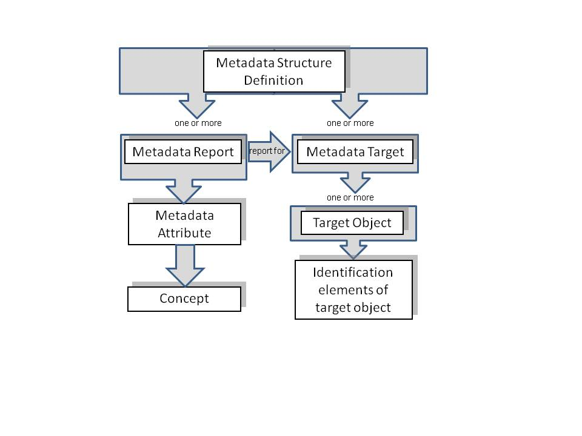
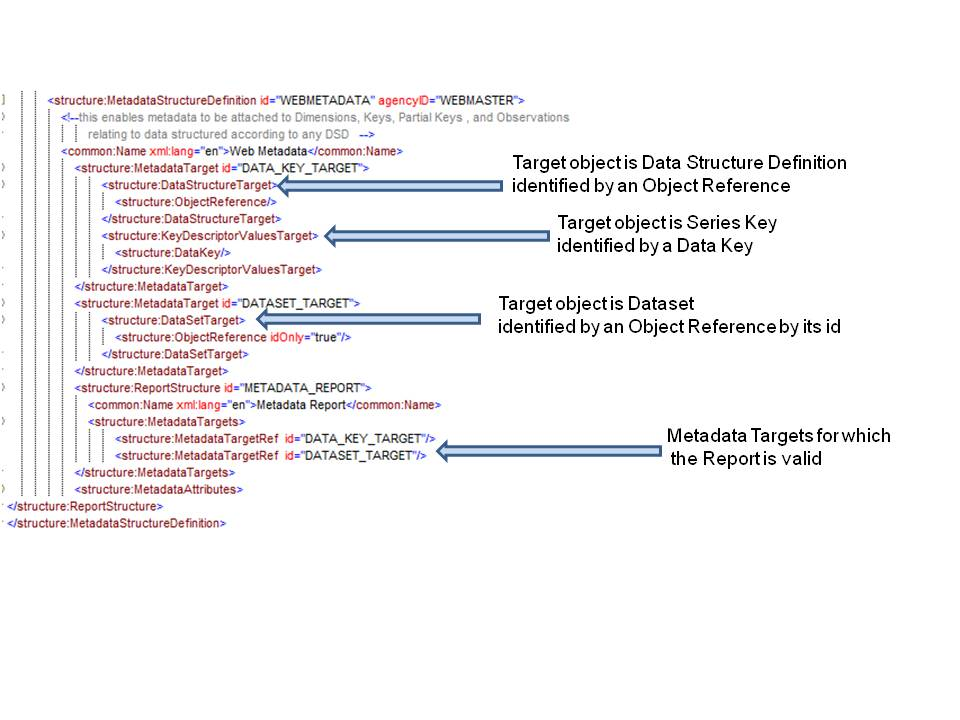
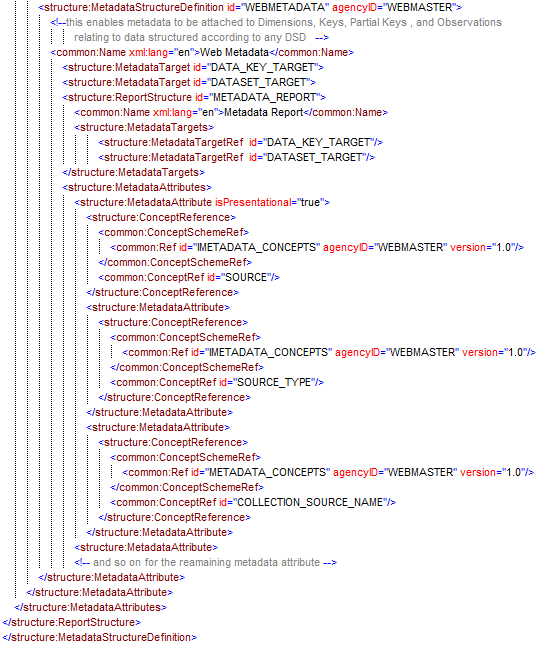
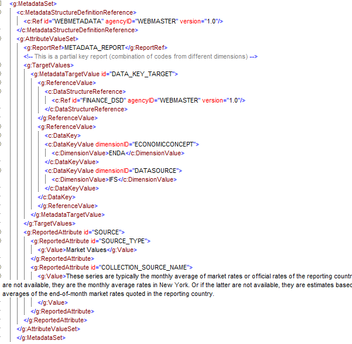
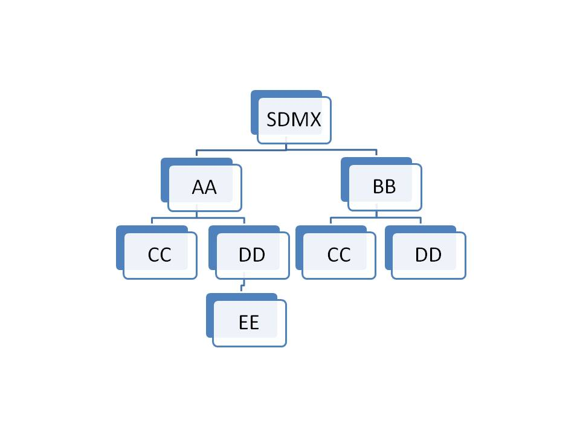
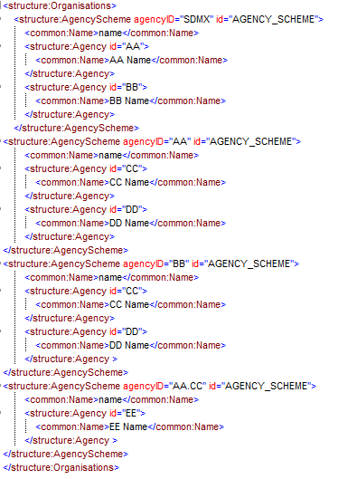
.. |image6| image:: ./media-SDMX_2_1_SECTION_6_TechnicalNotes_2_0/media/image8.png
.. |image7| image:: ./media-SDMX_2_1_SECTION_6_TechnicalNotes_2_0/media/image9.emf
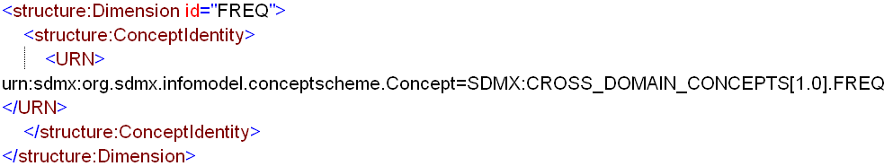
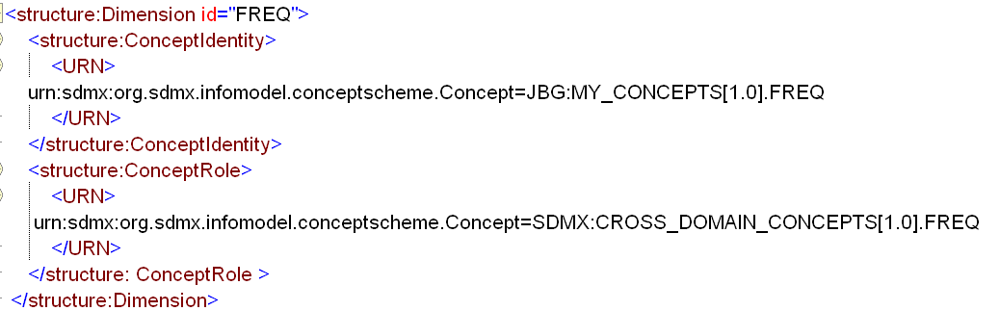
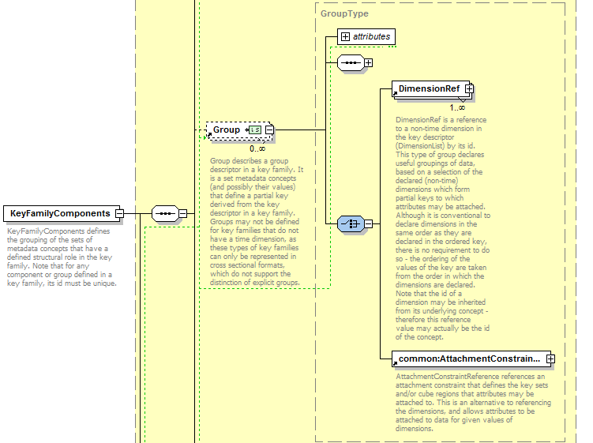
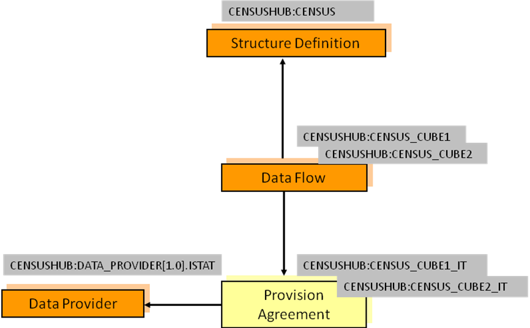
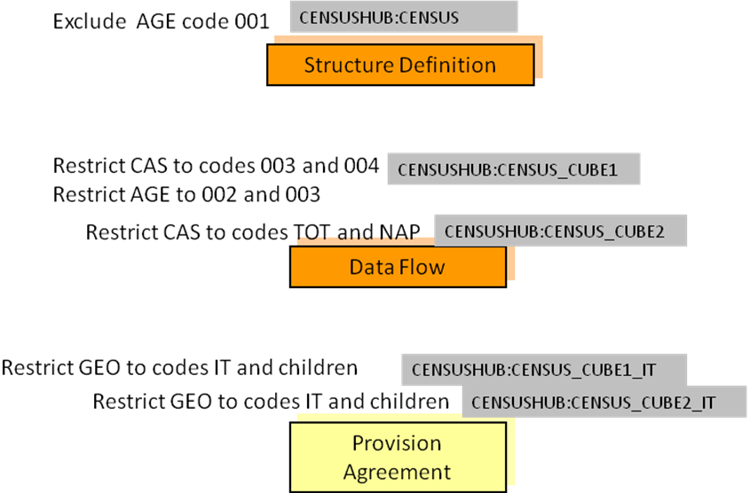
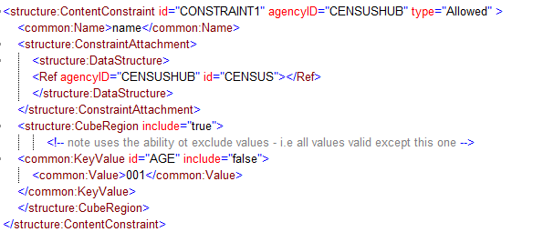
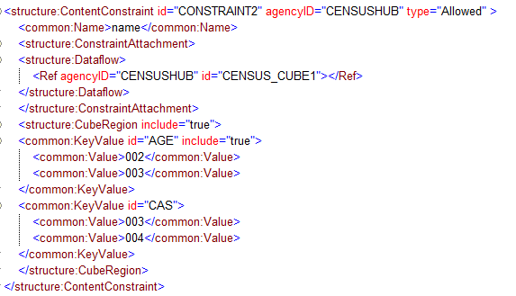
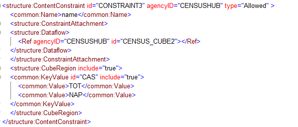
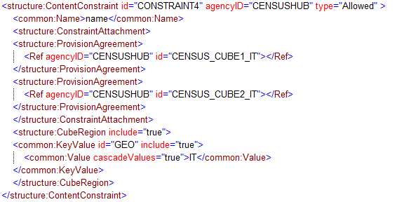
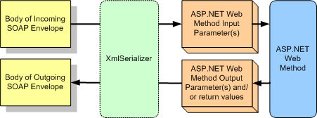

