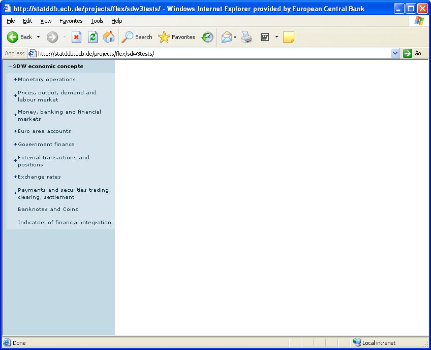
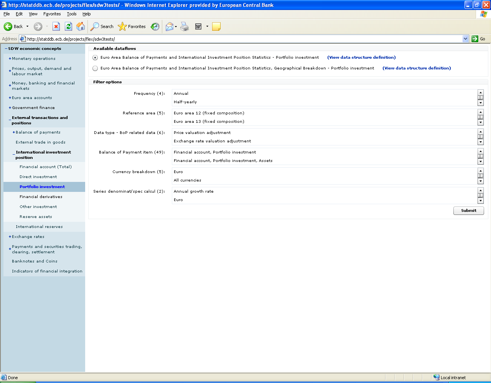
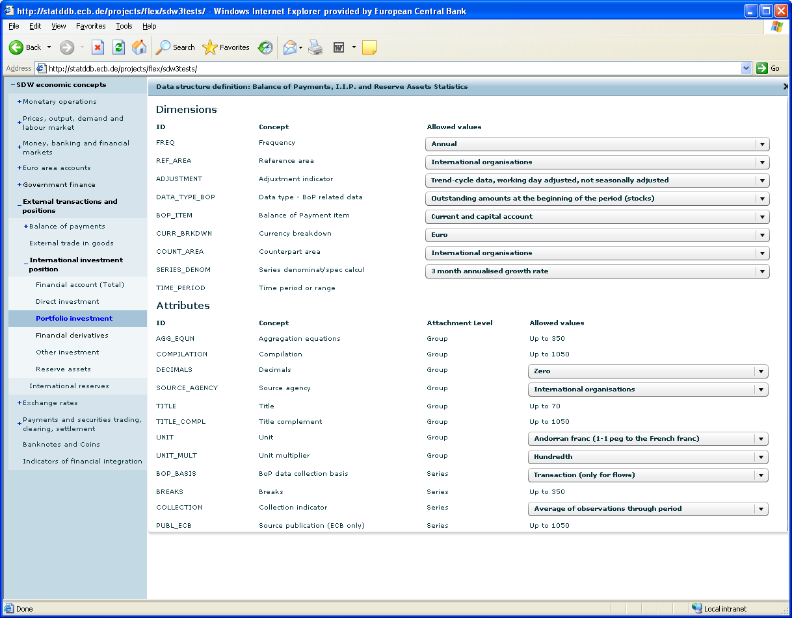
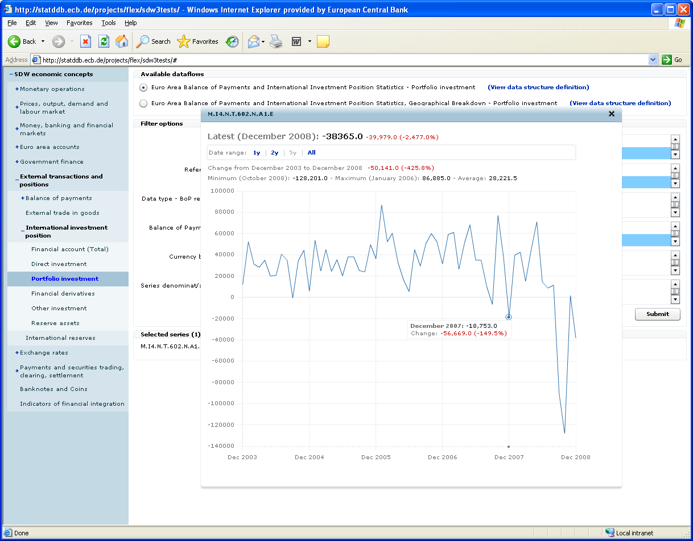

SDMX STANDARDS: SECTION 7

GUIDELINES FOR THE

USE OF WEB SERVICES

Version 2.1

April 2011

© SDMX 2011

http://www.sdmx.org/

Contents

`1 Introduction 1 <#introduction>`__

`2 Web Services and SDMX-ML 1 <#web-services-and-sdmx-ml>`__

`3 SOAP-Based SDMX Web Services: WSDL Operations and Behaviours
3 <#soap-based-sdmx-web-services-wsdl-operations-and-behaviours>`__

`3.1 Introduction 3 <#introduction-1>`__

`3.2 The SDMX Web-Services Namespace
3 <#the-sdmx-web-services-namespace>`__

`3.3 Support for WSDL Operations 3 <#support-for-wsdl-operations>`__

`3.4 List of WSDL Operations 3 <#list-of-wsdl-operations>`__

`3.4.1 Data 3 <#data>`__

`3.4.2 Metadata 4 <#metadata>`__

`3.4.3 Structure usage 4 <#structure-usage>`__

`3.4.4 Structure 4 <#structure>`__

`3.4.5 Item scheme 5 <#item-scheme>`__

`3.4.6 Other maintainable artefacts 5 <#other-maintainable-artefacts>`__

`3.4.7 XML Schemas (XSD) 6 <#xml-schemas-xsd>`__

`3.4.8 Generic query for structural metadata
6 <#generic-query-for-structural-metadata>`__

`3.5 Other Behaviours 6 <#other-behaviours>`__

`3.5.1 Versioning Defaults 6 <#versioning-defaults>`__

`3.5.2 Resolving References and Specifying Returned Objects
6 <#resolving-references-and-specifying-returned-objects>`__

`3.5.3 Enabling compression 6 <#enabling-compression>`__

`3.5.4 Implementation of the SOAP based SDMX Web Services
6 <#implementation-of-the-soap-based-sdmx-web-services>`__

`3.5.5 Compliance with WS-I 7 <#compliance-with-ws-i>`__

`4 SDMX RESTful API 7 <#sdmx-restful-api>`__

`4.1 A Brief Introduction to REST 7 <#a-brief-introduction-to-rest>`__

`4.2 Scope of the API 7 <#scope-of-the-api>`__

`4.3 Structural Metadata Queries 8 <#structural-metadata-queries>`__

`4.3.1 Resources 8 <#resources>`__

`4.3.2 Parameters 9 <#parameters>`__

`4.3.3 Examples 12 <#examples>`__

`4.4 Data and Metadata Queries 13 <#data-and-metadata-queries>`__

`4.4.1 Resources 13 <#resources-1>`__

`4.4.2 Parameters 13 <#parameters-1>`__

`4.4.3 Examples 17 <#examples-1>`__

`4.5 Schema queries 18 <#schema-queries>`__

`4.5.1 Resources 18 <#resources-2>`__

`4.5.2 Parameters 18 <#parameters-2>`__

`4.5.3 Examples 19 <#examples-2>`__

`4.6 Selection of the Appropriate Representation
20 <#selection-of-the-appropriate-representation>`__

`4.7 Enabling data compression 21 <#enabling-data-compression>`__

`5 Standard Errors for SDMX Web Services
21 <#standard-errors-for-sdmx-web-services>`__

`5.1 Introduction 21 <#introduction-2>`__

`5.2 Error handling in REST Web Service
21 <#error-handling-in-rest-web-service>`__

`5.3 SOAP Web Service 21 <#soap-web-service>`__

`5.4 Error categories 21 <#error-categories>`__

`5.5 Client-Caused Errors 22 <#client-caused-errors>`__

`5.5.1 No results found – 100 22 <#no-results-found-100>`__

`5.5.2 Unauthorized – 110 22 <#unauthorized-110>`__

`5.5.3 Response Too Large Due to Client Request 130
22 <#response-too-large-due-to-client-request-130>`__

`5.5.4 Syntax error – 140 22 <#syntax-error-140>`__

`5.5.5 Semantic error – 150 22 <#semantic-error-150>`__

`5.6 Server-Caused Errors 22 <#server-caused-errors>`__

`5.6.1 Internal Server Error – 500 22 <#internal-server-error-500>`__

`5.6.2 Not implemented – 501 22 <#not-implemented-501>`__

`5.6.3 Service unavailable – 503 23 <#service-unavailable-503>`__

`5.6.4 Response size exceeds service limit - 510
23 <#response-size-exceeds-service-limit---510>`__

`5.7 Custom Errors – 1000+ 23 <#custom-errors-1000>`__

`5.8 SDMX to HTTP Error Mapping 23 <#sdmx-to-http-error-mapping>`__

`6 Annex: Examples 24 <#annex-examples>`__

`6.1 Sample Queries for a Web Services Client
24 <#sample-queries-for-a-web-services-client>`__

`6.1.1 Step 1: Browsing an SDMX data source, using a list of
subject-matter domains
24 <#step-1-browsing-an-sdmx-data-source-using-a-list-of-subject-matter-domains>`__

`6.1.1.3 Request using the SOAP API 24 <#request-using-the-soap-api>`__

`6.1.2 STEP 2: Selecting a dataflow 25 <#step-2-selecting-a-dataflow>`__

`6.1.2.3 Request using the SOAP API
26 <#request-using-the-soap-api-1>`__

`6.1.3 STEP 3: Data selection 28 <#step-3-data-selection>`__

`6.1.3.3 Request using the SOAP API
28 <#request-using-the-soap-api-2>`__

`6.2 Sample Error Element in an SDMX message
30 <#sample-error-element-in-an-sdmx-message>`__

`6.3 Soap Fault example 31 <#soap-fault-example>`__

Introduction
============

Web services represent the current generation of Internet technologies.
They allow computer applications to exchange data directly over the
Internet, essentially allowing modular or distributed computing in a
more flexible fashion than ever before. In order to allow web services
to function, however, many standards are required: for requesting and
supplying data; for expressing the enveloping data which is used to
package exchanged data; for describing web services to one another, to
allow for easy integration into applications that use other web services
as data resources.

SDMX, with its focus on the exchange of data using Internet technologies
provides some of these standards relating to statistical data and
metadata. Many web-services standards already exist, however, and there
is no need to re-invent them for use specifically within the statistical
community. Specifically, SOAP (which originally stood for the “Simple
Object Access Protocol”) and the Web Services Description Language
(WSDL) can be used by SDMX to complement the data and metadata exchange
formats they are standardizing. In the web services world, the REST
(“Representational State Transfer”) protocol is also often used, relying
on a URL-based syntax to invoke web services. Such REST-based services
can be described in a standard fashion using WADL (“Web Application
Description Language”), in the same way that XML-invoked web services
based on SOAP can be described using WSDL.

Despite the promise of SOAP and WSDL, it became evident from early
implementations by vendors that these were not, in fact, interoperable.
It was for this reason that the Web Services - Interoperability (WS-I)
initiative was started. This consists of a group of vendors who have all
implemented the same web-services standards the same way, and have
verified this fact by doing interoperability tests. They publish
profiles describing how to use web services standards interoperably.
SDMX uses the work of WS-I as appropriate to meet the needs of the
statistical community.

This document provides several SDMX-specific guidelines for using the
existing standards in a fashion which will promote interoperability
among SDMX web services, and allow for the creation of generic client
applications which will be able to communicate meaningfully with any
SDMX web service which implements these guidelines.

Much of the content of this document is not normative – instead the
intention is to suggest a best practice in using SDMX-ML documents and
web services standards for the exchange of statistical data and
metadata. However, the SDMX WSDL and WADL files that formalise, in XML,
the APIs described in this document are normative.

Web Services and SDMX-ML
========================

Conventional applications and services traditionally expose their
functionality through application programming interfaces (APIs). Web
services are no different – they provide a public version of the
function calls which can be accessed over the web using web-services
protocols (SOAP or REST). In order to make a set of web services
interoperate, it is necessary to have a standard abstraction, or model,
on which these public functions are based. SDMX benefits from having a
common information model, and it is a natural extension to use the SDMX
Information Model as the basis for standard web-services function calls.

Web services exchange data in an XML format: this is how the data passed
between web services is formatted. SDMX-ML, as a standard XML for
exchanging data and structural metadata within the statistical realm,
provides a useful XML format for the public serialization of
web-services data. While there are some techniques for simple
web-services data exchanges – remote procedure calls (RPCs) – which are
often used, the use of a set of XML exchanges based on a common
information model is seen as a better approach for achieving
interoperability.

There are several different document types available within SDMX-ML, and
all are potentially important to the creators and users of SDMX web
services.

1. **The "Structure" Message:** This message describes the concepts,
   data and metadata structure definitions, and code lists which define
   the structure of statistical data and reference metadata. Every
   SDMX-compliant data set or metadata set must have a data or metadata
   structure definition described for it. This XML description must be
   available from an SDMX web service when it is asked for.

2. **The "Generic" Data Message:** This is the "generic" way of marking
   up an SDMX data set. This schema describes a
   non-data-structure-definition-specific format for exchanging SDMX
   data, and it is a requirement that every SDMX data web service makes
   its data available in at least this form. It is expected that, in
   many instances, other data-structure-definition-specific XML forms
   for expressing data will also be supported in parallel services.

3. **The "Structure Specific" Data Message:** This is a standard schema
   format derived from the structure description using a standardized
   mapping, and many standard tags. It is specific to the structure of a
   particular data structure definition, and so every data structure
   definition will have its own "structure specific" schemas. It is
   designed to enable the exchange of large data sets, This is a data
   format that a web service may wish to provide, depending on the
   requirements of the data they exchange.

4. **The "Query" Messages:** This is the set of messages used to invoke
   SOAP-based SDMX web services. These messages all conform in a
   consistent way to a master template, but are decomposed into specific
   queries to allow each service to support only those fields in the
   template message which are meaningful to it. These query messages are
   generic across all data and metadata structure definitions, making
   queries in terms of the values specified for the concepts of a
   specific structure (as specified in a structure description). It
   allows users to query for data, concepts, code lists, data and
   metadata structure definitions.

5. **The “RegistryInterfaces” Message:** All of the Registry Interfaces
   are sub-elements of this SDMX-ML Message type. They are more fully
   described in the SDMX Registry Specification.

6. **The “Generic” Metadata Message:** This is a message used to report
   reference metadata concepts, which is generic across all types of
   reference metadata structural descriptions.

7. **The “Structure Specific” Metadata Message:** This is a message used
   to report reference metadata concepts specific to a particular
   metadata structure definition.

SOAP-Based SDMX Web Services: WSDL Operations and Behaviours
============================================================

.. _introduction-1:

Introduction
------------

This section addresses the operations and behaviours specific to
SOAP-based Web Services. Most important is a list of standard WSDL
operations, which will form the basis of, and be accompanied by, actual
standard WSDL XML instances, for use in development packages. There are
also several guidelines for the implementation of web services, to
support interoperability.

All SDMX SOAP web services should be described using WSDL instances. The
global element for each XML data and metadata format within SDMX should
be specified as the content of the replies to each exchange. The
function names for each identified pattern are specified below, along
with the type of SDMX-ML payload.

Because SOAP RPC is not supported, the “parameters” of each function are
simply an instance of the appropriate SDMX-ML message type. As noted
above, <wsdl:import> should be used to specify the schema for a
multiple-message exchange. The distributed WSDL files illustrate how
SOAP messages should be used.

The SDMX Web-Services Namespace
-------------------------------

The SDMX Web Services namespace [1]_ contains a set of messages specific
to the use of SOAP-based services. Each of the operations described will
have a message to invoke the Web-Service, and a response message. In
each case, these are refinements of other SDMX messages, appropriate to
the operation being performed – these are described in the list of
operations, below.

Additionally, there is a list of error codes to be used in the SOAP
envelope (see the `standard error codes
section <#standard-errors-for-sdmx-web-services>`__).

Support for WSDL Operations
---------------------------

An SDMX web service must support all of the listed operations, even if
the support is minimal, and only involves the generation of an error
explaining that the requested operation has not been implemented. This
is necessary for the sake of interoperability.

List of WSDL Operations
-----------------------

For the use of SOAP and WSDL, the Web Services Interoperability
specification version 1.1 should be followed.

Data
~~~~

GetStructureSpecificData
^^^^^^^^^^^^^^^^^^^^^^^^

This operation is invoked using a GetStructureSpecificDataRequest
message, and receives a GetStructureSpecificDataResponse as a reply.

GetGenericData
^^^^^^^^^^^^^^

This operation is invoked using a GetGenericDataRequest message, and
receives a GetGenericDataResponse as a reply.

GetStructureSpecificTimeSeriesData
^^^^^^^^^^^^^^^^^^^^^^^^^^^^^^^^^^

This operation is invoked using a
GetStructureSpecificTimeSeriesDataRequest message, and receives a
GetStructureSpecificTimeSeriesDataResponse as a reply.

GetGenericTimeSeriesData
^^^^^^^^^^^^^^^^^^^^^^^^

This operation is invoked using a GetGenericTimeSeriesDataRequest
message, and receives a GetGenericTimeSeriesDataResponse as a reply.

Metadata
~~~~~~~~

GetGenericMetadata
^^^^^^^^^^^^^^^^^^

This operation is invoked using a GetGenericMetadataRequest message, and
receives a GetGenericMetdataResponse as a reply.

GetStructureSpecificMetadata
^^^^^^^^^^^^^^^^^^^^^^^^^^^^

This operation is invoked using a GetStructureSpecificRequest message,
and receives a GetStructureSpecificResponse as a reply.

Structure usage
~~~~~~~~~~~~~~~

GetDataflow
^^^^^^^^^^^

This operation is invoked using a GetDataflowRequest message, and
receives a GetDataflowResponse as a reply.

GetMetadataflow
^^^^^^^^^^^^^^^

This operation is invoked using a GetMetadataflowRequest message, and
receives a GetMetadataflowResponse as a reply.

Structure
~~~~~~~~~

GetDataStructure 
^^^^^^^^^^^^^^^^^

This operation is invoked using a GetDataStructureRequest message, and
receives a GetDataStructureResponse as a reply.

GetMetadataStructure
^^^^^^^^^^^^^^^^^^^^

This operation is invoked using a GetMetadataStructureRequest message,
and receives a GetMetadataStructureResponse as a reply.

Item scheme
~~~~~~~~~~~

GetCategoryScheme
^^^^^^^^^^^^^^^^^

This operation is invoked using a GetCategorySchemeRequest message, and
receives a GetCategorySchemeResponse as a reply.

GetConceptScheme 
^^^^^^^^^^^^^^^^^

This operation is invoked using a GetConceptSchemeRequest message, and
receives a GetConceptSchemeResponse as a reply.

GetCodelist 
^^^^^^^^^^^^

This operation is invoked using a GetCodelistRequest message, and
receives a GetCodelistResponse as a reply.

GetHierarchicalCodelist
^^^^^^^^^^^^^^^^^^^^^^^

This operation is invoked using a GetHierarchicalCodelistRequest
message, and receives a GetHierarchicalCodelistResponse as a reply.

GetOrganisationScheme
^^^^^^^^^^^^^^^^^^^^^

This operation is invoked using a GetOrganisationsSchemeRequest message,
and receives a GetOrganisationSchemeResponse as a reply.

GetReportingTaxonomy
^^^^^^^^^^^^^^^^^^^^

This operation is invoked using a GetReportingTaxonomyRequest message,
and receives a GetReportingTaxonomyResponse as a reply.

Other maintainable artefacts
~~~~~~~~~~~~~~~~~~~~~~~~~~~~

GetStructureSet
^^^^^^^^^^^^^^^

This operation is invoked using a GetStructureSetRequest message, and
receives a GetStructureSetResponse as a reply.

GetProcess
^^^^^^^^^^

This operation is invoked using a GetProcessRequest message, and
receives a GetProcessResponse as a reply.

GetCategorisation
^^^^^^^^^^^^^^^^^

This operation is invoked using a GetCategorisationRequest message, and
receives a GetCategorisationResponse as a reply.

GetProvisionAgreement 
^^^^^^^^^^^^^^^^^^^^^^

This operation is invoked using a GetProvisionAgreementRequest message,
and receives a GetProvisionAgreementResponse as a reply.

GetConstraint
^^^^^^^^^^^^^

This operation is invoked using a GetConstraintRequest message, and
receives a GetConstraintResponse as a reply.

XML Schemas (XSD)
~~~~~~~~~~~~~~~~~

GetDataSchema
^^^^^^^^^^^^^

This operation is invoked using a GetDataSchemaRequest message, and
receives a GetDataSchemaResponse as a reply.

GetMetadataSchema
^^^^^^^^^^^^^^^^^

This operation is invoked using a GetMetadataSchemaRequest message, and
receives a GetMetadataSchemaResponse as a reply.

Generic query for structural metadata
~~~~~~~~~~~~~~~~~~~~~~~~~~~~~~~~~~~~~

GetStructures
^^^^^^^^^^^^^

This operation is invoked using a GetStructuresRequest message, and
receives a GetStructuresResponse as a reply.

Other Behaviours
----------------

Versioning Defaults
~~~~~~~~~~~~~~~~~~~

When no version is specified in the message invoking a service, the
default is to return the last production version of the resource(s)
requested.

Resolving References and Specifying Returned Objects
~~~~~~~~~~~~~~~~~~~~~~~~~~~~~~~~~~~~~~~~~~~~~~~~~~~~

**Version 2.1 of the SDMX-ML Query message offers new functionality to
resolve reference and specify the type of objects to be returned. The
SOAP API relies on this mechanism for resolving references and
specifying returned objects. See Section “\ **\ `Applicability and
meaning of references
attribute <#applicability-and-meaning-of-references-attribute>`__\ **\ ”.**

Enabling compression
~~~~~~~~~~~~~~~~~~~~

Compression should be enabled using the appropriate HTTP Header field
(Accept-Encoding).

Implementation of the SOAP based SDMX Web Services
~~~~~~~~~~~~~~~~~~~~~~~~~~~~~~~~~~~~~~~~~~~~~~~~~~

In the SDMX Web Services, the development is Contract-First since the
WSDL has been specified by the standard. Furthermore it is a Web Service
of already prepared XML messages requests/responses, i.e. the interfaces
for the application logic are the XML messages. Therefore there is no
need to generate stubs for serialisation and de-serialisation of the
SOAP payloads from/to the native language classes. The indicative way is
to have full control on the XML messages requests/responses. When using
the automatic generation of code it will include an extra element for
the parameter of the operation in the SOAP request according to the RPC
paradigm, and to the SOAP specifications that is not desired according
to the standardised SDMX WSDL.

When using Apache Axis in Java, an interface for the service is offered
by the toolkit that reads/returns the XML payloads using DOM elements
(DOMElement in Axis2). Moreover when using the Java API for XML Web
Services (JAX-WS), the developer can use the Provider<SOAPMessage>
interface, where he is responsible for creating the SOAP request and
response messages as well as specifying the standardised WSDL of the
service.

However in the .NET environment there is no similar solution for this.
The developer of the service will have to use the XmlAnyElement
parameter for the .NET web methods. This specifies that the parameter of
the Service method can be any XML element thus allows the developer to
take control of the XML payload. The details of this approach are
presented in the “Annex I: How to eliminate extra element in the .NET
SDMX Web Service” in the section 06 of the SDMX documentation.

Compliance with WS-I
~~~~~~~~~~~~~~~~~~~~

To ensure interoperability between SDMX web services, compliance with
sections of the WS-I Profile 1.1 is recommended for all SDMX web
services. The documentation can be found at
http://www.ws-i.org/Profiles/BasicProfile-1.1-2004-08-24.html. The
recommended sections are those concerning the use of SOAP and WSDL.
UDDI, while useful for advertising the existence of SDMX web services,
is not necessarily central to SDMX interoperability.

SDMX RESTful API
================

A Brief Introduction to REST
----------------------------

This SDMX API is based on the REST principles, as described below:

-  In REST, specific information is known as “\ **Resource**\ ”. In
   SDMX, specific resources would be, for example, code lists, concept
   schemes, data structure definitions, dataflows, etc. Each resource is
   addressable via a **global identifier** (i.e.: a URI).

-  Manipulating resources is done using **methods defined in the HTTP
   protocol** (e.g.: GET, POST, PUT, DELETE). This API focuses on data
   retrieval, and, therefore, only the usage of HTTP GET is covered in
   this document.

-  A resource can be represented in various formats (such as the
   different flavours and versions of the SDMX-ML standard). Selection
   of the appropriate **representation** is done using HTTP Content
   Negotiation and the HTTP Accept request header.

Scope of the API
----------------

The RESTful API focuses on simplicity. The aim is not to replicate the
full semantic richness of the SDMX-ML Query message but to make it
simple to perform a limited set of standard queries. Also, in contrast
to other parts of the SDMX specification, the RESTful API focuses solely
on data retrieval (via HTTP GET). More specifically, the API allows:

-  To retrieve structural metadata, using a combination of id, agencyID
   and version number.

-  To retrieve statistical data or reference metadata using keys (with
   options for wildcarding and support for the OR operator), data or
   metadata flows and data or metadata providers.

-  To further refine queries for statistical data or reference metadata
   using time information (start period and end period).

-  To retrieve updates and revisions only.

-  To return the results of a query in various formats. The desired
   format and version of the returned message will be specified using
   HTTP Content Negotiation (and the HTTP Accept request header).

-  For structural metadata, it is possible to instruct the web service
   to resolve references (for instance, when querying for data structure
   definitions, it is possible to also retrieve the concepts and code
   lists used in the returned data structure definitions), as well as
   artefacts that use the matching artefact (for example, to retrieve
   the dataflows that use a matching data structure definition).

-  For structural metadata, it is possible to retrieve a minimal version
   of the artefact, for the sake of efficiency (for example, to retrieve
   all code lists – names, ids, etc – without the codes).

-  A distinction should be established between the elements that allow
   identifying the resource to be retrieved and the elements that give
   additional information about, or allow to further filter, the desired
   results. Elements belonging to the 1\ :sup:`st` category are
   specified in the path part of the URL while elements belonging to the
   2\ :sup:`nd` category are specified in the query string part of the
   URL.

Structural Metadata Queries
---------------------------

Resources
~~~~~~~~~

The following resources are defined:

-  datastructure [2]_

-  metadatastructure [3]_

-  categoryscheme

-  conceptscheme

-  codelist

-  hierarchicalcodelist

-  organisationscheme [4]_

-  agencyscheme [5]_

-  dataproviderscheme

-  dataconsumerscheme

-  organisationunitscheme

-  dataflow

-  metadataflow

-  reportingtaxonomy

-  provisionagreement

-  structureset

-  process

-  categorisation

-  contentconstraint

-  attachmentconstraint

-  structure [6]_

Parameters
~~~~~~~~~~

Parameters used for identifying a resource
^^^^^^^^^^^^^^^^^^^^^^^^^^^^^^^^^^^^^^^^^^

The following parameters are used for identifying resources:

========== ==================================================== ==================================================
Parameter  Type                                                 Description
========== ==================================================== ==================================================
agencyID   A string compliant with the SDMX common:NCNameIDType The agency maintaining the artefact to be returned
resourceID A string compliant with the SDMX common: IDType      The id of the artefact to be returned
version    A string compliant with the SDMX common:VersionType  The version of the artefact to be returned
========== ==================================================== ==================================================

The parameters mentioned above are specified using the following syntax:

protocol:// ws-entry-point/resource/agencyID/resourceID /version

Furthermore, some keywords may be used:

======== ========== ========================================================================
Keyword  Scope      Description
======== ========== ========================================================================
all [7]_ agencyID   Returns artefacts maintained by any maintenance agency\ :sup:`8`
all      resourceID Returns all resources of the type defined by the resource parameter [8]_
all      version    Returns all versions of the resource
latest   version    Returns the latest version in production of the resource\ :sup:`8`
======== ========== ========================================================================

The following rules apply:

-  If no version is specified, the version currently used in production
   should be returned. It is therefore equivalent to using the keyword
   “latest”.

-  If no agencyID is specified, the matching artefacts maintained by any
   maintenance agency should be returned. It is therefore equivalent to
   using the keyword “all” [9]_.

-  If no resourceID is specified, all matching artefacts (according to
   the other criteria used) should be returned. It’s is therefore
   equivalent to using the keyword “all”.

-  If no parameters are specified, the “latest” version of “all”
   resources of the type identified by the resource parameter,
   maintained by any maintenance agency should be returned.

Parameters used to further describe the desired results
^^^^^^^^^^^^^^^^^^^^^^^^^^^^^^^^^^^^^^^^^^^^^^^^^^^^^^^

The following parameters are used to further describe the desired
results, once the resource has been identified. As mentioned in
`3.2 <#scope-of-the-api>`__, these parameters appear in the query string
part of the URL.

========== ====== ========================================================================================================================================================================================================================================================================================================================================================================================================================================================================================================================================================================================================================================================================================================================================================================================================================================================================================================================================================================================================= =======
Parameter  Type   Description                                                                                                                                                                                                                                                                                                                                                                                                                                                                                                                                                                                                                                                                                                                                                                                                                                                                                                                                                                                               Default
========== ====== ========================================================================================================================================================================================================================================================================================================================================================================================================================================================================================================================================================================================================================================================================================================================================================================================================================================================================================================================================================================================================= =======
detail     String This attribute specifies the desired amount of information to be returned. For example, it is possible to instruct the web service to return only basic information about the maintainable artefact (i.e.: id, agency id, version and name). Most notably, items of item schemes will not be returned (for example, it will not return the codes in a code list query). Possible values are: “allstubs” (all artefacts should be returned as stubs [10]_), “referencestubs” (referenced artefacts should be returned as stubs [11]_) and full (all available information for all artefacts should be returned [12]_).                                                                                                                                                                                                                                                                                                                                                                                     full
references String This attribute instructs the web service to return (or not) the artefacts referenced by the artefact to be returned (for example, the code lists and concepts used by the data structure definition matching the query), as well as the artefacts that use the matching artefact (for example, the dataflows that use the data structure definition matching the query). Possible values are: “none” (no references will be returned), “parents” (the artefacts that use the artefact matching the query), “parentsandsiblings” (the artefacts that use the artefact matching the query, as well as the artefacts referenced by these artefacts), “children” (artefacts referenced by the artefact to be returned), “descendants” (references of references, up to any level, will also be returned), “all” (the combination of parentsandsiblings and descendants). In addition, a concrete type of resource, as defined in `3.3.1 <#resources>`__, may also be used (for example, references=codelist). none
========== ====== ========================================================================================================================================================================================================================================================================================================================================================================================================================================================================================================================================================================================================================================================================================================================================================================================================================================================================================================================================================================================================= =======

Applicability and meaning of references attribute
^^^^^^^^^^^^^^^^^^^^^^^^^^^^^^^^^^^^^^^^^^^^^^^^^

The table below lists the artefacts that will be returned if the
references parameter is set to “all”.

=========================== ============================
**Maintainable artefact**   **Artefacts returned**
=========================== ============================
Categorisation              All
CategoryScheme              Categorisations
Codelist                    HierarchicalCodelist
ConceptScheme               Codelists
Constraint                  OrganisationSchemes
                            DataProviderSchemes
                            DataStructureDefinitions
                            Dataflows
                            MetadataStructureDefinitions
                            Metadataflows
                            ProvisionAgreements
Dataflow                    Constraints
                            DataStructureDefinitions
                            ProvisionAgreements
                            ReportingTaxonomies
                            StructureSets
DataProviderScheme          Constraint
                            ProvisionAgreement
HierarchicalCodelist        Codelists
DataStructureDefinition     Codelists
                            ConceptSchemes
                            Constraints
                            Dataflows
                            StructureSets
Metadataflow                Constraints
                            MetadataStructureDefinitions
                            ProvisionAgreements
                            ReportingTaxonomies
                            StructureSets
MetadataStructureDefinition ConceptSchemes
                            Codelists
                            DataProviderSchemes
                            DataConsumerSchemes
                            AgencySchemes
                            OrganisationSchemes
                            Constraints
                            Metadataflows
                            StructureSets
OrganisationScheme          None
Process                     All
ProvisionAgreement          DataProviderSchemes
                            Dataflows
                            Metadataflows
ReportingTaxonomy           Dataflows
                            Metadataflows
StructureSet                DataStructureDefinitions
                            MetadataStructureDefinitions
                            CategorySchemes
                            DataProviderSchemes
                            DataConsumerSchemes
                            AgencySchemes
                            OrganisationSchemes
                            ConceptSchemes
                            Codelists
                            HierarchicalCodelists
=========================== ============================

Examples
~~~~~~~~

| - To retrieve version 1.0 of the DSD with id ECB_EXR1 maintained by
  the ECB, as well as the code lists and the concepts used in the DSD:
| http://ws-entry-point/datastructure/ECB/ECB_EXR1/1.0?references=children

- To retrieve the latest version in production of the DSD with id
ECB_EXR1 maintained by the ECB, without the code lists and concepts of
the DSD:

http://ws-entry-point/datastructure/ECB/ECB_EXR1

- To retrieve all DSDs maintained by the ECB, as well as the dataflows
using these DSDs:

http://ws-entry-point/datastructure/ECB?references=dataflow

- To retrieve the latest version in production of all code lists
maintained by all maintenance agencies, but without the codes:

`http://ws-entry-point/codelist?detail=allstubs <http://ws-entry-point/codelist?detail=allstubs%20>`__

- To retrieve, as stubs, the latest version in production of all
maintainable artefacts maintained by the ECB:

http://ws-entry-point/structure/ECB?detail=allstubs

Data and Metadata Queries
-------------------------

.. _resources-1:

Resources
~~~~~~~~~

The following resources should be supported:

-  data

-  metadata

.. _parameters-1:

Parameters
~~~~~~~~~~

.. _parameters-used-for-identifying-a-resource-1:

Parameters used for identifying a resource
^^^^^^^^^^^^^^^^^^^^^^^^^^^^^^^^^^^^^^^^^^

The following parameters are used for identifying resources in data
queries:

================= ==================================================================================================================================================== ==========================================================================================================================================================================================================================================================================================================================================================================================================================================================================================================================================================================================================================================
Parameter         Type                                                                                                                                                 Description
================= ==================================================================================================================================================== ==========================================================================================================================================================================================================================================================================================================================================================================================================================================================================================================================================================================================================================================
flowRef [13]_     A string identifying the dataflow. The syntax is agency id, artefact id, version, separated by a “,”. For example: AGENCY_ID,FLOW_ID,VERSION         The data (or metadata) flow of the data (or metadata) to be returned
                                                                                                                                                                      
                  In case the string only contains one out of these 3 elements, it is considered to be the flow id, i.e. ALL,FLOW_ID,LATEST                           
                                                                                                                                                                      
                  In case the string only contains two out of these 3 elements, they are considered to be the agency id and the flow id, i.e. AGENCY_ID,FLOW_ID,LATEST
key               A string compliant with the KeyType defined in the SDMX WADL.                                                                                        The key of the artefact to be returned. Wildcarding is supported by omitting the dimension code for the dimension to be wildcarded. For example, if the following series key identifies the bilateral exchange rates for the daily US dollar exchange rate against the euro, D.USD.EUR.SP00.A, then the following series key can be used to retrieve the data for all currencies against the euro: D..EUR.SP00.A. The OR operator is supported using the + character. For example, the following series key can be used to retrieve the exchange rates against the euro for both the US dollar and the Japanese Yen: D.USD+JPY.EUR.SP00.A.
providerRef [14]_ A string identifying the provider. The syntax is agency id, provider id, separated by a “,”. For example: AGENCY_ID,PROVIDER_ID.                     The provider of the data (or metadata) to be retrieved. If not supplied, the returned message will contain data (or metadata) provided by any provider.
                                                                                                                                                                      
                  In case the string only contains one out of these 2 elements, it is considered to be the provider id, i.e. ALL,PROVIDER_ID.                         
================= ==================================================================================================================================================== ==========================================================================================================================================================================================================================================================================================================================================================================================================================================================================================================================================================================================================================================

The parameters mentioned above are specified using the following syntax:

protocol://ws-entry-point/resource/flowRef/key/providerRef

Furthermore, some keywords may be used:

========= =========== ===============================================================================================================================
Keyword   Scope       Description
========= =========== ===============================================================================================================================
all       key         Returns all data belonging to the specified dataflow and provided by the specified provider.
all [15]_ providerRef Returns all data matching the supplied key and belonging to the specified dataflow that has been provided by any data provider.
========= =========== ===============================================================================================================================

The following rules apply:

-  If no key is specified, all data (or metadata) belonging to the
   dataflow (or metadataflow) identified by the flowRef should be
   supplied. It is therefore equivalent to using the keyword “all”.

-  If no providerRef is specified, the matching data (or metadata)
   provided by any data provider should be returned. It is therefore
   equivalent to using the keyword “all”.

Parameters used to further filter the desired results
^^^^^^^^^^^^^^^^^^^^^^^^^^^^^^^^^^^^^^^^^^^^^^^^^^^^^

The following parameters are used to further describe (or filter) the
desired results, once the resource has been identified. As mentioned in
`3.2 <#scope-of-the-api>`__, these parameters go in the query string
part of the URL.

============================ ============================================================================================================================================================================================================================================================================================================================================================================================================================================================================================== ========================================================================================================================================================================================================================================================================================================================================================================================================================================================================================================================================================================================================================================================================================================================
Parameter                    Type                                                                                                                                                                                                                                                                                                                                                                                                                                                                                           Description
============================ ============================================================================================================================================================================================================================================================================================================================================================================================================================================================================================== ========================================================================================================================================================================================================================================================================================================================================================================================================================================================================================================================================================================================================================================================================================================================
startPeriod                  common:StandardTimePeriodType, as defined in the SDMXCommon.xsd schema.                                                                                                                                                                                                                                                                                                                                                                                                                        The start period for which results should be supplied (inclusive).
                                                                                                                                                                                                                                                                                                                                                                                                                                                                                                                           
                             Can be expressed using [16]_:                                                                                                                                                                                                                                                                                                                                                                                                                                                                 
                                                                                                                                                                                                                                                                                                                                                                                                                                                                                                                           
                             -  dateTime: all data that falls between the calendar dates will be matched                                                                                                                                                                                                                                                                                                                                                                                                                   
                                                                                                                                                                                                                                                                                                                                                                                                                                                                                                                           
                             -  Gregorian Period: all data that falls between the calendar dates will be matched                                                                                                                                                                                                                                                                                                                                                                                                           
                                                                                                                                                                                                                                                                                                                                                                                                                                                                                                                           
                             -  Reporting Period: all data reported as periods that fall between the specified periods will be returned. When comparing reporting weeks and days to higher order periods (e.g. quarters) one must account for the actual time frames covered by the periods to determine whether the data should be included. Data reported as Gregorian periods or distinct ranges will be returned if it falls between the specified reporting periods, based on a reporting year start day of January 1.
                                                                                                                                                                                                                                                                                                                                                                                                                                                                                                                           
                             In case the : or + characters are used, the parameter must be percent-encoded by the client [17]_.                                                                                                                                                                                                                                                                                                                                                                                            
                                                                                                                                                                                                                                                                                                                                                                                                                                                                                                                           
                             Note that this value is assumed to be inclusive to the range of data being sought.                                                                                                                                                                                                                                                                                                                                                                                                            
endPeriod                    Same as above                                                                                                                                                                                                                                                                                                                                                                                                                                                                                  The end period for which results should be supplied (inclusive).
updatedAfter                 xs:dateTime                                                                                                                                                                                                                                                                                                                                                                                                                                                                                    The last time the query was performed by the client in the database. If this attribute is used, the returned message should only include the latest version of what has changed in the database since that point in time (updates and revisions). This should include:
                                                                                                                                                                                                                                                                                                                                                                                                                                                                                                                           
                                                                                                                                                                                                                                                                                                                                                                                                                                                                                                                            - Observations [18]_ that have been added since the last time the query was performed (INSERT).
                                                                                                                                                                                                                                                                                                                                                                                                                                                                                                                           
                                                                                                                                                                                                                                                                                                                                                                                                                                                                                                                            - Observations that have been revised since the last time the query was performed (UPDATE).
                                                                                                                                                                                                                                                                                                                                                                                                                                                                                                                           
                                                                                                                                                                                                                                                                                                                                                                                                                                                                                                                            - Observations that have been deleted since the last time the query was performed (DELETE).
                                                                                                                                                                                                                                                                                                                                                                                                                                                                                                                           
                                                                                                                                                                                                                                                                                                                                                                                                                                                                                                                            If no offset is specified, default to local time of the web service.
firstNObservations           Positive integer                                                                                                                                                                                                                                                                                                                                                                                                                                                                               Integer specifying the maximum number of observations to be returned for each of the matching series, starting from the first observation
lastNObservations            Positive integer                                                                                                                                                                                                                                                                                                                                                                                                                                                                               Integer specifying the maximum number of observations to be returned for each of the matching series, counting back from the most recent observation
dimensionAtObservation [19]_ A string compliant with the SDMX common:NCNameIDType                                                                                                                                                                                                                                                                                                                                                                                                                                           The ID of the dimension to be attached at the observation level.
detail                       String                                                                                                                                                                                                                                                                                                                                                                                                                                                                                         This attribute specifies the desired amount of information to be returned. For example, it is possible to instruct the web service to return data only (i.e. no attributes). Possible options are: “full” (all data and documentation, including annotations - This is the default), “dataonly” (attributes – and therefore groups – will be excluded from the returned message), “serieskeysonly” (returns only the series elements and the dimensions that make up the series keys. This is useful for performance reasons, to return the series that match a certain query, without returning the actual data), “nodata” (returns the groups and series, including attributes and annotations, without observations).
============================ ============================================================================================================================================================================================================================================================================================================================================================================================================================================================================================== ========================================================================================================================================================================================================================================================================================================================================================================================================================================================================================================================================================================================================================================================================================================================

The table below defines the meaning of parameters combinations:

============================================================= =================================================================================================================================================
startPeriod with no endPeriod                                 Until the most recent
============================================================= =================================================================================================================================================
endPeriod and no startPeriod                                  From the beginning
startPeriod and endPeriod                                     Within the supplied time range
lastNObservations + startPeriod/endPeriod                     The specified number of observations, starting from the end, within the supplied time range
firstNObservations + startPeriod/endPeriod + updatedAfterDate The specified number of observations, starting from the beginning, that have changed since the supplied timestamp, within the supplied time range
updatedAfterDate + startPeriod/endPeriod                      The observations, within the supplied time range, that have changed since the supplied timestamp.
============================================================= =================================================================================================================================================

.. _examples-1:

Examples
~~~~~~~~

-  | To retrieve the data for the series M.USD.EUR.SP00.A supplied by
     the ECB for the ECB_EXR1_WEB dataflow:
   | http://ws-entry-point/data/ECB_EXR1_WEB/M.USD.EUR.SP00.A/ECB

..

   In this example, the assumption is made that the dataflow id
   (ECB_EXR1_WEB) is sufficient to uniquely identify the dataflow, and
   the data provider id (ECB) is sufficient to uniquely identify the
   data provider.

-  To retrieve the data, provided by the ECB for the ECB_EXR1_WEB
   dataflow, for the supplied series keys, using wildcarding for the
   second dimension:

..

   http://ws-entry-point/data/ECB,ECB_EXR1_WEB,LATEST/M..EUR.SP00.A/ECB

   In this example, the full reference to the dataflow is supplied (ECB
   as maintenance agency, ECB_EXR1_WEB as dataflow id and LATEST for the
   version).

-  To retrieve the updates and revisions for the data matching the
   supplied series keys, using the OR operator for the second dimension,
   and using percent encoding for the updatedAfterDate:

..

   http://ws-entry-point/Data/ECB_EXR1_WEB/M.USD+GBP+JPY.EUR.SP00.A?updatedAfter=2009-05-15T14
   %3A 15 %3A 00%2B01%3A00

-  To retrieve the data matching the supplied series key and restricting
   the start and end dates:

..

   http://ws-entry-point/data/ECB_EXR1_WEB/D.USD.EUR.SP00.A?startPeriod=2009-05-01&endPeriod=2009-05-31

Schema queries
--------------

.. _resources-2:

Resources
~~~~~~~~~

The following resource is defined:

-  schema

This resource allows a client to ask a service to return an XML schema,
which defines data (or reference metadata) validity within a certain
context. The service must take into account the constraints that apply
within that context (DSD or MSD, dataflow or metadataflow, or provision
agreement).

.. _parameters-2:

Parameters
~~~~~~~~~~

.. _parameters-used-for-identifying-a-resource-2:

Parameters used for identifying a resource
^^^^^^^^^^^^^^^^^^^^^^^^^^^^^^^^^^^^^^^^^^

The following parameters are used for identifying resources:

========== ===================================================================================================== =============================================================================================================================================================================================================================================================================================================================================================================================================================================================================================================================================================================================================================================================================================================
Parameter  Type                                                                                                  Description
========== ===================================================================================================== =============================================================================================================================================================================================================================================================================================================================================================================================================================================================================================================================================================================================================================================================================================================
context    One of the following: datastructure, metadatastructure, dataflow, metadataflow or provisionagreement. The value of this parameter determines the constraints that need to be taken into account, when generating the schema. If datastructure or metadatastructure is used, constraints attached to the DSD or MSD must be applied when generating the schema. If dataflow or metadataflow is used, constraints attached to the dataflow or metadataflow and to the DSD or MSD used in the dataflow or metadataflow must be applied when generating the schema. If provisionagreement is used, constraints attached to the provision agreement, as well as to the dataflow or metadafalow used in the agreement and the DSD or MSD used in the dataflow or metadataflow must be applied when generating the schema.
agencyID   A string compliant with the SDMX common:NCNameIDType                                                  The agency maintaining the artefact used to generate the schema to be returned.
resourceID A string compliant with the SDMX common: IDType                                                       The id of the artefact used to generate the schema to be returned.
version    A string compliant with the SDMX common:VersionType                                                   The version of the artefact used to generate the schema to be returned.
========== ===================================================================================================== =============================================================================================================================================================================================================================================================================================================================================================================================================================================================================================================================================================================================================================================================================================================

The parameters mentioned above are specified using the following syntax:

protocol:// ws-entry-point/schema/context/agencyID/resourceID/version

Furthermore, a keyword may be used [20]_:

======= ======= ==================================================================
Keyword Scope   Description
======= ======= ==================================================================
latest  version Returns the latest version in production of the resource\ :sup:`8`
======= ======= ==================================================================

The following rules apply:

-  If no version attribute is specified, the version currently used in
   production should be returned. It is therefore equivalent to using
   the keyword “latest”.

.. _parameters-used-to-further-describe-the-desired-results-1:

Parameters used to further describe the desired results
^^^^^^^^^^^^^^^^^^^^^^^^^^^^^^^^^^^^^^^^^^^^^^^^^^^^^^^

The following parameters are used to further describe the desired
results, once the resource has been identified:

====================== ===================================================== ===========================================================================================================
Parameter              Type                                                  Description
====================== ===================================================== ===========================================================================================================
dimensionAtObservation A string compliant with the SDMX common: NCNameIDType The ID of the dimension to be attached at the observation level.
explicitMeasure        Boolean                                               For cross-sectional data validation, indicates whether observations are strongly typed (defaults to false).
====================== ===================================================== ===========================================================================================================

.. _examples-2:

Examples
~~~~~~~~

| - To retrieve the schema for data supplied within the context of
  version 1.0 of the provision agreement EXR_WEB maintained by the ECB:
| `http://ws-entry-point/schema/provisionagreement/ECB/
  EXR_WEB/1.0/ <http://ws-entry-point/schema/provisionagreement/ECB/%20EXR_WEB/1.0/>`__

In this case, the schema returned by the service must take into account
the constraints attached to the provision agreement, the dataflow used
in the provision agreement and the data structure definition used in the
dataflow.

Selection of the Appropriate Representation
-------------------------------------------

Selection of the appropriate formats for the response message is made
using the mechanisms defined for HTTP Content Negotiation [21]_. Using
the HTTP Content Negotiation mechanism, the client specifies the desired
format and version of the resource using the Accept HTTP header [22]_.

Along with official mime types (e.g.: text/html, application/xml, etc),
the standard also defines a syntax allowing a service to define its own
types. The SDMX Restful API makes use of this functionality and the
syntax is as follows:

application/vnd.sdmx.[format]+xml;version=[version [23]_], where
[format] should be replaced with the desired format (i.e. : genericdata,
structurespecificdata, structure, etc) and [version] should be replaced
with one of the versions of the SDMX standard, starting with SDMX 2.1
(e.g.: 2.1, future SDMX versions, etc).

A few examples are listed below

-  SDMX-ML Generic Data Format, version 2.1:
   application/vnd.sdmx.genericdata+xml;version=2.1

-  SDMX-ML Structure Specific Data Format, version 2.1:
   application/vnd.sdmx.structurespecificdata+xml;version=2.1

-  | SDMX-ML Structure Format, version 2.1:
   | application/vnd.sdmx.structure+xml;version=2.1

In case the client does not specify the desired format and version of
the response message, or only specifies the generic application/xml
format, the SDMX RESTful web service should return:

-  The most recent version, that the service support, of the SDMX-ML
   Structure format for structural metadata queries;

-  The most recent version, that the service support, of the SDMX-ML
   Generic Data format for data queries;

-  The most recent version, that the service support, of the SDMX-ML
   Generic Metadata format for metadata queries.

The list below indicates the valid formats for SDMX RESTful web
services, compliant with version 2.1 of the SDMX standard:

-  application/vnd.sdmx.genericdata+xml;version=2.1

-  application/vnd.sdmx.structurespecificdata+xml;version=2.1

-  application/vnd.sdmx.generictimeseriesdata+xml;version=2.1

-  application/vnd.sdmx.structurespecifictimeseriesdata+xml;version=2.1

-  application/vnd.sdmx.genericmetadata+xml;version=2.1

-  application/vnd.sdmx.structurespecificmetadata+xml;version=2.1

-  application/vnd.sdmx.structure+xml;version=2.1

-  application/vnd.sdmx.schema+xml;version=2.1

Enabling data compression
-------------------------

Compression should be enabled using the appropriate HTTP Header field
(Accept-Encoding).

Standard Errors for SDMX Web Services
=====================================

.. _introduction-2:

 Introduction
------------

In SDMX-ML version 2.1 an error element has been implemented in all
messages that would normally be a response to a query, that is:
Structure, MetadataStructure, GenericData, DSDData and Metadata. In case
of an error the error element will be added to the structure:Structures
\| generic:GenericDataSet \| message:DataSet \|
genericmetadata:MetadataSet \| metadatareport:MetadataSet element in the
response message.

The element belongs to Message schemas and use the StatusTextType from
the Common schema file. In the end of this document is an extract from
the schema files showing the error element.

The error part of the XML message supports the 2 following use cases:

-  Any error which is detected before SDMX data is streamed to the
   client will be returned in the Error element defined in the SDMX
   message namespace.

-  If the error occurs after some SDMX data has already been streamed to
   the client, the error information will be supplied via a “footer”
   element in the SDMX payload.

 Error handling in REST Web Service
----------------------------------

RESTful web services should indicate errors using the proper HTTP status
code. In addition, whenever appropriate, the error should also be
returned using the error message offered starting with version 2.1 of
SDMX-ML.

 SOAP Web Service
----------------

SOAP web services should indicate errors using the standard SOAP error
mechanism, using the specific namespace created for this purpose. In
addition, whenever appropriate [24]_, the error should also be returned
using the error message offered starting with version 2.1 of SDMX-ML.

In case of error, the following elements should be set in the SOAP
Envelope:

-  the <faultcode> element for the error number

-  the <faultstring> element for the description

-  the <faultactor> element for the webservice method with the url for
   the webservice prefixed

-  The <detail> element is optional, and can be used by the service
   provider to provide any additional information deemed useful

Error categories
----------------

The numbering of error messages divides the three types of messages up,
and provides for web services to implement custom messages as well:

-  000 – 499: Client-caused "errors"

-  500 – 999: Server-caused "errors"

-  1000 and up: Custom Messages

 Client-Caused Errors
--------------------

No results found – 100 
~~~~~~~~~~~~~~~~~~~~~~~

There is no difference between SOAP and REST webservices for this
message. If the result from the query is empty the webservice should
return this message. This is a way to inform the client that the result
is empty.

Unauthorized – 110
~~~~~~~~~~~~~~~~~~

For use when authentication is needed but has failed or has not yet been
provided.

 Response Too Large Due to Client Request 130
~~~~~~~~~~~~~~~~~~~~~~~~~~~~~~~~~~~~~~~~~~~~

The request results in a response that is larger than the client is
willing or able to process. The client has the possibility, using
SDMX-ML query, to limit the size of the response returned by the server.
In case the response is larger than the limit set by the client, the
server should return this error code.

Syntax error – 140
~~~~~~~~~~~~~~~~~~

This error code is used when:

- SOAP: The supplied SDMX-ML Query message is invalid (XML validation
fails)

- REST: The query string doesn’t comply with the SDMX RESTful interface.

Semantic error – 150
~~~~~~~~~~~~~~~~~~~~

A web service should return this error when a request is syntactically
correct but fails a semantic validation or violates agreed business
rules.

 Server-Caused Errors 
---------------------

Internal Server Error – 500
~~~~~~~~~~~~~~~~~~~~~~~~~~~

The webservice should return this error code when none of the other
error codes better describes the reason for the failure of the service
to provide a meaningful response.

Not implemented – 501
~~~~~~~~~~~~~~~~~~~~~

If the webservice has not yet implemented one of the methods defined in
the API, then the webservice should return this error.

Note: All SDMX web services should implement all the standard
interfaces, even if their only function is to return this error message.
This eases interoperability between SDMX-compliant web services and it
also eases the development of generic SDMX web services clients.

Service unavailable – 503
~~~~~~~~~~~~~~~~~~~~~~~~~

If a web service is temporarily unavailable because of maintenance or
for some other similar reasons, then the webservice should return this
error code.

Response size exceeds service limit - 510
~~~~~~~~~~~~~~~~~~~~~~~~~~~~~~~~~~~~~~~~~

The request results in a response that is larger than the server is
willing or able to process.

In case the service offers the possibility to users to download the
results of large queries at a later stage (for instance, using
asynchronous web services), the web service may choose to indicate the
(future) location of the file, as part of the error message. In SOAP,
this can be done using the error element <faultstring>.

 Custom Errors – 1000+
---------------------

Web services can use codes 1000 and above for the transmission of
service-specific error messages. However, it should be understood that
different services may use the same numbers for different errors, so the
documentation provided by the specific service should be consulted when
implementing this class of errors.

 SDMX to HTTP Error Mapping
--------------------------

The following table maps the SDMX error codes with the HTTP status code
for RESTful web services and indicates how the errors should be returned
in SOAP.

============================================ ============================ ==============
**SDMX error**                               **HTTP error usage in REST** **SOAP usage**
============================================ ============================ ==============
**Client errors**                                                        
100 No results found                         404 Not found                SOAP Fault
110 Unauthorized                             401 Unauthorized             SOAP Fault
130 Response too large due to client request 413 Request entity too large SOAP Fault
140 Syntax error                             400 Bad syntax               SOAP Fault
150 Semantic error                           400 Bad syntax               SOAP Fault
\                                                                        
**Server errors**                                                        
500 Internal Server error                    500 Internal server error    SOAP Fault
501 Not implemented                          501 Not implemented          SOAP Fault
503 Service unavailable                      503 Service unavailable      SOAP Fault
510 Response size exceeds service limit      413 Request entity too large Payload
1000+                                        500 Internal server error    SOAP Fault
============================================ ============================ ==============

Annex: Examples 
================

Sample Queries for a Web Services Client
----------------------------------------

Step 1: Browsing an SDMX data source, using a list of subject-matter domains
~~~~~~~~~~~~~~~~~~~~~~~~~~~~~~~~~~~~~~~~~~~~~~~~~~~~~~~~~~~~~~~~~~~~~~~~~~~~

Use case
^^^^^^^^

The web client offers the possibility to retrieve data by browsing a
list of subject matter domains. The client requests the version
currently in production of the SDW_ECON category scheme, maintained by
the ECB.

|image0|

Request using the RESTful API
^^^^^^^^^^^^^^^^^^^^^^^^^^^^^

http://ws-entry-point/categoryscheme/\ `ECB/SDW_ECON <http://ws-entry-point/CategoryScheme/?detail=ReferenceStubs>`__?references=categorisation

Note: Using the references attribute with a value of “categorisation”,
the categorisations used by the category scheme will also be returned
and these will contain references to the dataflows attached to the
categories.

**Request using the SOAP API**
^^^^^^^^^^^^^^^^^^^^^^^^^^^^^^

<query:CategorySchemeQuery referenceResolution=”Shallow”>

<query:References>

<query:Default/>

</query:References>

<query:CategorySchemeWhere>

<query:ID>SDW_ECON</query:ID>

<query:AgencyID>ECB</query:AgencyID>

</query:CategorySchemeWhere>

</query:CategorySchemeQuery>

Note: For the sake of clarity, the SOAP envelop has been omitted.

Response
^^^^^^^^

An SDMX-ML Structure message containing the category schemes, as well as
the categorisations with references to the dataflows will be returned.
The structure of the SDMX-ML Structure message will be as follow (root
element, header and repeated elements omitted for the sake of clarity):

<structure:Structures>

<structure:CategorySchemes>

<structure:CategoryScheme>

</structure:CategoryScheme>

</structure:CategorySchemes>

<structure:Categorisations>

<structure:DataflowCategorisation>

</structure:DataflowCategorisation>

</structure:Categorisations>

</structure:Structures>

STEP 2: Selecting a dataflow
~~~~~~~~~~~~~~~~~~~~~~~~~~~~

.. _use-case-1:

Use case
^^^^^^^^

Once a subject-matter domain and a dataflow have been selected, a filter
box needs to be populated, to allow users to select data. In order to
only create queries for data that actually exist in the database, the
dataflow constraints will also be requested.

|image1|

.. _request-using-the-restful-api-1:

Request using the RESTful API
^^^^^^^^^^^^^^^^^^^^^^^^^^^^^

In this sample query, the dataflow id is 123456, the agency id is ECB
and the version is 1.2. Using the references attribute, the data
structure definition and the constraints will also be returned.

http://ws-entry-point/dataflow/ECB/123456/1.2?references=all

.. _request-using-the-soap-api-1:

**Request using the SOAP API**
^^^^^^^^^^^^^^^^^^^^^^^^^^^^^^

<query:DataflowQuery>

<query:References>

<query:Default/>

</query:References>

<query:DataflowWhere>

<query:ID>123456</query:ID>

<query:Version>1.2</query:Version>

<query:AgencyID>ECB</query:AgencyID>

</query:DataflowWhere>

</ query:DataflowQuery>

.. _response-1:

Response
^^^^^^^^

An SDMX-ML Structure message containing the requested dataflow, as well
as the data structure definition and the dataflow constraints attached.
The structure of the SDMX-ML Structure message will be as follows (root
element and header omitted):

<structure:Structures>

<structure:Dataflows>

   <structure:Dataflow>

   </structure:Dataflow>

</structure:Dataflows>

<structure:Codelists>

</structure:Codelists>

<structure:Concepts>

</structure:Concepts>

<structure:DataStructures>

</structure:DataStructures>

<structure:Constraints>

   <structure:ContentConstraint>

   </structure:ContentConstraint>

</structure:Constraints>

</structure:Structures>

If, before selecting data, the user wants to review the data structure
definition used by the dataflow, this can be done without sending an
additional query, as this information has already been included in the
response.

|image2|

STEP 3: Data selection
~~~~~~~~~~~~~~~~~~~~~~

.. _use-case-2:

Use case
^^^^^^^^

The user uses the dimension filters, to retrieve the data he is
interested in. |image3|

.. _request-using-the-restful-api-2:

Request using the RESTful API
^^^^^^^^^^^^^^^^^^^^^^^^^^^^^

http://ws-entry-point/data/123456/M.I4.N.9.339+340+341.N.A1.A/ECB?startPeriod=2009-01&endPeriod=2009-12&detail=dataonly

Note: Apart from the dataflow id (123456), the data provider is set to
ECB, and the series key uses the OR operator for the 5\ :sup:`th`
dimension. Furthermore, only data for 2009 should be returned. As the
purpose of the returned data is to be displayed on a graph, the detail
level is set to data only. Therefore, attributes and groups will be
excluded from the returned message. Regarding the references to the
dataflow, the short form is used, as, for this particular web service,
the dataflow id and the data provider id are sufficient to uniquely
identify the dataflow and the data provider respectively. Should this
not be the case, the full reference must be supplied (for example,
ECB+123456+1.2 instead of 123456).

.. _request-using-the-soap-api-2:

**Request using the SOAP API**
^^^^^^^^^^^^^^^^^^^^^^^^^^^^^^

<query:Query>

<query:DataWhere>

<query:DataProvider>

<common:OrganisationSchemeRef>

<common:AgencyID>ECB</common:AgencyID>
<common:ID>DataProviderScheme</common:ID>

</common:OrganisationSchemeRef>

<common:DataProviderRef>

<common:ID>ECB</common:ID>

</common:DataProviderRef>

</query:DataProvider>

<query:StructureUsage>

<common:DataflowReference>

<common:Ref>

<common:AgencyID>ECB</common:AgencyID>

<common:ID>123456</common:ID>

<common:Version>1.2</common:Version>

</common:Ref>

</common:DataflowReference>

</query:StructureUsage>

<query:DimensionValue>

<query:ID>FREQ</query:ID>

<query:Value>M</query:Value>

</query:DimensionValue>

<query:DimensionValue>

<query:ID>REF_AREA</query:ID>

<query:Value>I4</query:Value>

</query:DimensionValue>

<query:DimensionValue>

<query:ID>ADJUSTMENT</query:ID>

<query:Value>N</query:Value>

</query:DimensionValue>

<query:DimensionValue>

<query:ID>DATA_TYPE_BOP</query:ID>

<query:Value>9</query:Value>

</query:DimensionValue>

<query:DimensionValue>

<query:ID>CURR_BRKDWN</query:ID>

<query:Value>N</query:Value>

</query:DimensionValue>

<query:DimensionValue>

<query:ID>COUNT_AREA</query:ID>

<query:Value>A1</query:Value>

</query:DimensionValue>

<query:DimensionValue>

<query:ID>SERIES_DENOM</query:ID>

<query:Value>A</query:Value>

</query:DimensionValue>

<query:TimeDimensionValue>

<query:ID>TIME_PERIOD</query:ID>

<query:TimeValue
operator="GreaterThanOrEqualTo">2009-01</query:TimeValue>

<query:TimeValue operator="LessThanOrEqualTo">2010-12</query:TimeValue>

</query:TimeDimensionValue>

<query:Or>

<query:DimensionValue>

<query:ID>BOP_ITEM</query:ID>

<query:Value>339</query:Value>

</query:DimensionValue>

<query:DimensionValue>

<query:ID>BOP_ITEM</query:ID>

<query:Value>340</query:Value>

</query:DimensionValue>

<query:DimensionValue>

<query:ID>BOP_ITEM</query:ID>

<query:Value>341</query:Value>

</query:DimensionValue>

</query:Or>

</query:DataWhere>

</query:Query>

.. _response-2:

Response
^^^^^^^^

An SDMX-ML Generic data message containing the requested time series.

The structure of the SDMX-ML Data message will be as follows (root
element and header omitted):

<message:DataSet>

<generic:Series>

</generic:Series>

</message:DataSet>

Sample Error Element in an SDMX message
---------------------------------------

<xs:element name="Error" type="ErrorType">

<xs:annotation>

   <xs:documentation>Error is used to communicate that an error has
   occurred when responding to a request in an non-registry environment.
   The content will be a collection of error messages.

   </xs:documentation>

</xs:annotation>

</xs:element>

<xs:complexType name="ErrorType">

<xs:annotation>

   <xs:documentation>ErrorType describes the structure of an error
   response.

   </xs:documentation>

</xs:annotation>

<xs:sequence>

   <xs:element name="ErrorMessage" type="common:StatusTextType"
   maxOccurs="unbounded">

<xs:annotation>

<xs:documentation>ErrorMessage contains the error message. It can occur
multiple times to communicate message for multiple errors, or to
communicate the error message in parallel languages. If both messages
for multiple errors and parallel language messages are used, then each
error message should be given a code in order to distinguish message for
unique errors.

   </xs:documentation>

   </xs:annotation>

   </xs:element>

</xs:sequence>

</xs:complexType>

 Soap Fault example
------------------

| <?xml version = "1.0" encoding = "UTF-8" ?>
| <soapenv:Envelope
  xmlns:soapenv=\ `"http://schemas.xmlsoap.org/soap/envelope/" <http://schemas.xmlsoap.org/soap/envelope/>`__
| xmlns:xsd=\ `"http://www.w3.org/2001/XMLSchema" <http://www.w3.org/2001/XMLSchema>`__
| xmlns:xsi=\ `"http://www.w3.org/2001/XMLSchema-instance" <http://www.w3.org/2001/XMLSchema-instance>`__
| xmlns:sdmxerror=\ `"http://www.SDMX.org/resources/SDMXML/webservice/iso/v_2_0_draft/error" <file:///I:\%22http:\www.SDMX.org\resources\SDMXML\webservice\iso\v_2_0_draft\error%22>`__

| xmlns:sdmxws=\ `"http://www.SDMX.org/resources/SDMXML/webservice/iso/v_2_0_draft" <file:///I:\%22http:\www.SDMX.org\resources\SDMXML\webservice\iso\v_2_0_draft%22>`__>
| <soapenv:Body>
| <soapenv:Fault>
| <faultcode>sdmxerror:500</faultcode>
| <faultstring>Internal server error</faultstring>
| <faultactor>sdmxws:GetCodelist</faultactor>
| <detail>
| <sdmxws:composite>
| <sdmxws:code>1028</sdmxws:code>
| <sdmxws:titles>
| <sdmxws:title lang="de">Could not get connection from
  pool</sdmxws:title>
| <sdmxws:title lang="en">Could not get connection from
  pool</sdmxws:title>
| <sdmxws:title lang="fr">Could not get connection from
  pool</sdmxws:title>
| </sdmxws:titles>
| <sdmxws:source>SdmxRegistryService error: could not get connection
  from pool</sdmxws:source>
| </sdmxws:composite>
| </detail>
| </soapenv:Fault>
| </soapenv:Body>
| </soapenv:Envelope>

.. [1]
   i.e., the declared namespace of the SDMX WSDL definition.

.. [2]
   This has been shortened from DataStructureDefinition to allow for
   shorter URLs.

.. [3]
   This has been shortened from MetadataStructureDefinition to allow for
   shorter URLs.

.. [4]
   The organisationscheme resource can be used whenever the role played
   by the organisation schemes (e.g. maintenance agencies) is not
   known/relevant.

.. [5]
   For 3 of the subtypes of OrganisationScheme (AgencyScheme,
   DataProviderScheme and DataConsumerScheme), the id and version
   parameters have fixed values. See Section 03 of the SDMX information
   model document for additional information.

.. [6]
   This type can be used to retrieve any type of structural metadata
   matching the supplied parameters.

.. [7]
   As “all” is a reserved keyword in the SDMX RESTful API, it is
   recommended not to use it as an identifier for agencies, resources or
   a specific version.

.. [8]
   Default, if parameter not specified

.. [9]
   This would potentially return more than one artefact, if different
   agencies give the same identifier to a resource (for example,
   http://ws-entry-point/codelist/all/CL_FREQ, could return more than
   one codelist if more than one agency is maintaining a codelist with
   id “CL_FREQ”).

.. [10]
   The equivalent in SDMX-ML query is: Stub at the query level and Stub
   at the reference level.

.. [11]
   The equivalent in SDMX-ML query is: Full at the query level and Stub
   at the reference level.

.. [12]
   The equivalent in SDMX-ML query is: Full at the query level and Full
   at the reference level.

.. [13]
   It’s a common use case in SDMX-based web services that the flow id is
   sufficient to uniquely identify a dataflow. Should this not be the
   case, the agency id and the dataflow version, can be used, in
   conjunction with the flow id, in order to uniquely identify a
   dataflow.

.. [14]
   It’s a common use case in SDMX-based web services that the provider
   id is sufficient to uniquely identify a data provider. Should this
   not be the case, the agency can be used, in conjunction with the
   provider id, in order to uniquely identify a data provider.

.. [15]
   As “all” is a reserved keyword in the SDMX RESTful API, it is
   recommended not to use it as an identifier for providers.

.. [16]
   For additional information, see section 4.2.14 of Section 06 (SDMX
   Technical Notes).

.. [17]
   See
   http://en.wikipedia.org/wiki/URL_encoding#Percent-encoding_reserved_characters
   for additional information.

.. [18]
   If the information about when the data has been updated is not
   available at the observation level, the web service should return
   either the series that have changed (if the information is attached
   at the series level) or the dataflows that have changed (if the
   information is attached at the dataflow level).

.. [19]
   This parameter is useful for cross-sectional data queries, to
   indicate which dimension should be attached at the observation level.

.. [20]
   As the query for schema must match one artefact only, the keyword
   “all” is not supported for agencyId and resourceId.

.. [21]
   For additional information, please refer to
   http://www.w3.org/Protocols/rfc2616/rfc2616-sec12.html

.. [22]
   For additional information, please refer to
   http://www.w3.org/Protocols/rfc2616/rfc2616-sec14.html

.. [23]
   For the time being, only version 2.1 is supported as version number.

.. [24]
   According to the SOAP version Framework 1.2, it is not possible to
   place both a <faultcode> element and return other information.

